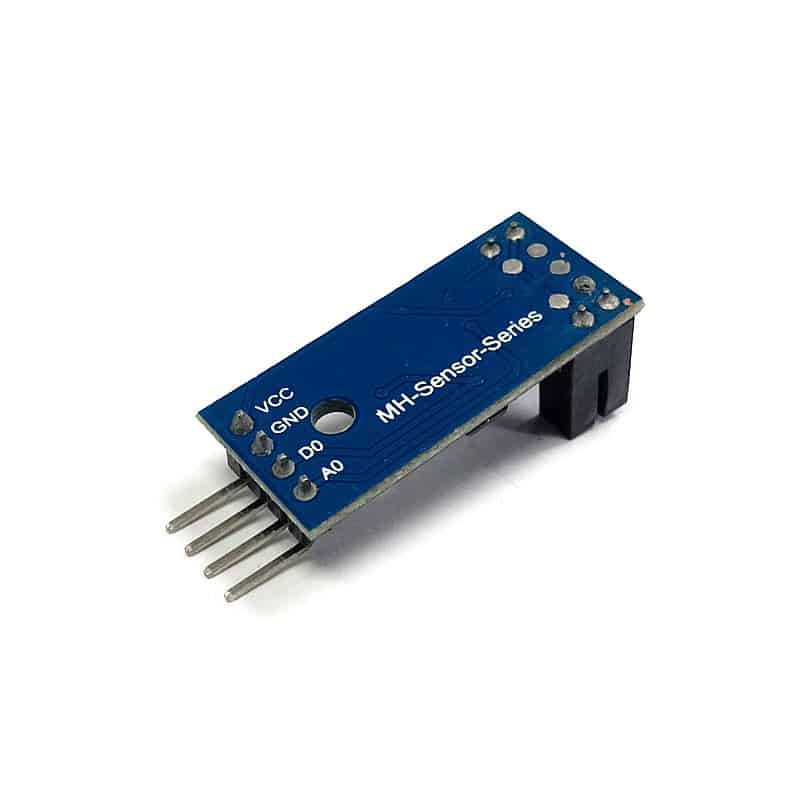

# Equipo Bunker Romeo – WRO Future Engineers 2026

## Índice
 
1.  [Acerca del Equipo](#acerca-del-equipo)
2.  [Resumen del Vehículo (Estado Actual)](#resumen-del-vehículo-estado-actual)
   - [Diseño Mecánico](#diseño-mecánico)
   - [Potencia y Sensores](#potencia-y-sensores)
   - [Software y Navegación](#software-y-navegación)
   - [Fotos del Vehículo (rev.15 – Regional Mexicali)](#fotos-del-vehículo-rev15--regional-mexicali)
3.  [Videos de la Competencia](#videos-de-la-competencia)
   - [Open Challenge](#open-challenge)
   - [Obstacle Challenge](#obstacle-challenge)
4.  [Bitácora de Decisiones de Ingeniería](#bitácora-de-decisiones-de-ingeniería)
5.  [BOM (Bill of Materials)](#bom-bill-of-materials)
---
 
## Acerca del Equipo
 
Somos un equipo de Baja California, México, compuesto por dos integrantes: Ian Fernando Rivera Armenta y Jacobo Arteaga Castañeda, de Bunker Robotics. Ambos miembros del equipo cuentan con experiencia en otras competencias, específicamente en la categoría Robomission, sumando un total de 10 años de experiencia combinada.
 
Este es nuestro segundo año participando en la categoría Future Engineers. Comenzamos nuestra preparación al inicio del año (Enero de 2025) y, con el paso del tiempo, nuestro robot ha pasado por varias iteraciones y mejoras que se documentan a detalle en la [Bitácora de Decisiones de Ingeniería](#bitácora-de-decisiones-de-ingeniería) de este documento.
 

[⬆ Volver al índice](#índice)
 
---
 
## Resumen del Vehículo (Estado Actual)
 
Esta sección describe **el estado actual (rev.15)** del vehículo. El razonamiento detrás de cada decisión de diseño —qué alternativas se consideraron y por qué se eligió cada solución— se documenta a detalle en la [Bitácora de Decisiones de Ingeniería](#bitácora-de-decisiones-de-ingeniería).
 
### Diseño Mecánico
 
| Aspecto | Especificación actual |
|---|---|
| Ruedas | 57 × 14 mm (Lego Spike Prime) |
| Altura total | 20.3 cm |
| Ancho total | 14.6 cm |
| Controlador principal | Arduino Mega 2560 |
 
> [!NOTE]
> El chasis fue rediseñado a partir de una versión anterior que usaba ruedas de 62.4 × 20 mm (altura 23.9 cm, ancho 15 cm). Razonamiento completo en la Bitácora, **Decisión 3**.
 
### Potencia y Sensores
 
| Sistema | Especificación actual |
|---|---|
| Alimentación principal | 2 × baterías 7.8 V, 2200 mAh |
| Alimentación en evaluación | 2 × baterías 7.4 V, 3000 mAh (pruebas comparativas en curso) |
| Sensores laterales (muros) | 2 × VL53L0X (láser ToF) |
| Sensor frontal | 1 × HC-SR04P (ultrasónico) |
| Sensor de esquina (líneas) | 1 × MH Sensor Series (TCRT5000 + comparador LM393), extremo trasero inferior |
| IMU / giroscopio | GY-9250 (en el BOM; ya no se usa para navegación en curvas — ver Bitácora, **Decisión 9**) |
| Visión | HuskyLens PRO OV5640 |
 
> [!NOTE]
> Los sensores laterales cambiaron de ultrasónico (HC-SR04P) a VL53L0X ToF, y el algoritmo de toma de curvas migró de alineación por giroscopio a seguimiento de muro. Razonamiento completo en la Bitácora, **Decisiones 8 y 9**.
 
### Software y Navegación
 
- **Controlador:** Arduino Mega 2560 (único SBC/SBM del sistema desde el 21 de mayo de 2026).
- **Visión:** HuskyLens realiza la detección de color de los pilares (rojo/verde) y el seguimiento del obstáculo.
- **Toma de curvas:** seguimiento de muro (*wall-following*) con los sensores laterales VL53L0X + lectura de líneas de esquina con el sensor infrarrojo trasero.
- **Evasión de obstáculos:** esquema reactivo basado en umbrales de distancia (seguimiento desde 50 cm, giro de evasión desde 30 cm, re-centrado de 10 frames). Este esquema reemplazó al algoritmo Pure Pursuit usado en versiones anteriores.
> [!NOTE]
> El sistema de evasión de obstáculos pasó de un enfoque basado en Pure Pursuit (generación de *waypoints* y trayectorias geométricas) a un esquema reactivo más simple. Razonamiento completo en la Bitácora, **Decisión 10**.
 
### Fotos del Vehículo (rev.15 – Regional Mexicali)
 
<table align="center">
<tr>
<td align="center"> Vista Frontal</td>
<td align="center"> Vista Lateral Izquierda</td>
<td align="center"> Vista Trasera</td>
</tr>
<tr>
<td align="center"> Vista Lateral Derecha</td>
<td align="center"> Vista Superior</td>
<td align="center"> Vista Inferior</td>
</tr>
</table>
[⬆ Volver al índice](#índice)
 
---
 
## Videos de la Competencia
 
Conforme al reglamento oficial WRO 2026 – Future Engineers, cada equipo debe publicar un video en YouTube (público o accesible mediante enlace) que documente el manejo autónomo del vehículo para cada reto, con una duración mínima de 30 segundos por video.
 
| Reto | Estado | Enlace | Duración del recorrido |
|------|--------|--------|-------------------------|
| **Open Challenge** (Vuelta Abierta) | ✅ Publicado | [Ver en YouTube](https://youtu.be/jBpTh44YIUg) | 75 s |
| **Obstacle Challenge** (Vuelta con Obstáculos) | ✅ Publicado | [Ver en YouTube](https://youtu.be/mim8iLk7CLE) | Clip de prueba |
 
### Open Challenge
 

El video corresponde a la prueba de la ronda de vuelta abierta realizada el **28 de junio de 2026**. En la corrida documentada, el robot:
 
- Ejecuta de forma autónoma **3 vueltas consecutivas** sobre la pista.
- Se estaciona en el **cuadrante de inicio** del recorrido, sin intervención manual.
- Completa la totalidad del reto en **75 segundos**.
**Sistemas involucrados durante la corrida:** seguimiento de muro (*wall-following*) mediante sensores VL53L0X laterales para la toma de curvas, sensor infrarrojo MH Sensor Series en el extremo trasero inferior para lectura de líneas de esquina, y HuskyLens + Arduino Mega como unidad de control principal.
 
### Obstacle Challenge
 

El video corresponde a la prueba de evasión de obstáculos realizada el **7 de julio de 2026**. El clip muestra al robot recorriendo una **sección recta de la pista** y evadiendo, en orden, un pilar **rojo** seguido de un pilar **verde**:
 
- **Pilar rojo:** el robot lo mantiene de su lado derecho, conforme a la regla de tránsito del reto.
- **Pilar verde:** el robot lo mantiene de su lado izquierdo.
**Sistemas involucrados durante la corrida:** detección de color mediante la cámara HuskyLens, seguimiento del obstáculo manteniéndolo centrado en cámara a partir de 50 cm de distancia, giro de evasión a partir de 30 cm, y protocolo de re-centrado de 10 frames al perder de vista el obstáculo.
 
[⬆ Volver al índice](#índice)
 
---
 
## Bitácora de Decisiones de Ingeniería
 
> [!NOTE]
> Esta sección documenta, en orden cronológico, el **razonamiento detrás de cada cambio importante** en el robot: el problema o restricción que lo motivó, las alternativas consideradas, la decisión tomada y la evidencia que la respalda. El objetivo es mostrar el proceso de ingeniería completo, no solo el resultado final.
 
Cada entrada sigue el mismo formato: **Contexto/Restricción → Opciones consideradas → Decisión y justificación → Evidencia/Resultado**.
 
### Resumen rápido
 
| # | Fecha | Decisión | Categoría | Estado |
|---|---|---|---|---|
| 1 | Inicio de temporada (s/f) | RPi + Pure Pursuit para evasión de obstáculos | Software |  (ver 10) |
| 2 | 21 may 2026 | Raspberry Pi → HuskyLens + Arduino Mega | Software/Hardware |  |
| 3 | s/f | Ruedas 62.4×20 mm → 57×14 mm | Mecánico |  |
| 4 | s/f | Baterías 6×3.7 V → 2×7.8 V/2200 mAh | Potencia |  (comparando alternativa 7.4 V/3000 mAh) |
| 5 | Antes del regional | VL53L0X probado, no usado en el regional | Sensores |  (ver 8) |
| 6 | 25 jun 2026 | Falla eléctrica (regulador + servo) | Riesgo/Mantenimiento |  |
| 7 | 28 jun 2026 | Sensor de esquina IR + validación Open Round | Sensores |  |
| 8 | 5 jul 2026 | Sensores laterales: ultrasónico → VL53L0X | Sensores |  |
| 9 | 5 jul 2026 | Curvas: giroscopio → seguimiento de muro | Software |  |
| 10 | Post-regional (s/f exacta) | Evasión: Pure Pursuit → reactivo por distancia | Software |  |
| 11 | 7 jul 2026 | Validación de evasión de obstáculos | Pruebas |  (solo tramo recto) |
 
### Decisión 1 — Arquitectura inicial de evasión de obstáculos: Raspberry Pi + Pure Pursuit
 
- **Contexto/Restricción:** el sistema de evasión de obstáculos dependía inicialmente de maniobras preprogramadas y casos específicos, lo cual limitaba la adaptabilidad del robot ante distintas posiciones de obstáculos.
- **Decisión:** implementar un sistema de seguimiento de trayectoria basado en **Pure Pursuit**, usando la cámara Raspberry Pi Rev 1.3 como sensor principal de percepción. El algoritmo detectaba la posición del obstáculo, generaba *waypoints* alrededor de este y seleccionaba continuamente un punto adelantado (*lookahead point*) sobre la trayectoria para calcular el ángulo de dirección necesario.
- **Resultado:** el enfoque generó movimientos más suaves que las maniobras fijas, pero incrementó la complejidad y la carga de procesamiento del sistema (ver Decisión 2 y Decisión 10).
### Decisión 2 — Cambio de plataforma de visión: Raspberry Pi → HuskyLens (21 de mayo de 2026)
 
- **Contexto/Restricción:** la Raspberry Pi + cámara Raspberry Pi ofrecía resultados funcionales, pero incrementaba la complejidad general del sistema y requería mayor carga de procesamiento para ejecutar los algoritmos de detección.
- **Opciones consideradas:** optimizar el pipeline de visión sobre Raspberry Pi vs. migrar a un sensor de visión dedicado con modos de reconocimiento preconfigurados.
- **Decisión y justificación:** se reemplazaron la Raspberry Pi y su cámara por una **cámara HuskyLens**, dejando al **Arduino Mega** como único controlador. La HuskyLens simplifica el desarrollo del sistema de detección (funciones de visión artificial integradas) y libera al Arduino Mega para tareas de control y navegación, mejorando la capacidad de reacción durante maniobras dinámicas.
- **Evidencia/Resultado:** HuskyLens integrada desde el 21 de mayo de 2026; se continúa calibrando y evaluando los distintos modos de reconocimiento de la cámara.
### Decisión 3 — Rediseño de ruedas y footprint
 
- **Contexto/Restricción:** las ruedas anteriores (62.4 × 20 mm) ofrecían buena estabilidad pero incrementaban el tamaño general del robot.
- **Opciones consideradas:** mantener las ruedas actuales vs. adoptar un modelo más pequeño (Lego Spike Prime, 57 × 14 mm).
- **Decisión y justificación:** se sustituyeron las ruedas por el modelo de 57 × 14 mm. Estas ruedas tienen un coeficiente de desgaste más alto, lo que mejora la durabilidad y el agarre en superficies de competencia; su menor tamaño también reduce dimensiones y peso.
- **Evidencia/Resultado:** altura reducida de 23.9 cm a 20.3 cm; ancho de 15 cm a 14.6 cm. La estructura resultante es más compacta y ligera, con un centro de gravedad ligeramente mejorado que favorece la estabilidad en curvas y maniobras rápidas.
### Decisión 4 — Simplificación del sistema de alimentación
 
- **Contexto/Restricción:** el arreglo anterior de 6 baterías de 3.7 V (~12 V, 2000 mAh) cumplía los requerimientos energéticos, pero ocupaba mucho espacio interno y aumentaba el peso del robot.
- **Opciones consideradas:** mantener el arreglo de 6 celdas vs. consolidar en menos celdas de mayor voltaje.
- **Decisión y justificación:** se adoptaron **2 baterías de 7.8 V, 2200 mAh**, liberando espacio interno, reduciendo peso y simplificando la gestión energética.
- **Evidencia/Resultado:** reducción de espacio y peso confirmada; autonomía suficiente mantenida. **Iteración en curso:** actualmente se prueba un segundo conjunto de baterías (7.4 V, 3000 mAh) más ligero y compacto pero de menor capacidad, para determinar el mejor equilibrio entre autonomía, estabilidad eléctrica, peso y rendimiento general. Esta comparación **aún no concluye**.
### Decisión 5 — Prueba experimental del sensor VL53L0X (no desplegado en el regional)
 
- **Contexto/Restricción:** el sensor láser VL53L0X (Time-of-Flight) se integró de forma experimental en la arquitectura electrónica para mejorar la detección frontal de obstáculos y la precisión a corta distancia.
- **Decisión de mitigación de riesgo:** debido a limitaciones de tiempo durante la integración y calibración, el equipo decidió **no utilizar el sensor durante la competencia regional**, priorizando la confiabilidad del sistema sobre la incorporación de un componente insuficientemente probado.
- **Resultado:** el sensor se documentó como una mejora importante para futuras iteraciones y se integró de forma permanente después del regional (ver Decisión 8).
### Decisión 6 — Incidente eléctrico y respuesta a falla (25 de junio de 2026)
 
- **Contexto:** durante las pruebas, el regulador de voltaje y el servomotor de dirección (MG90S) sufrieron un corto circuito y resultaron dañados.
- **Impacto:** las pruebas de navegación se detuvieron temporalmente mientras se diagnosticaba el origen de la falla.
- **Acción de mitigación:** reemplazo de ambos componentes y revisión del cableado y las conexiones asociadas, con el objetivo de evitar que la falla se repita.
- **Estado:** Resuelto con el debido cambio de componentes.
### Decisión 7 — Sensor de esquina trasero y validación con pruebas de vuelta abierta (28 de junio de 2026)
 
- **Contexto/Restricción:** el robot no contaba con un sensor dedicado a detectar las líneas de las esquinas de la pista, lo que podía generar imprecisiones al iniciar o finalizar una maniobra de giro.
- **Decisión y justificación:** se incorporó un sensor infrarrojo **MH Sensor Series** (basado en TCRT5000 con comparador LM393) en el extremo trasero inferior, complementando la información de los sensores laterales VL53L0X y el algoritmo de seguimiento de muro.
- **Evidencia/Resultado:** en las pruebas de vuelta abierta del mismo día, el robot completó **3 vueltas de forma consistente**, se estacionó correctamente en el cuadrante de inicio y completó el recorrido en **75 segundos**, validando en conjunto los sensores VL53L0X laterales, el seguimiento de muro y el nuevo sensor de esquina. Ver video en la sección [Open Challenge](#open-challenge).
### Decisión 8 — Sensores laterales: de ultrasónico a VL53L0X ToF (5 de julio de 2026)
 
- **Contexto/Restricción:** los sensores ultrasónicos (HC-SR04P) usados en los laterales eran susceptibles a variaciones de lectura según el ángulo o el material del muro.
- **Opciones consideradas:** mantener los sensores ultrasónicos vs. desplegar de forma definitiva el VL53L0X, ya validado experimentalmente (Decisión 5) pero no usado en el regional por límites de tiempo.
- **Decisión y justificación:** se sustituyeron los sensores laterales ultrasónicos por **VL53L0X ToF**, que al basarse en luz infrarroja ofrecen mediciones más estables y consistentes a corta distancia que la reflexión de ondas sonoras.
- **Resultado:** el VL53L0X pasa a formar parte permanente de la arquitectura electrónica, específicamente en los laterales.
### Decisión 9 — Navegación en curvas: de giroscopio a seguimiento de muro
 
- **Contexto:** el robot dependía del sensor giroscópico (GY-9250) para alinearse durante el giro, usando la orientación angular para corregir la trayectoria.
- **Decisión y justificación:** el cambio de hardware de la Decisión 8 (VL53L0X en los laterales) permitió migrar a un esquema de **seguimiento de muro** (*wall-following*): el sistema mide constantemente la distancia entre el robot y el muro exterior y ajusta la dirección para mantenerla constante durante la curva, sin depender del giroscopio.
- **Estado:** en fase de pruebas, ajustando parámetros de control para lograr un seguimiento estable en diferentes configuraciones de pista.
- **Nota de pensamiento sistémico:** este cambio de algoritmo fue posible *gracias* a la decisión de hardware anterior (Decisión 8) — un ejemplo de cómo una decisión de sensado habilitó directamente una simplificación en el software de navegación.
### Decisión 10 — Evasión de obstáculos: de Pure Pursuit a seguimiento reactivo por distancia
 
- **Contexto/Restricción:** Pure Pursuit requería generar *waypoints* y recalcular constantemente una trayectoria geométrica alrededor de cada obstáculo, lo cual añadía complejidad de cómputo y de diseño.
- **Opciones consideradas:** mantener y refinar Pure Pursuit vs. adoptar un esquema reactivo más simple basado en umbrales de distancia.
- **Decisión y justificación:** se eliminó Pure Pursuit para la evasión de obstáculos y se adoptó un esquema reactivo:
  1. El robot avanza en línea recta.
  2. Al detectar un obstáculo a 50 cm, inicia su seguimiento manteniéndolo centrado en el campo de visión de la HuskyLens.
  3. A 30 cm, comienza a girar para esquivarlo.
  4. El giro continúa hasta perder de vista el obstáculo.
  5. Se ejecuta un protocolo de re-centrado de 10 frames respecto al carril antes de continuar recto.
  **Este cambio afecta únicamente al sistema de evasión de obstáculos**; los sensores y el algoritmo de seguimiento de muro (Decisión 9) no se modificaron.
- **Evidencia/Resultado:** validado en las pruebas de evasión de obstáculos del 7 de julio de 2026 (ver Decisión 11).
### Decisión 11 — Validación: pruebas de evasión de obstáculos (7 de julio de 2026)
 
- **Contexto:** validar en pista el esquema reactivo de la Decisión 10.
- **Evidencia/Resultado:** en una sección recta, el robot evadió correctamente un pilar rojo (mantenido a su derecha) y un pilar verde (mantenido a su izquierda). Ver video en la sección [Obstacle Challenge](#obstacle-challenge).
- **Estado actual:** esta prueba corresponde únicamente a un tramo recto de la pista. Continúan las pruebas para validar la evasión de pilares en distintas posiciones y combinaciones de color a lo largo del circuito completo.
[⬆ Volver al índice](#índice)
 
---
 
## BOM (Bill of Materials)
 
| Componente | Requerimiento de energía | Imagen | Precio |
|------------|--------------------------|--------|--------|
| Arduino Mega 2560 | 0.25-0.5W |  | ≈ 24.46 Dlls |
| Motor DC con Encoder: GA37-520 300RPM | 5.55-16.65W |  | ≈ 22.12 Dlls |
| Puente H TB6612FNG | 0.025W |  | ≈ 4.35 Dlls |
| Servo Motor: MG90S | 0.5-2.5W |  | ≈ 4.08 Dlls |
| Sensor Ultrasonico: HC-SR04P x1 (frontal) | 0.075W |  | ≈ 0.90 Dlls |
| Sensor Láser ToF: VL53L0X x2 (laterales) | ≈ 0.10W |  | ≈ 9.00 Dlls |
| Acelerometro/Giroscopio: GY-9250 | 0.033W |  | ≈ 9.24 Dlls |
| LED x4 | 0.264W |  | ≈ 0.44 Dlls |
| Buzzer | N/A |  | ≈ 0.27 Dlls |
| SEN0336 HuskyLens PRO OV5640 | 3.3~5.0V |  | ≈ 40.65 Dlls |
| Sensor Infrarrojo (Line Tracking): MH Sensor Series x1 (trasero inferior) | 0.05-0.075W |  | ≈ 1.50 Dlls* |
| **Total** | | | **≈ 117.50 Dlls*** |
 
[⬆ Volver al índice](#índice)
 
