# Equipo Bunker Romeo – WRO Future Engineers 2026

## Índice

1. [Acerca del Equipo](#acerca-del-equipo)
2. [Implementación de Pure Pursuit y Mejoras Estructurales del Robot](#implementación-de-pure-pursuit-y-mejoras-estructurales-del-robot)
   - [Funcionamiento del sistema Pure Pursuit](#funcionamiento-del-sistema-pure-pursuit)
   - [Modificaciones estructurales del robot](#modificaciones-estructurales-del-robot)
     - [Footprint](#footprint)
   - [Implementación del sensor VL53L0X](#implementación-del-sensor-vl53l0x)
   - [Modificaciones en el sistema de alimentación](#modificaciones-en-el-sistema-de-alimentación)
   - [Modificaciones en el sistema de visión y hardware](#modificaciones-en-el-sistema-de-visión-y-hardware)
3. [Especificaciones del robot](#especificaciones-del-robot)
   - [Fotos del vehículo rev.15 (Regional Mexicali)](#fotos-del-vehículo-rev15-regional-mexicali)
4. [Incidente eléctrico del 25 de junio de 2026](#incidente-eléctrico-del-25-de-junio-de-2026)
5. [Actualización Post-Regional de Baja California (5 de julio de 2026)](#actualización-post-regional-de-baja-california-5-de-julio-de-2026)
   - [Cambio de sensores laterales: de ultrasónico a VL53L0X ToF](#cambio-de-sensores-laterales-de-ultrasónico-a-vl53l0x-tof)
   - [Cambio de algoritmo de navegación en curvas: de giroscopio a seguimiento de muro](#cambio-de-algoritmo-de-navegación-en-curvas-de-alineación-por-giroscopio-a-seguimiento-de-muro)
6. [BOM (Bill of Materials)](#bom-bill-of-materials)

---

## Acerca del Equipo

Somos un equipo de Baja California, México, compuesto por dos integrantes: Ian Fernando Rivera Armenta y Jacobo Arteaga Castañeda, de Bunker Robotics. Ambos miembros del equipo cuentan con experiencia en otras competencias, específicamente en la categoría Robomission, sumando un total de 9 años de experiencia combinada.

Este es nuestro segundo año participando en la categoría Future Engineers. Comenzamos nuestra preparación al inicio del año (enero de 2025) y, con el paso del tiempo, nuestro robot ha pasado por varias iteraciones y mejoras.

[⬆ Volver al índice](#índice)

---

## Implementación de Pure Pursuit y Mejoras Estructurales del Robot

Durante esta revisión realizamos múltiples modificaciones tanto en el sistema de navegación como en la estructura física y electrónica del robot, con el objetivo de mejorar la estabilidad, reducir dimensiones y aumentar la capacidad de adaptación ante diferentes escenarios de competencia.

Una de las mejoras más importantes fue la implementación de un sistema de seguimiento de trayectoria basado en **Pure Pursuit**, utilizando inicialmente la cámara Raspberry Pi Rev 1.3 como sensor principal de percepción.

Anteriormente, nuestro sistema de evasión de obstáculos dependía principalmente de maniobras preprogramadas y casos específicos. Sin embargo, con la incorporación del algoritmo Pure Pursuit, ahora somos capaces de generar trayectorias dinámicas alrededor de los obstáculos detectados.

### Funcionamiento del sistema Pure Pursuit

1. Capturamos imágenes del entorno en tiempo real mediante la cámara.
2. Utilizamos visión por computadora para detectar la posición relativa del obstáculo.
3. Dependiendo de la ubicación detectada, generamos waypoints alrededor del objeto.
4. Estos waypoints forman una trayectoria temporal que el robot debe seguir.
5. El controlador Pure Pursuit selecciona continuamente un punto adelantado sobre la trayectoria y calcula el ángulo de dirección necesario para alcanzarlo.

Este enfoque nos permite generar movimientos más suaves y naturales en comparación con sistemas basados únicamente en correcciones directas o maniobras fijas.

Además, recalculamos constantemente la trayectoria mientras el obstáculo permanece visible, permitiéndonos corregir pequeñas variaciones en tiempo real y adaptarnos dinámicamente a diferentes posiciones de los obstáculos.

La implementación de Pure Pursuit también redujo significativamente la complejidad del sistema, ya que únicamente necesitamos:

- detectar el obstáculo,
- generar waypoints alrededor de este,
- y seguir la trayectoria calculada geométricamente.

El algoritmo funciona calculando la curvatura necesaria para alcanzar un punto objetivo ubicado cierta distancia adelante del vehículo, conocido como **lookahead point**. Esto produce giros más suaves y estables durante la navegación.

### Modificaciones estructurales del robot

También realizamos modificaciones importantes en las dimensiones físicas del robot debido al cambio de ruedas instaladas en los extremos derecho e izquierdo del sistema.

#### Footprint

En la revisión anterior utilizamos ruedas de **62.4 mm × 20 mm**, las cuales ofrecían buena estabilidad, pero incrementaban el tamaño general del robot. Para esta temporada, sustituimos dichas ruedas por un nuevo modelo de **57 mm × 14 mm** de Lego Spike Prime, permitiéndonos reducir tanto la altura como el ancho de la estructura.

**¿Por qué se hizo este cambio?**
Se realizó porque las nuevas ruedas tienen un **coeficiente de desgaste más alto** que el de las otras llantas, lo que mejora la durabilidad y el agarre en superficies de competencia. Además, su menor tamaño contribuye a reducir dimensiones y peso.

#### Como resultado:

- Redujimos la altura total del robot de **23.9 cm** a **20.3 cm**.
- El ancho pasó de **15 cm** a **14.6 cm**.

Esta reducción nos permitió obtener una estructura más compacta y ligera, además de mejorar ligeramente el centro de gravedad del sistema, favoreciendo la estabilidad durante curvas y maniobras rápidas. El menor tamaño de las ruedas también contribuyó a optimizar la distribución interna de componentes electrónicos y cableado dentro del chasis.

### Implementación del sensor VL53L0X

Otro cambio importante fue la incorporación del **sensor láser VL53L0X** dentro del sistema electrónico del robot.

En temporadas anteriores únicamente habíamos utilizado este sensor para pruebas experimentales, por lo que no formaba parte de nuestro sistema final. Sin embargo, durante esta edición logramos integrarlo exitosamente dentro de la arquitectura principal del robot.

El sensor VL53L0X utiliza tecnología **Time-of-Flight (ToF)** para medir distancias mediante luz infrarroja, ofreciendo mediciones más precisas y estables que los sensores ultrasónicos convencionales.

La implementación de este sensor tenía como propósito:

- mejorar la detección frontal de obstáculos,
- aumentar la precisión de medición a corta distancia,
- y complementar la información obtenida mediante visión por computadora.

> **Nota:** Debido a limitaciones de tiempo durante el proceso de integración y calibración, decidimos **no utilizar el sensor durante la competencia regional**. A pesar de ello, consideramos que su implementación representa una mejora importante para futuras iteraciones del robot.
>
> **Actualización (5 de julio de 2026):** Tras el Regional de Baja California, este sensor pasó de ser experimental a formar parte permanente de la arquitectura del robot.

### Modificaciones en el sistema de alimentación

También realizamos cambios importantes en el sistema de alimentación eléctrica del robot con el objetivo de reducir espacio, simplificar la distribución energética y disminuir el peso total de la estructura.

En la edición pasada utilizamos un arreglo compuesto por **seis baterías de 3.7V**, conectadas para obtener aproximadamente **12V y 20000mAh**. Aunque esta configuración cumplía con los requerimientos energéticos del sistema, ocupaba una cantidad considerable de espacio dentro del robot y aumentaba significativamente el peso general de la plataforma.

Para esta edición, reemplazamos el sistema por únicamente **dos baterías de 7.8V y 12200mAh**, permitiéndonos:

- simplificar el sistema de energía,
- reducir el espacio ocupado por las baterías,
- mejorar la distribución interna de componentes,
- y disminuir el peso total del robot.

**¿Por qué se hizo este cambio?**
Se realizó para **liberar espacio interno, reducir el peso y simplificar la gestión energética**. La configuración anterior era voluminosa y pesada; el nuevo arreglo mantiene suficiente autonomía con una fracción del tamaño y masa.

Además, recientemente comenzamos a realizar pruebas utilizando un **segundo conjunto de baterías de 7.4V y 3000mAh**. Estas pruebas tienen como objetivo evaluar alternativas más ligeras y compactas que nos permitan reducir aún más el peso del robot y mejorar la eficiencia energética del sistema.

Aunque estas baterías poseen una menor capacidad de almacenamiento, ofrecen ventajas importantes en términos de tamaño, distribución interna y reducción de carga sobre la estructura del robot.

Actualmente continuamos realizando pruebas comparativas entre ambas configuraciones de alimentación para determinar cuál ofrece el mejor equilibrio entre:

- autonomía,
- estabilidad eléctrica,
- peso,
- y rendimiento general durante la competencia.

Gracias a todas estas modificaciones, logramos desarrollar un robot más compacto, eficiente y adaptable, tanto a nivel mecánico como electrónico.

### Modificaciones en el sistema de visión y hardware

Durante esta edición realizamos cambios importantes en el sistema de visión y en el hardware principal del robot, con el objetivo de simplificar la arquitectura electrónica y mejorar la detección de obstáculos durante la navegación autónoma.

**Anteriormente**, utilizábamos una **Raspberry Pi** junto con una **cámara Raspberry Pi** como sistema principal de procesamiento y percepción visual. Esta configuración ofrecía resultados funcionales en tareas básicas de visión por computadora, pero incrementaba la complejidad general del sistema y requería una mayor carga de procesamiento para ejecutar los algoritmos de detección.

**El cambio a HuskyLens** se realizó el **21 de mayo de 2026**. Decidimos reemplazar tanto la cámara Raspberry Pi como la propia Raspberry Pi por una **cámara HuskyLens**, utilizando únicamente el **Arduino Mega** como controlador principal.

#### Razones del cambio:

- **Facilidad de implementación**: la HuskyLens tiene funciones integradas de visión artificial y modos preconfigurados de reconocimiento y seguimiento de objetos, lo que simplifica enormemente el desarrollo del sistema de detección y evasión de obstáculos.
- **Menor carga de procesamiento**: al delegar la visión artificial a la HuskyLens, el Arduino Mega queda liberado para tareas de control y navegación, mejorando la capacidad de reacción durante maniobras dinámicas.

#### Propósitos de la nueva implementación:

- simplificar la arquitectura electrónica del robot,
- reducir la complejidad del procesamiento de visión artificial,
- mejorar la detección y seguimiento de obstáculos en tiempo real,
- disminuir la carga de procesamiento del sistema general,
- y optimizar la capacidad de reacción del robot durante maniobras dinámicas.

> **Estado actual:** La cámara HuskyLens ya ha sido integrada al robot (desde el 21 de mayo de 2026). Se continuará realizando pruebas y calibraciones para evaluar el rendimiento de los diferentes modos de reconocimiento de la cámara y determinar la configuración más adecuada para las condiciones de competencia.

[⬆ Volver al índice](#índice)

---

## Especificaciones del robot

### Fotos del vehículo rev.15 (Regional Mexicali)

| Vista | Foto |
|-------|------|
| Vista Frontal | 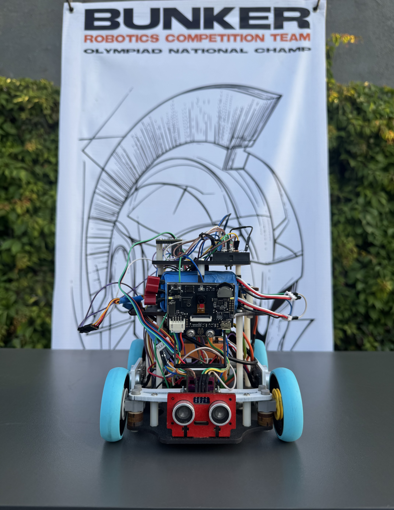 |
| Vista Lateral Izquierda | 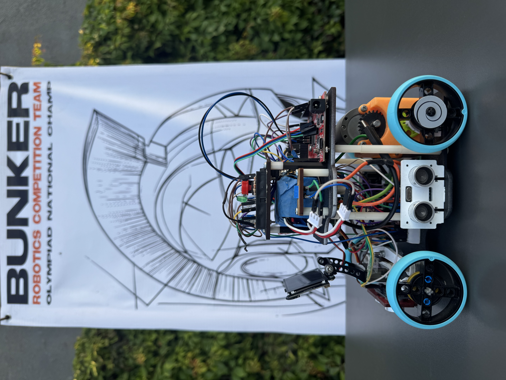 |
| Vista Trasera | 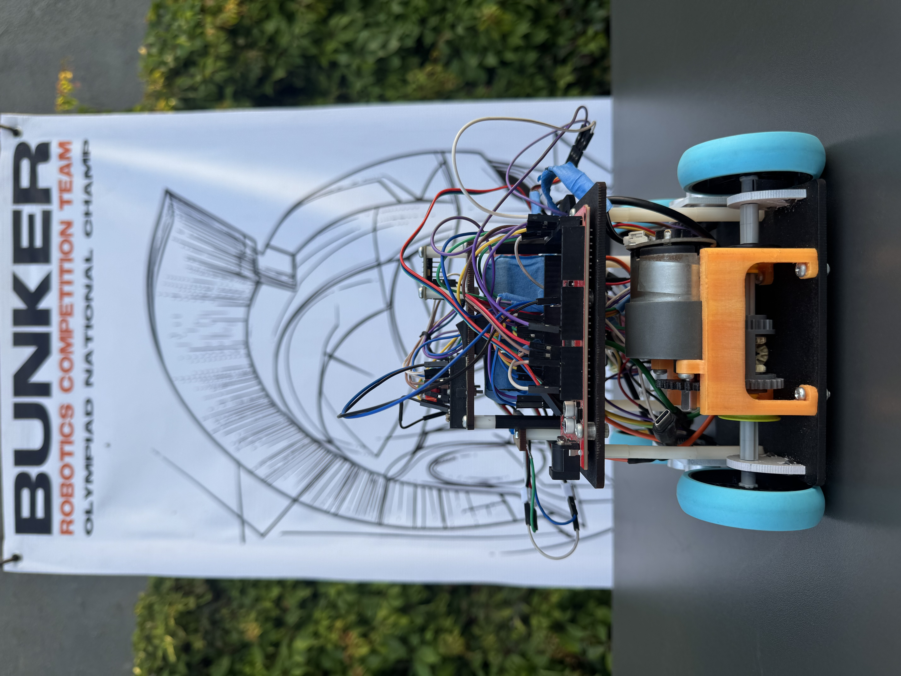 |
| Vista Lateral Derecha | 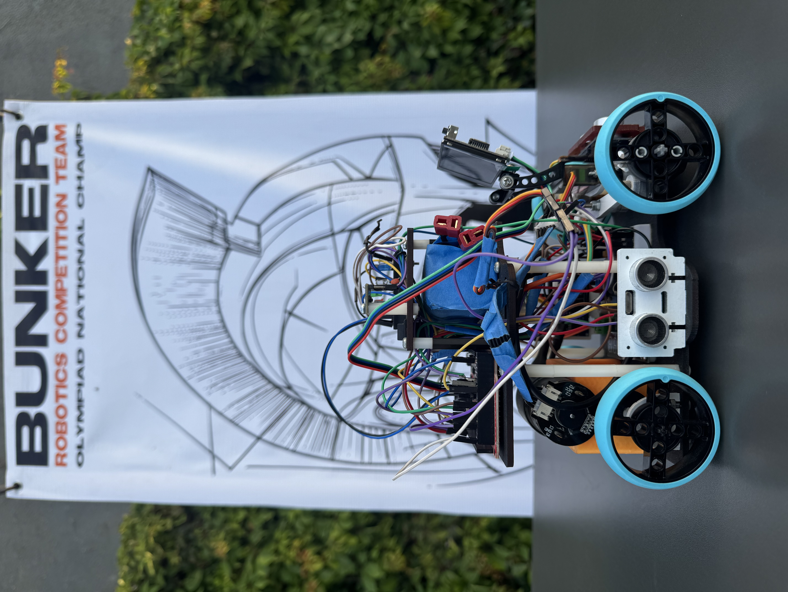 |
| Vista Superior | 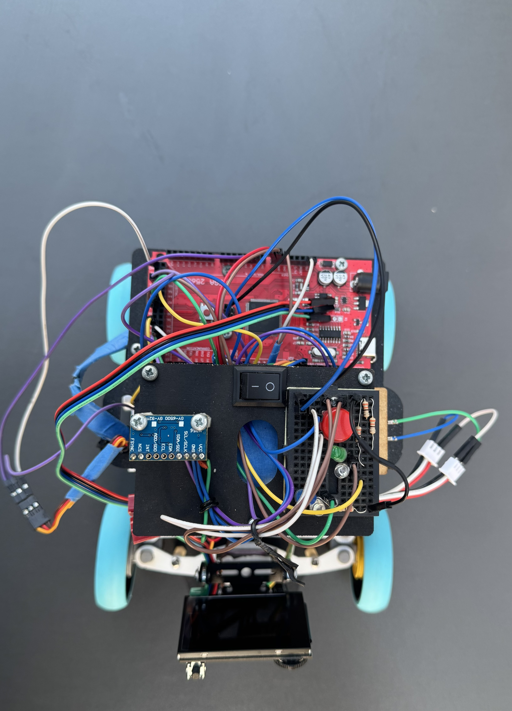 |
| Vista Inferior | 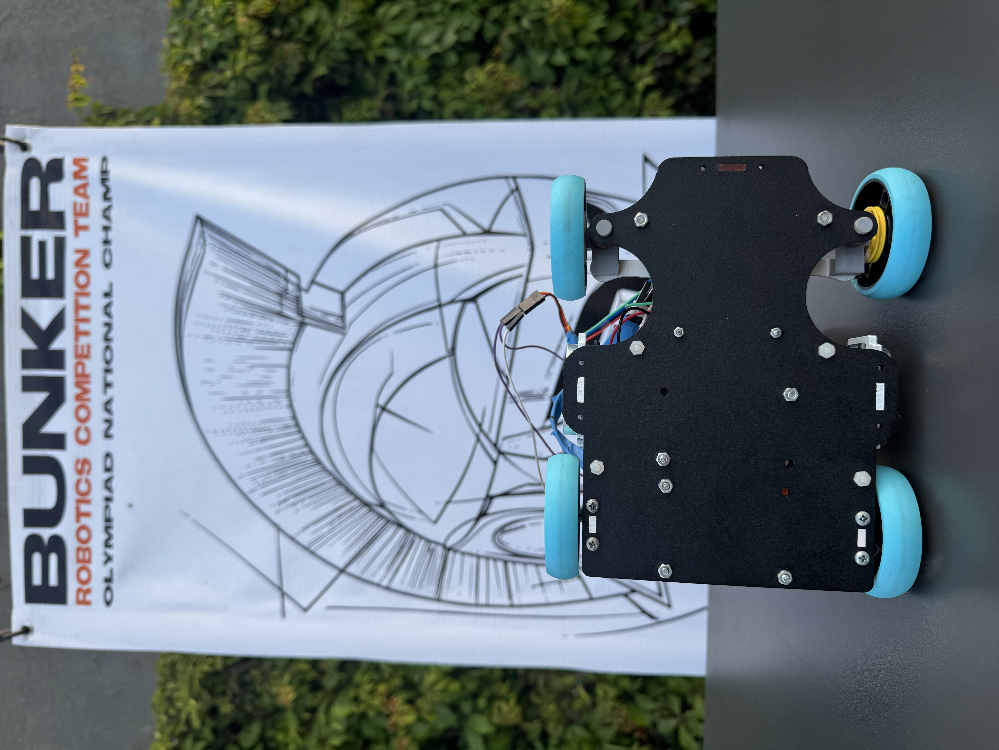 |

[⬆ Volver al índice](#índice)

---

## Incidente eléctrico del 25 de junio de 2026

El día **25 de junio de 2026** se presentó una falla eléctrica en el robot durante las pruebas: tanto el **regulador de voltaje** como el **servomotor de dirección (MG90S)** sufrieron un corto circuito y resultaron dañados (quemados).

Como consecuencia, las pruebas de navegación se detuvieron temporalmente mientras se diagnosticaba el origen de la falla.

**Estado actual:** el equipo se encuentra en proceso de **reemplazar ambos componentes** y de revisar el cableado y las conexiones asociadas, con el objetivo de evitar que la falla se repita antes de retomar las pruebas y continuar con la siguiente competencia.

[⬆ Volver al índice](#índice)

---

## Actualización Post-Regional de Baja California (5 de junio de 2026)

A partir del **Regional de Baja California**, comenzamos a implementar una serie de cambios tanto en el hardware como en el algoritmo de navegación del robot, con el objetivo de mejorar la precisión durante las maniobras de evasión y el seguimiento de muros dentro de la pista.

### Cambio de sensores laterales: de ultrasónico a VL53L0X ToF

Anteriormente, los sensores ubicados en los **laterales** del robot eran de tipo ultrasónico (HC-SR04P). A partir de esta actualización, sustituimos dichos sensores por **sensores láser VL53L0X** de tipo **Time-of-Flight (ToF)**.

**¿Por qué se hizo este cambio?**
Se realizó con el objetivo de obtener **mayor precisión al momento de detectar la distancia entre el muro y el robot**. Los sensores ultrasónicos, al depender de la reflexión de ondas sonoras, son más susceptibles a variaciones de lectura según el ángulo o el material del muro; en cambio, los sensores VL53L0X, al basarse en luz infrarroja, ofrecen mediciones más estables y consistentes a corta distancia.

Vale la pena señalar que este sensor ya había sido probado de forma experimental anteriormente (ver sección [Implementación del sensor VL53L0X](#implementación-del-sensor-vl53l0x)), pero no se había integrado de forma definitiva debido a limitaciones de tiempo durante el regional previo. Con esta actualización, el VL53L0X pasa a formar parte permanente de la arquitectura electrónica del robot, ahora utilizado específicamente en los laterales.

### Cambio de algoritmo de navegación en curvas: de alineación por giroscopio a seguimiento de muro

Este cambio de hardware nos permitió replantear también el algoritmo utilizado para tomar las vueltas dentro de la pista.

**Antes:** dependíamos del sensor giroscópico (GY-9250) para alinear al robot durante el giro, utilizando la medición de orientación angular para corregir la trayectoria.

**Ahora:** con la incorporación de los sensores VL53L0X en los laterales, el robot ya no depende del giroscopio para este propósito. En su lugar, el sistema mide constantemente la **distancia entre el robot y el muro exterior**, y ajusta la dirección para mantener una distancia consistente respecto a dicho muro mientras avanza por la curva. En otras palabras, migramos de un esquema de alineación angular (giroscopio) hacia un esquema de **seguimiento de muro (wall-following)** basado en distancia.

Actualmente nos encontramos en fase de pruebas con este nuevo enfoque, ajustando parámetros de control para lograr un seguimiento estable del muro exterior en diferentes configuraciones de pista.

[⬆ Volver al índice](#índice)

---

## BOM (Bill of Materials)

| Componente | Requerimiento de energía | Imagen | Precio |
|------------|--------------------------|--------|--------|
| Arduino Mega 2560 | 0.25-0.5W | 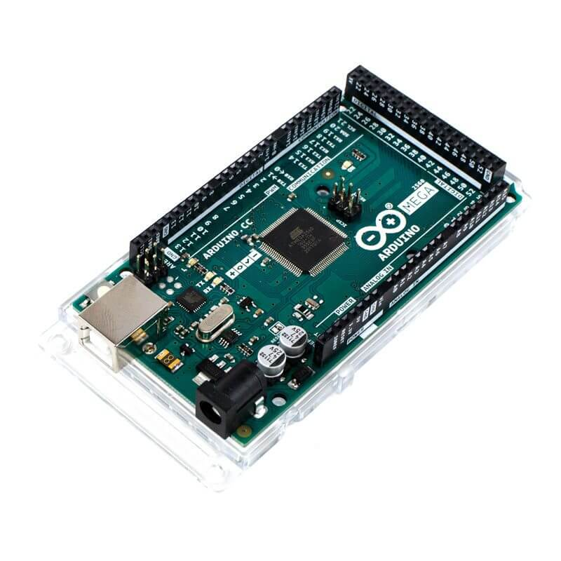 | ≈ 24.46 Dlls |
| Motor DC con Encoder: GA37-520 300RPM | 5.55-16.65W | 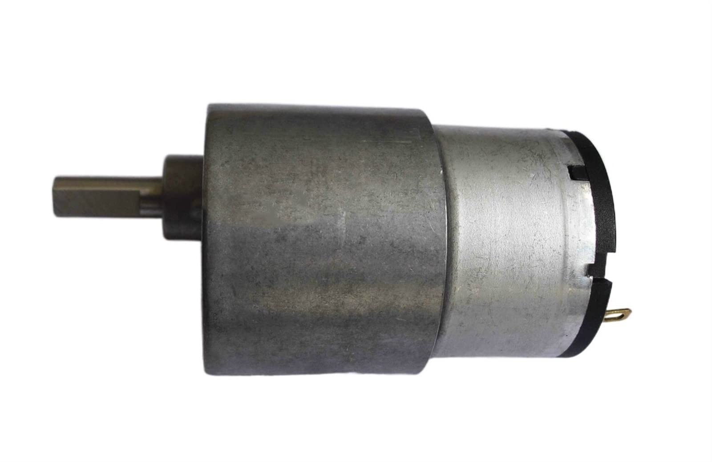 | ≈ 22.12 Dlls |
| Puente H TB6612FNG | 0.025W | 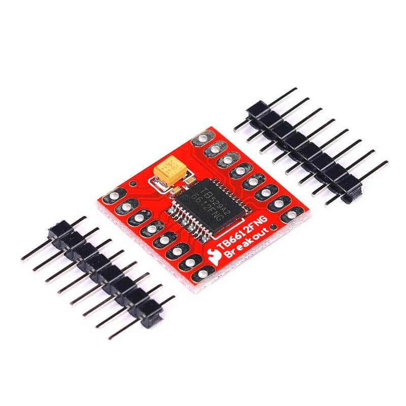 | ≈ 4.35 Dlls |
| Servo Motor: MG90S | 0.5-2.5W | 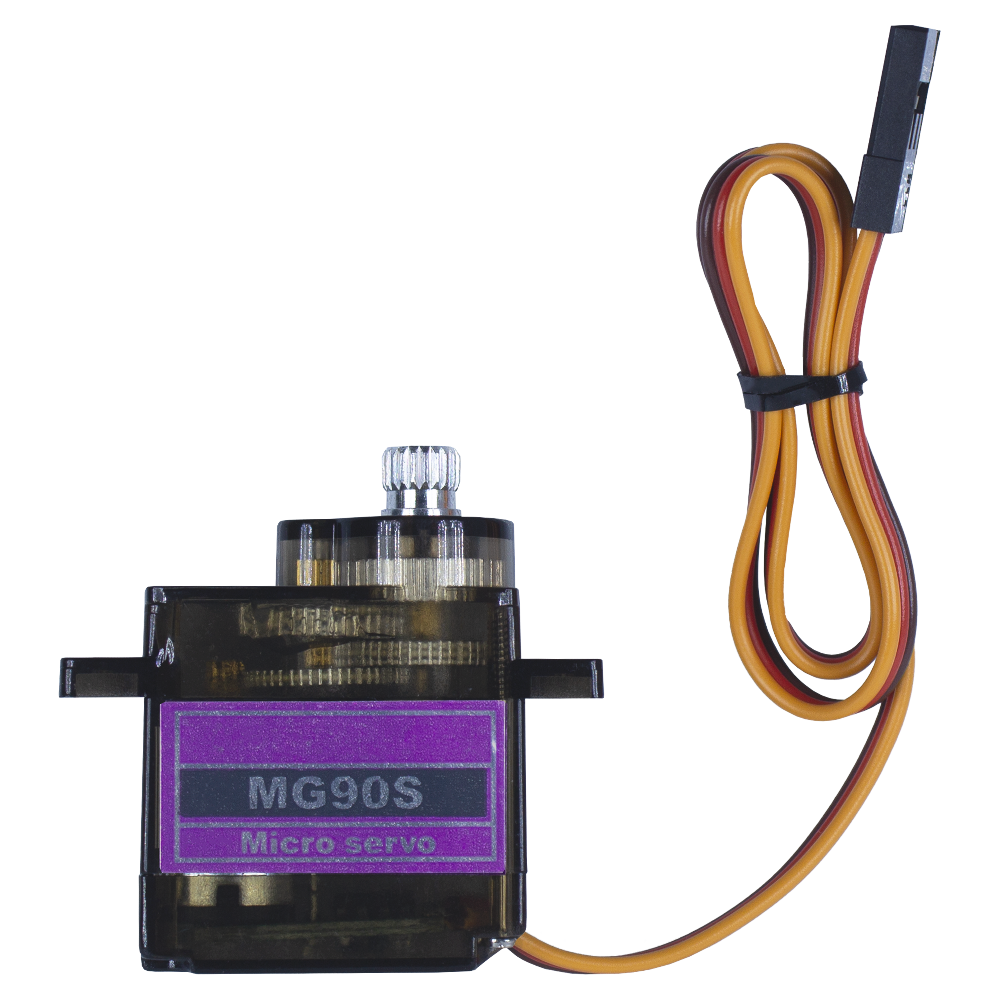 | ≈ 4.08 Dlls |
| Sensor Ultrasonico: HC-SR04P x1 (frontal) | 0.075W | 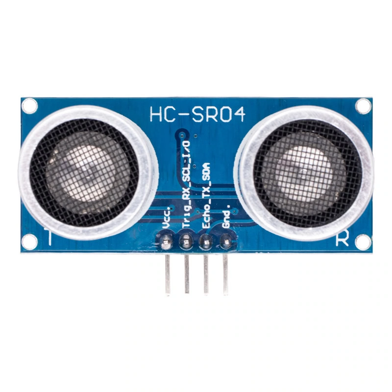 | ≈ 0.90 Dlls |
| Sensor Láser ToF: VL53L0X x2 (laterales) | ≈ 0.10W | 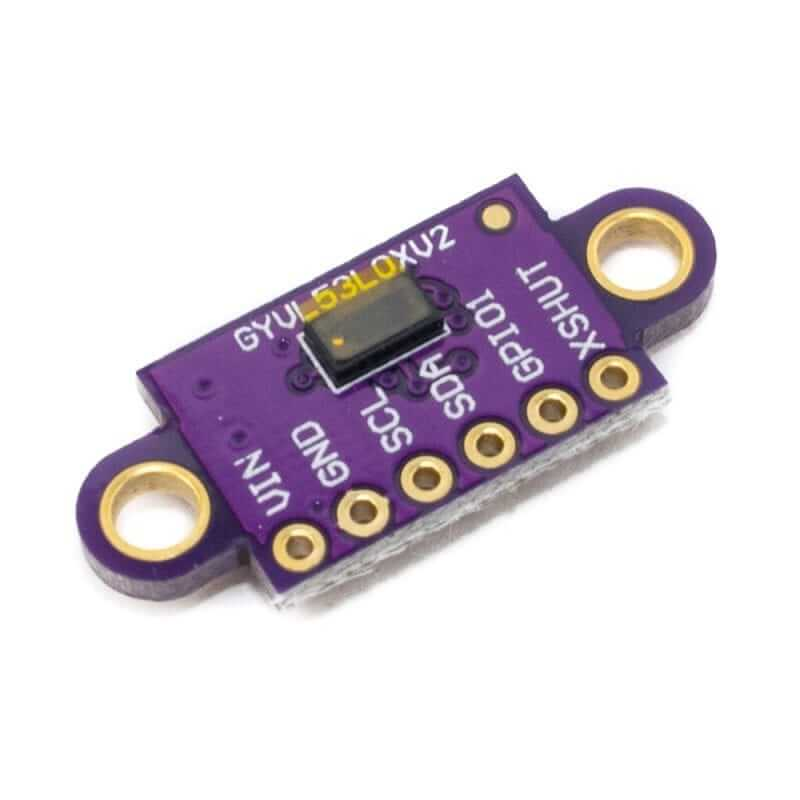 | ≈ 9.00 Dlls |
| Acelerometro/Giroscopio: GY-9250 | 0.033W | 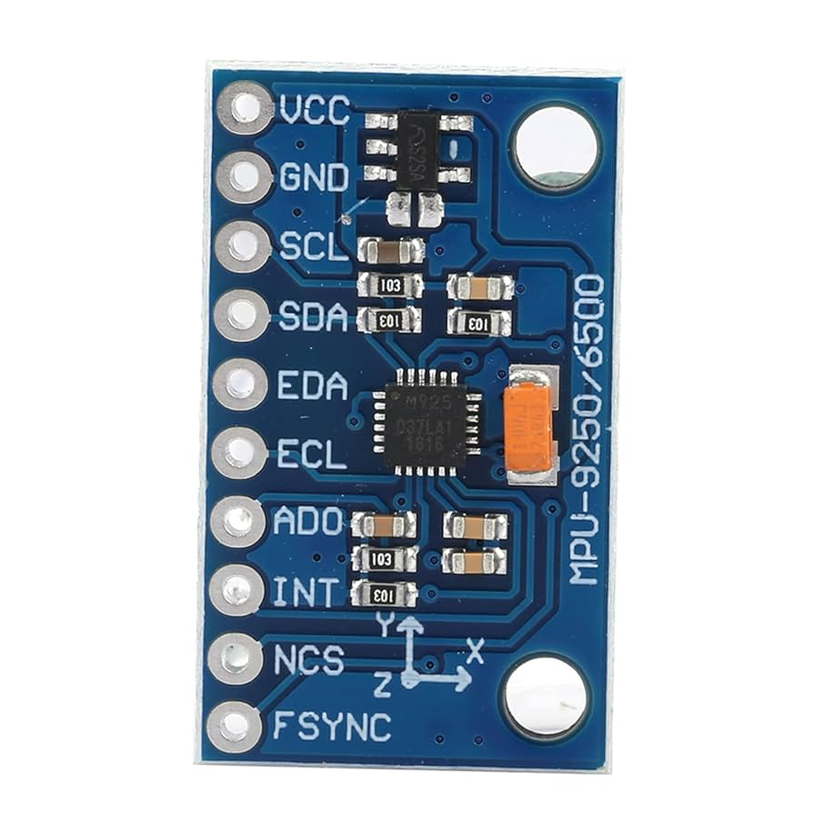 | ≈ 9.24 Dlls |
| LED x4 | 0.264W | 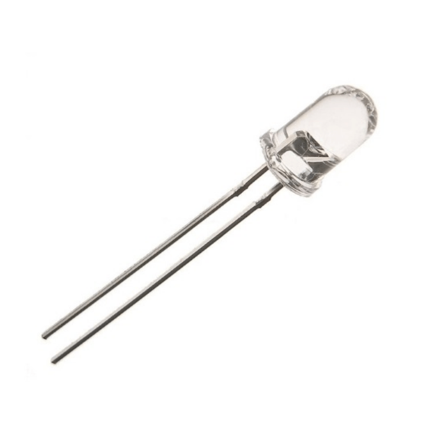 | ≈ 0.44 Dlls |
| Buzzer | N/A | 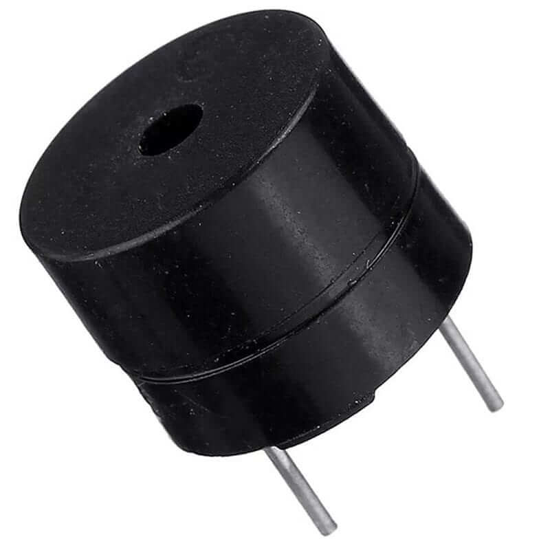 | ≈ 0.27 Dlls |
| SEN0336 HuskyLens PRO OV5640 | 3.3~5.0V | 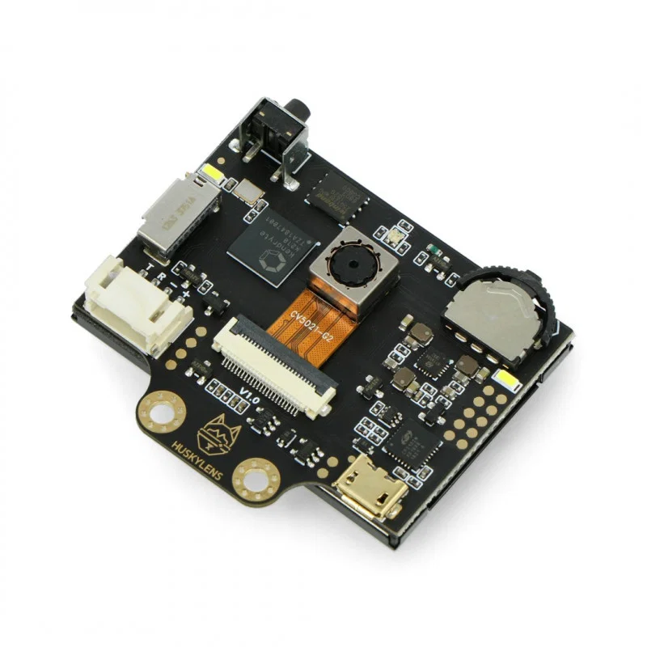 | ≈ 40.65 Dlls |
| **Total** | | | **≈ 116 Dlls** |

[⬆ Volver al índice](#índice)
