# Equipo Bunker Romeo – WRO Future Engineers 2026

   

 
## Índice
 
1.  [Acerca del Equipo](#acerca-del-equipo)
2.  [Resumen del Vehículo (Estado Actual)](#resumen-del-vehiculo)
   - [Diseño Mecánico](#diseno-mecanico)
   - [Potencia y Sensores](#potencia-y-sensores)
   - [Software y Navegación](#software-y-navegacion)
   - [Fotos del Vehículo (rev.15 – Regional Mexicali)](#fotos-del-vehiculo)
3.  [Arquitectura del Algoritmo: Obstacle Challenge](#arquitectura-obstaculos)
   - [1. Marco del reto y objetivos de diseño](#marco-del-reto)
   - [2. Arquitectura general: máquina de estados](#maquina-de-estados)
   - [3. Conjunto de sensores y asignación de funciones](#sensores-obstaculos)
   - [4. Control de rumbo recto](#control-rumbo-recto)
   - [5. Seguimiento de pilares](#seguimiento-pilares)
   - [6. Decisión de sorteo](#decision-sorteo)
   - [7. Detección de esquinas](#deteccion-esquinas)
   - [8. Giro de esquina](#giro-esquina)
   - [9. Ingeniería defensiva](#ingenieria-defensiva)
   - [10. Odometría y separación de contadores](#odometria)
   - [11. Metodología y decisiones revertidas](#metodologia-decisiones-revertidas)
4.  [Videos de la Competencia](#videos-de-la-competencia)
   - [Open Challenge](#open-challenge)
   - [Obstacle Challenge](#obstacle-challenge)
5.  [Bitácora de Decisiones de Ingeniería](#bitacora-decisiones)
6.  [BOM (Bill of Materials)](#bom)
---
 
## Acerca del Equipo
 
Somos un equipo de Baja California, México, compuesto por dos integrantes: Ian Fernando Rivera Armenta y Jacobo Arteaga Castañeda, de Bunker Robotics. Ambos miembros del equipo cuentan con experiencia en otras competencias, específicamente en la categoría Robomission, sumando un total de 10 años de experiencia combinada.
 
Este es nuestro segundo año participando en la categoría Future Engineers. Comenzamos nuestra preparación al inicio del año (enero de 2025) y, con el paso del tiempo, nuestro robot ha pasado por varias iteraciones y mejoras que se documentan a detalle en la [Bitácora de Decisiones de Ingeniería](#bitacora-decisiones) de este documento.
 

[⬆ Volver al índice](#indicleto)
 
---
 

 
## Resumen del Vehículo (Estado Actual)
 
Esta sección describe **el estado actual (rev.15)** del vehículo. El razonamiento detrás de cada decisión de diseño —qué alternativas se consideraron y por qué se eligió cada solución— se documenta a detalle en la [Bitácora de Decisiones de Ingeniería](#bitacora-decisiones).
 

 
### Diseño Mecánico
 
| Aspecto | Especificación actual |
|---|---|
| Ruedas | 57 × 14 mm (Lego Spike Prime) |
| Altura total | 20.3 cm |
| Ancho total | 14.6 cm |
| Controlador principal | Arduino Mega 2560 |
 
> [!NOTE]
> El chasis fue rediseñado a partir de una versión anterior que usaba ruedas de 62.4 × 20 mm (altura 23.9 cm, ancho 15 cm). Razonamiento completo en la Bitácora, **Decisión 3**.

> [!NOTE]
> Se corrigió un orificio de eje mal dimensionado en el soporte impreso del motor, que causaba una deriva excesiva (~45°) al avanzar en línea recta. La deriva se redujo considerablemente tras el ajuste, aunque persiste en menor grado. Razonamiento completo en la Bitácora, **Decisión 13**.
 
### Potencia y Sensores
 
| Sistema | Especificación actual |
|---|---|
| Alimentación principal | 2 × baterías 7.8 V, 2200 mAh |
| Alimentación en evaluación | 2 × baterías 7.4 V, 3000 mAh (pruebas comparativas en curso) |
| Sensor frontal | 1 × HC-SR04P (ultrasónico) |
| Sensores laterales (muros) | 2 × VL53L0X (láser ToF) |
| Sensor de esquina (líneas) | 1 × MH Sensor Series (TCRT5000 + comparador LM393), extremo trasero inferior |
| Visión | 1 × HuskyLens PRO OV5640 |
| IMU / giroscopio | 1 × GY-9250 |
 
> [!NOTE]
> **Por qué cada sensor** (de adelante hacia atrás, y de ahí a los sistemas internos): el **frontal** (HC-SR04P) detecta muros y obstáculos de frente. Los **laterales** (VL53L0X) reemplazaron un par de ultrasónicos por ofrecer lecturas más estables a corta distancia — Bitácora, **Decisión 8**. El de **esquina** (MH Sensor Series) se agregó para leer las líneas de esquina al tomar una curva — Bitácora, **Decisión 7**. La **visión** (HuskyLens) reemplazó a una Raspberry Pi + cámara por simplicidad y menor carga de procesamiento — Bitácora, **Decisión 2**. Y el **giroscopio** (GY-9250) ya no gobierna la toma de curvas del Open Challenge (reemplazado por los VL53L0X — Bitácora, **Decisión 9**), pero sigue activo en el Obstacle Challenge para el rumbo recto y el cierre de lazo de los giros de esquina — ver [Arquitectura del Algoritmo: Obstacle Challenge](#arquitectura-obstaculos).

> [!WARNING]
> Actualmente los soportes de montaje de los sensores laterales VL53L0X están en proceso de ajuste de altura para asegurar una lectura confiable respecto a los muros de la pista — ver Bitácora, **Decisión 12**.
 

 
### Software y Navegación
 
- **Controlador:** Arduino Mega 2560 (único SBC/SBM del sistema desde el 21 de mayo de 2026).
- **Visión:** HuskyLens realiza la detección de color de los pilares (rojo/verde) y el seguimiento del obstáculo.
- **Toma de curvas (Open Challenge):** seguimiento de muro con los sensores laterales VL53L0X + lectura de líneas de esquina con el sensor infrarrojo trasero.
- **Toma de esquinas (Obstacle Challenge):** máquina de estados con detección de apertura lateral (VL53L0X en modo de largo alcance) y giro de 90° en lazo cerrado con el giroscopio, disparado por odometría del encoder. Estrategia distinta a la del Open Challenge por la necesidad adicional de coordinar la esquina con el sorteo de pilares — ver detalle completo en [Arquitectura del Algoritmo: Obstacle Challenge](#arquitectura-obstaculos).
- **Evasión de obstáculos:** esquema reactivo basado en umbrales de distancia (seguimiento entre 60 y 30 cm, inicio de evasión entre 25 y 20 cm con desviación progresiva, re-centrado de 10 cuadros). Este esquema reemplazó al algoritmo Pure Pursuit usado en versiones anteriores.
> [!NOTE]
> El sistema de evasión de obstáculos pasó de un enfoque basado en Pure Pursuit (generación de puntos de trayectoria y cálculo geométrico) a un esquema reactivo más simple. Razonamiento completo en la Bitácora, **Decisión 10**.
 

 
### Fotos del Vehículo (rev.15 – Regional Mexicali)
 
<table align="center">
<tr>
<td align="center">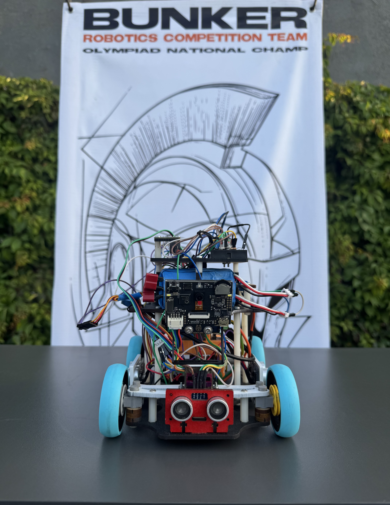 Vista Frontal</td>
<td align="center">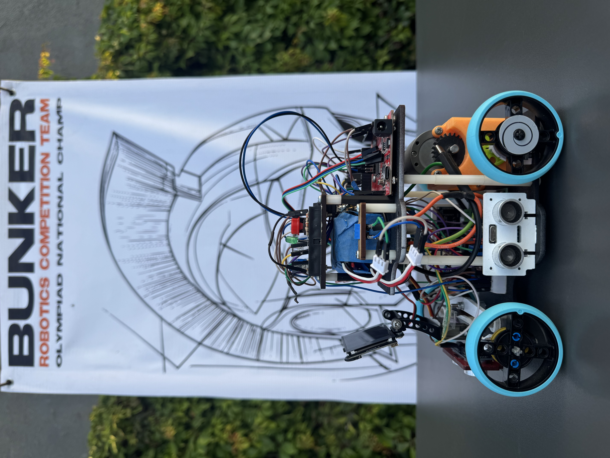 Vista Lateral Izquierda</td>
<td align="center">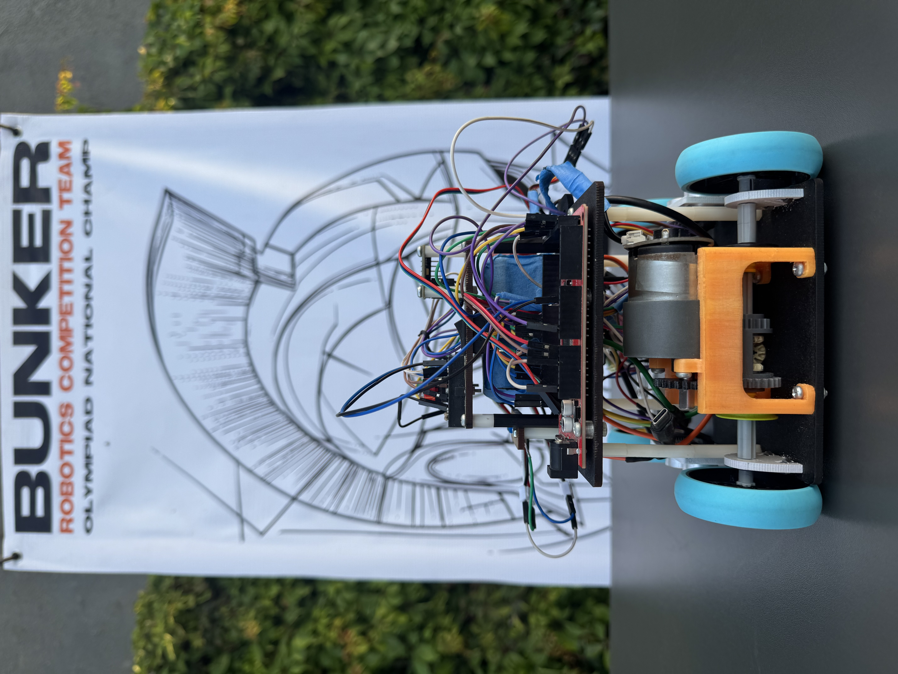 Vista Trasera</td>
</tr>
<tr>
<td align="center">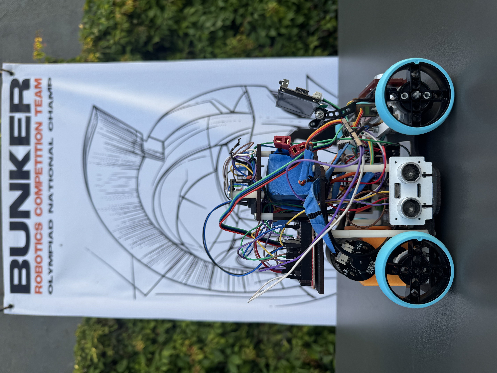 Vista Lateral Derecha</td>
<td align="center">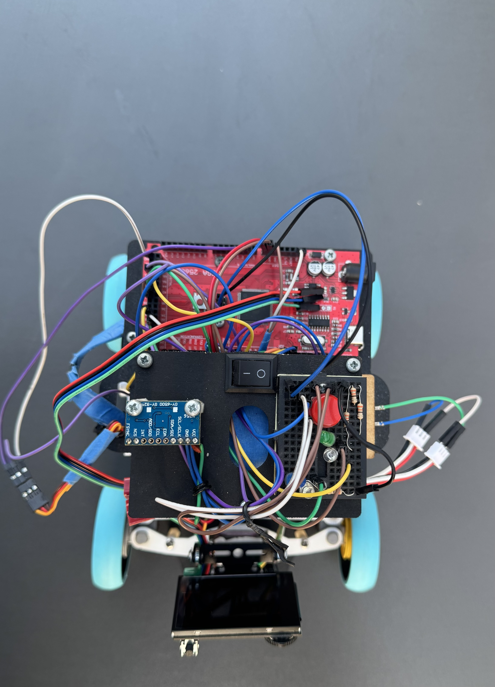 Vista Superior</td>
<td align="center">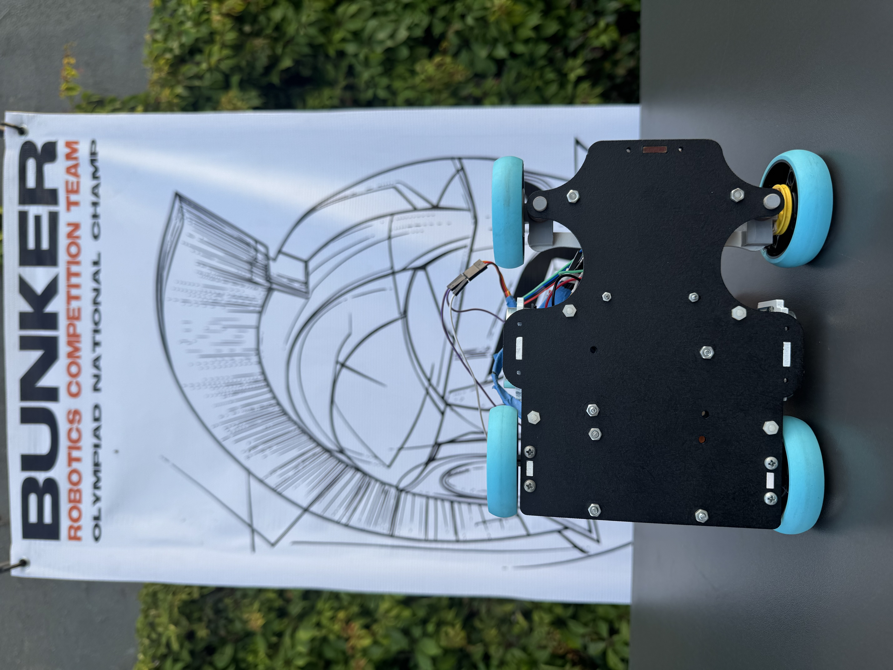 Vista Inferior</td>
</tr>
</table>

[⬆ Volver al índice](#indicleto)
 
---
 

## Arquitectura del Algoritmo: Obstacle Challenge

> [!NOTE]
> Esta sección cuenta, en nuestras propias palabras, **cómo y por qué** funciona el algoritmo del Obstacle Challenge: la arquitectura de control, qué sensor hace qué, y el razonamiento (y los tropiezos) detrás de cada subsistema. Complementa a la [Bitácora de Decisiones de Ingeniería](#bitacora-decisiones), que lleva la línea de tiempo de los cambios de hardware/algoritmo a nivel de proyecto.

### 1. Marco del reto y objetivos de diseño

El Obstacle Challenge de WRO Future Engineers 2026 le pide al vehículo recorrer, de forma completamente autónoma, tres vueltas a una pista de ocho secciones —cuatro esquinas y cuatro rectas— mientras esquiva señales de tráfico colocadas al azar antes de cada ronda. La regla es simple de decir pero exigente de cumplir: un pilar **rojo** obliga a pasar por su lado **derecho**, uno **verde** por el **izquierdo**, y en ningún caso se puede mover la señal. Como el sentido de la ronda (horario o antihorario) se decide al azar justo antes de arrancar, el algoritmo no puede asumir nada de entrada: tiene que averiguarlo por sí mismo apenas empieza a moverse. Y al final, después de las tres vueltas, hay que volver al estacionamiento.

Desde el principio nos propusimos tres cosas al diseñar el sistema: que aguantara bien la aleatoriedad (posición de pilares, sentido de la ronda), que dependiera lo menos posible de la iluminación o de medidas exactas de la pista, y que se pudiera depurar por partes. Esta última terminó siendo casi la regla de oro del equipo: **medir antes de prescribir**. Cada valor que importaba lo dejamos como una constante ajustable, y cada subsistema lo probamos aislado en su propio programa antes de juntarlo con los demás — así, cuando algo fallaba, sabíamos exactamente en qué módulo buscar.

### 2. Arquitectura general: máquina de estados

El control del robot está organizado como una **máquina de estados** que, básicamente, calca la forma de la pista. En cada tramo recto, el vehículo pasa por cuatro estados:

- **RECTO:** avanza manteniendo el rumbo.
- **SEGUIR:** al detectar un pilar, lo centra en el cuadro de la cámara mientras se acerca.
- **ESQUIVAR:** al llegar a cierta distancia, ejecuta la maniobra de esquive.
- **REGRESAR:** retoma el rumbo recto.

Por encima de todo esto, el robot también puede entrar en la maniobra de esquina — pero solo si está en estado RECTO. Esa restricción fue una decisión a propósito: así nos aseguramos de que el robot nunca intente doblar una esquina a la mitad de un esquive, resolviendo de una vez el conflicto entre "sortear el pilar" y "tomar la esquina" a favor de lo primero.

Separar el control de esta manera nos permitió que cada tarea usara el sensor que mejor le quedaba, sin que se estorbaran entre sí: la cámara maneja SEGUIR y ESQUIVAR, el giroscopio se encarga del rumbo en RECTO y REGRESAR, los sensores de distancia detectan las esquinas, y el encoder le da la odometría a todas las maniobras.

### 3. Conjunto de sensores y asignación de funciones

Sobre un Arduino Mega, el robot integra cuatro sistemas de percepción, la mayoría conectados por el mismo bus I2C:

- **Cámara HuskyLens** (modo de reconocimiento de color): detecta los pilares y da su posición horizontal en el cuadro, además de su tamaño aparente, que usamos como estimador de distancia.
- **Dos sensores de tiempo de vuelo VL53L0X** en los laterales: detectan cuándo se abre una esquina y, si hace falta, ayudan a centrar el robot entre los muros.
- **Giroscopio (GY-9250):** calcula el rumbo (*yaw*) integrando la velocidad angular — es la base tanto del control en línea recta como de los giros de 90°.
- **Encoder** de un canal en el eje de tracción: da la distancia recorrida para todas las maniobras basadas en odometría.

Repartir las tareas entre sensores especializados, en vez de cargarle todo a la cámara, fue algo que aprendimos por las malas: la cámara ya tenía suficiente trabajo detectando pilares bajo luz variable, y si además le pedíamos distinguir las líneas del piso, se volvía poco confiable. Separar la percepción por dominio —color a la cámara, distancia lateral a los ToF, rumbo al giroscopio— hizo que todo el sistema fuera más robusto.

### 4. Control de rumbo recto

Al principio pensamos que bastaba con "dejar el volante centrado" para que el robot avanzara recto. No es así: un volante centrado mecánicamente no garantiza una trayectoria recta, y cualquier desalineación —por mínima que sea— se va acumulando como deriva (de hecho, encontramos una causa mecánica concreta de esto; ver Bitácora, **Decisión 13**). Por eso cerramos el rumbo en lazo con el giroscopio: un controlador proporcional corrige el servo según el error entre el rumbo que queremos y el que el giroscopio está midiendo. Llegamos a esta solución después de comprobar, en la práctica, que sin ese control el robot derivaba de forma notoria.

Como capa extra, opcional, también implementamos un centrado entre muros usando la diferencia de lecturas de los dos ToF (distancia izquierda menos distancia derecha). Lo bueno de este cálculo es que el ancho del robot se cancela solo, así que no hace falta meterlo en la ecuación. Este centrado se apaga automáticamente si un lado deja de ver muro, para no perseguir una pared que ya no está ahí, como pasa justo en las esquinas.

### 5. Seguimiento de pilares (estado SEGUIR)

Cuando un pilar aparece lo suficientemente grande en el cuadro, el robot entra en SEGUIR y lo mantiene centrado con un controlador proporcional-derivativo que ajusta el servo según qué tan lejos está el pilar del centro real de la cámara (ya calibrado). Este comportamiento corresponde al tramo de **60 a 30 cm** descrito en la Bitácora, **Decisión 14**.

- **Filtrado por tamaño:** las líneas naranjas del piso a veces se detectan como manchas pequeñas y rojizas, así que descartamos cualquier caja cuyo lado menor no supere un tamaño mínimo — de lo contrario, el robot terminaba persiguiendo una línea como si fuera un pilar. Entre las cajas que sí pasan el filtro, siempre seguimos la más grande, que es la del pilar más cercano.
- **Un error de signo bastante instructivo:** en una primera versión, el robot se **alejaba** del pilar en vez de seguirlo. Visto desde afuera parecía que estaba esquivando la caja, y al perderla de vista se enderezaba solo — se veía exactamente como un esquive, pero en realidad era el seguidor corrigiendo al revés. Bastó con invertir el signo del lazo de la cámara para que empezara a converger correctamente hacia el centro.

### 6. Decisión de sorteo: votación de color y maniobra comprometida (estado ESQUIVAR)

Esta fase concentró dos de las decisiones más importantes de todo el proyecto, y las dos salieron de fallos que vimos en pista y tuvimos que corregir. Este estado corresponde al tramo de **25 a 20 cm** descrito en la Bitácora, **Decisión 14**.

**Votación de color durante la aproximación.** Al principio, el color del pilar se decidía justo en el momento en que el robot llegaba a la distancia de esquive. El problema es que, a quemarropa, el pilar llena toda la cámara y la clasificación de color se vuelve ruidosa. La solución fue ir acumulando "votos" de color durante toda la aproximación —cuando el pilar todavía se ve a media distancia y el color es confiable— y decidir por mayoría justo antes de esquivar. Así, una sola lectura mala cerca del pilar ya no arruina la decisión.

**Comprometerse con una dirección, sin importar la posición.** El fallo más sutil de todos fue que el esquive seguía la *posición* del pilar en el cuadro en vez de comprometerse con una dirección fija: si el pilar entraba un poco cargado hacia un lado, el volante arrancaba hacia ese mismo lado, y terminábamos esquivando por el lado equivocado según dónde estuviera el pilar, no según su color. Lo arreglamos convirtiendo esta fase en una **decisión binaria, ciega a la posición**: si detecta rojo, el robot compromete el volante hacia el lado que marca el reglamento; si no, revisa si es verde y va hacia el lado contrario; y si no logra identificar ningún color válido, suena una alarma. Una vez tomada la decisión, el volante se queda fijo por el resto de la maniobra, **sin volver a mirar la posición del pilar** — esto eliminó por completo los esquives por el lado equivocado.

La maniobra termina por distancia recorrida (odometría), por un ángulo máximo de giro (para evitar que el robot se quede dando vueltas) o por un tiempo límite de seguridad; después de eso, pasa a REGRESAR y se reincorpora al rumbo.

### 7. Detección de esquinas

La detección de esquina se basa en algo simple: cuando el muro de un lado desaparece, el sensor de ese lado deja de leer una distancia corta y empieza a leer "abierto". En la práctica, este fue el subsistema que más vueltas nos dio.

- **Cómo decide el robot de qué lado están las esquinas:** como el sentido de la ronda es aleatorio, el robot lo resuelve solo al arrancar: se pega a la barrera exterior y promedia varias lecturas de los dos ToF; el sensor que ve **más lejos** apunta hacia el interior de la pista, que es justo el lado por donde se van a abrir las esquinas. Ese lado queda fijo para toda la ronda, y así resolvimos de una sola vez la ambigüedad de horario/antihorario, sin necesitar leer ninguna línea del piso.
- **El alcance del sensor nos hizo perder tiempo:** durante las pruebas la detección era intermitente — a veces funcionaba, a veces no, a veces tarde. Al investigar encontramos que el VL53L0X, en su modo por defecto, solo es confiable hasta unos **50 cm** — muy por debajo de los más de **100 cm** que hacen falta para distinguir una esquina. Eso explicaba por qué el mismo sensor funcionaba perfecto siguiendo pared de cerca en el Open Challenge, pero fallaba al detectar la apertura. La solución fue activar el **modo de largo alcance (~2 m)**, y confirmar cada lectura con varias mediciones seguidas para descartar picos raros.
- **Y al final, el problema era mecánico:** incluso con el modo correcto, la detección seguía fallando en pista: el sensor del lado abierto reportaba 7–10 cm donde debía leer "abierto". Al revisar los datos con calma, notamos que los sensores estaban ligeramente inclinados hacia el suelo — a simple vista parecían perpendiculares, pero los números decían otra cosa, y el haz terminaba pegándole al piso a pocos centímetros. **Este es exactamente el mismo tipo de problema que documentamos en la Bitácora, Decisión 12/13** (soportes de sensores laterales desalineados). Lo arreglamos enderezando y elevando los sensores para que su cono de visión (~40°) no chocara con el piso ni pasara por encima de la barrera. Este episodio nos dejó una lección que repetimos seguido en el equipo: **no asumas, mide** — llevábamos días persiguiendo lo que creíamos un problema de software, y resultó ser de montaje.

### 8. Giro de esquina

Una vez confirmada la esquina, el giro se ejecuta en dos pasos: primero el robot avanza una distancia fija (por odometría) para meterse bien al vértice, y después gira 90°.

- **Qué dispara el giro:** aquí tuvimos que dar marcha atrás en una decisión importante. Al principio usábamos un sensor ultrasónico frontal para detectar la pared y disparar el giro, pero lo abandonamos porque los ultrasónicos leen mal las superficies en ángulo: si el robot llegaba ligeramente torcido, el eco no regresaba y el disparo simplemente no ocurría. Lo cambiamos por un disparo basado en la distancia del encoder, confirmado por el ToF, y con eso dejamos de depender de un sensor tan sensible al ángulo.
- **El giro por giroscopio, y el dolor de cabeza de los signos:** el giro se cierra en lazo con el giroscopio, y aquí vivimos la depuración más difícil de todo el proyecto: el volante tenía que girar físicamente hacia un lado mientras el giroscopio confirmaba esa misma rotación, y ambas cosas tenían que coincidir. Durante varias iteraciones, arreglar el sentido físico desajustaba el signo esperado del *yaw*, y viceversa — el resultado eran giros que terminaban en el sentido contrario, o que nunca terminaban y se cortaban por tiempo. La solución definitiva fue dejar de fijarnos en el signo y basar el fin del giro en el **cambio absoluto** de rumbo (la diferencia, en valor absoluto, entre el yaw actual y el inicial): así el giro termina en cuanto se rota el ángulo objetivo, sin importar el signo. Con eso, el problema se redujo a una sola variable —el sentido físico del volante— fácil de revisar y ajustar en una sola línea. Esta decisión eliminó de raíz toda una categoría de errores que nos había costado muchísimas pruebas.
- **Compensar la deriva:** el rumbo objetivo se actualiza después de cada giro, y lo reiniciamos cada cuatro esquinas (una vuelta completa) para que la deriva del giroscopio no se vaya acumulando a lo largo de las tres vueltas.

### 9. Ingeniería defensiva: tiempos de seguridad y protección del bus

Después de varios episodios en los que el robot se quedaba trabado, adoptamos un principio simple: **ninguna fase debe poder atorarse para siempre**. Por eso el giro, el esquive y la reincorporación tienen temporizadores de seguridad que garantizan una salida aunque el sensor que normalmente cierra esa fase falle. Hicimos lo mismo con el bus I2C: le pusimos un tiempo límite, así que si algún dispositivo deja de responder, la comunicación simplemente corta la espera en vez de congelar todo el programa —nos pasó que un periférico se colgaba y se llevaba al resto del sistema con él—. Estas protecciones no arreglan la causa de fondo, pero sí evitan que un fallo se convierta en algo catastrófico (robot detenido o girando sin control) y lo dejan como algo acotado y recuperable.

### 10. Odometría y separación de contadores

Calibramos la odometría midiendo, de forma empírica, los pulsos por centímetro del encoder — el valor correcto reemplazó a unas lecturas anteriores que estaban descuadrando las distancias.

Algo que se nos ocurrió al integrar todo fue que necesitábamos **dos contadores de distancia separados**: uno para las distancias de cada fase (esquive, avance a la esquina, giro), que se reinicia en cada transición, y otro para la distancia acumulada desde la última esquina, que controla cuándo se vuelve a armar la detección — este último **no** se puede reiniciar si ocurre un esquive entre dos esquinas. Sin esa separación, un esquive a mitad de recta habría borrado la cuenta de re-armado y bloqueado la detección de la siguiente esquina.

### 11. Metodología de desarrollo y decisiones revertidas

Desarrollamos todo con una estrategia de **integración por capas**: cada subsistema (seguimiento, esquive, rumbo, esquinas, salida del estacionamiento) lo validamos aislado en su propio programa antes de juntarlo con el resto, así la depuración nunca tenía que resolver dos incógnitas al mismo tiempo.

Este método nos salvó más de una vez, sobre todo para distinguir fallos reales de artefactos de la prueba: varios comportamientos "raros" que vimos con el robot suspendido en el aire resultaron ser, simplemente, que las ruedas giraban sin que el chasis rotara — lo cual invalidaba cualquier medición que dependiera del movimiento (un artefacto parecido al que describimos en la Bitácora, **Decisión 13**). La prueba correcta siempre había que hacerla sobre el piso.

Como registro, estas son las principales decisiones que revertimos o reemplazamos durante el desarrollo de este algoritmo:

| Decisión original | Reemplazada por | Motivo |
|---|---|---|
| Disparo de giro por ultrasónico frontal | Disparo por odometría (encoder) | Mal desempeño en aproximaciones anguladas |
| Modo por defecto del VL53L0X | Modo de largo alcance (~2 m) | Alcance por defecto (~50 cm) insuficiente para detectar esquinas |
| Determinación de color a quemarropa | Votación de color durante la aproximación | Ruido de clasificación a corta distancia |
| Sorteo guiado por posición del pilar | Decisión binaria comprometida por color | Sorteos por el lado equivocado según posición, no color |
| Sensor de color por fotorresistencia (líneas del piso) | Sensor RGB dedicado con iluminación propia | Incapacidad de separar tono (*pendiente de integración*) |
| Fin de giro basado en el signo del yaw | Fin de giro basado en el cambio absoluto de rumbo | Errores de signo que impedían completar el giro |

Cada una de estas reversiones nació de una observación concreta de algo que estaba fallando, y la resolvimos atacando la **causa raíz**, no el síntoma — esa fue, en el fondo, la filosofía que guio todo el proyecto.

[⬆ Volver al índice](#indicleto)
 
---
 
## Videos de la Competencia

 
Conforme al reglamento oficial WRO 2026 – Future Engineers, cada equipo debe publicar un video en YouTube (público o accesible mediante enlace) que documente el manejo autónomo del vehículo para cada reto, con una duración mínima de 30 segundos por video.
 
| Reto | Estado | Enlace | Duración del recorrido |
|------|--------|--------|-------------------------|
| **Open Challenge** (Vuelta Abierta) | ✅ Publicado | [Ver en YouTube](https://youtu.be/jBpTh44YIUg) | 75 s |
| **Obstacle Challenge** (Vuelta con Obstáculos) | ✅ Publicado | [Ver en YouTube](https://youtube.com/shorts/EIXM7CX9vMc?feature=share) | ≈ 3/4 de vuelta |
 
### Open Challenge
 

El video corresponde a la prueba de la ronda de vuelta abierta realizada el **28 de junio de 2026**. En la corrida documentada, el robot:
 
- Ejecuta de forma autónoma **3 vueltas consecutivas** sobre la pista.
- Se estaciona en el **cuadrante de inicio** del recorrido, sin intervención manual.
- Completa la totalidad del reto en **75 segundos**.
**Sistemas involucrados durante la corrida:** seguimiento de muro mediante sensores VL53L0X laterales para la toma de curvas, sensor infrarrojo MH Sensor Series en el extremo trasero inferior para lectura de líneas de esquina, y HuskyLens + Arduino Mega como unidad de control principal.

> [!NOTE]
> El video publicado corresponde a la corrida del 28 de junio (75 s). El **3 de agosto de 2026**, tras la corrección de deriva (ver Bitácora, **Decisión 13**), el equipo logró un tiempo de **47 s** en el Open Challenge. Pendiente grabar y publicar el video actualizado de esta corrida.
 
### Obstacle Challenge
 

El video corresponde a la prueba de evasión de obstáculos realizada el **9 de agosto de 2026**, y cubre aproximadamente **3/4 de una vuelta completa** de la pista (a diferencia de la prueba anterior del 7 de julio, limitada a un tramo recto). El robot detecta y evade los obstáculos según su color y distancia:
 
- **Pilar verde:** se evade por la **izquierda**.
- **Pilar rojo:** se evade por la **derecha**.

**Sistemas involucrados durante la corrida:** detección de color mediante la cámara HuskyLens; seguimiento del obstáculo manteniéndolo centrado en cámara entre **60 y 30 cm** de distancia; inicio de la secuencia de evasión entre **25 y 20 cm**, con desviación progresiva conforme el robot se acerca; y protocolo de re-centrado de 10 cuadros al perder de vista el obstáculo (umbrales recalibrados respecto a la prueba anterior — ver Bitácora, **Decisión 14**).
 
[⬆ Volver al índice](#indicleto)
 
---
 

 
## Bitácora de Decisiones de Ingeniería
 
> [!NOTE]
> Esta sección documenta, en orden cronológico, el **razonamiento detrás de cada cambio importante** en el robot: el problema o restricción que lo motivó, las alternativas consideradas, la decisión tomada y la evidencia que la respalda. El objetivo es mostrar el proceso de ingeniería completo, no solo el resultado final.
 
Cada entrada sigue el mismo formato: **Contexto/Restricción → Opciones consideradas → Decisión y justificación → Evidencia/Resultado**.
 
### Resumen rápido
 
| # | Fecha | Decisión | Categoría | Estado |
|---|---|---|---|---|
| 1 | Inicio de temporada (s/f) | RPi + Pure Pursuit para evasión de obstáculos | Software |  (ver 10) |
| 2 | 21 may 2026 | Raspberry Pi → HuskyLens + Arduino Mega | Software/Hardware |  |
| 3 | s/f | Ruedas 62.4×20 mm → 57×14 mm | Mecánico |  |
| 4 | s/f | Baterías 6×3.7 V → 2×7.8 V/2200 mAh | Potencia |  (comparando alternativa 7.4 V/3000 mAh) |
| 5 | Antes del regional | VL53L0X probado, no usado en el regional | Sensores |  (ver 8) |
| 6 | 25 jun 2026 | Falla eléctrica (regulador + servo) | Riesgo/Mantenimiento |  |
| 7 | 28 jun 2026 | Sensor de esquina IR + validación Open Round | Sensores |  |
| 8 | 5 jul 2026 | Sensores laterales: ultrasónico → VL53L0X | Sensores |  |
| 9 | 5 jul 2026 | Curvas: giroscopio → seguimiento de muro | Software |  |
| 10 | Post-regional (s/f exacta) | Evasión: Pure Pursuit → reactivo por distancia | Software |  |
| 11 | 7 jul 2026 | Validación de evasión de obstáculos | Pruebas |  (solo tramo recto) |
| 12 | 26 jul – 9 ago 2026 | Falla de montaje en soportes de sensores laterales → reubicación temporal → rediseño alargado (en curso) | Mecánico |  |
| 13 | 3 ago 2026 | Corrección de deriva: orificio de eje mal dimensionado en soporte impreso del motor | Mecánico |  |
| 14 | 9 ago 2026 | Recalibración de umbrales de evasión + validación en ¾ de vuelta | Software/Pruebas |  |
 
### Decisión 1 — Arquitectura inicial de evasión de obstáculos: Raspberry Pi + Pure Pursuit
 
- **Contexto/Restricción:** el sistema de evasión de obstáculos dependía inicialmente de maniobras preprogramadas y casos específicos, lo cual limitaba la adaptabilidad del robot ante distintas posiciones de obstáculos.
- **Decisión:** implementar un sistema de seguimiento de trayectoria basado en **Pure Pursuit**, usando la cámara Raspberry Pi Rev 1.3 como sensor principal de percepción. El algoritmo detectaba la posición del obstáculo, generaba puntos de trayectoria alrededor de este y seleccionaba continuamente un punto adelantado sobre la trayectoria para calcular el ángulo de dirección necesario.
- **Resultado:** el enfoque generó movimientos más suaves que las maniobras fijas, pero incrementó la complejidad y la carga de procesamiento del sistema (ver Decisión 2 y Decisión 10).
### Decisión 2 — Cambio de plataforma de visión: Raspberry Pi → HuskyLens (21 de mayo de 2026)
 
- **Contexto/Restricción:** la Raspberry Pi + cámara Raspberry Pi ofrecía resultados funcionales, pero incrementaba la complejidad general del sistema y requería mayor carga de procesamiento para ejecutar los algoritmos de detección.
- **Opciones consideradas:** optimizar el pipeline de visión sobre Raspberry Pi vs. migrar a un sensor de visión dedicado con modos de reconocimiento preconfigurados.
- **Decisión y justificación:** se reemplazaron la Raspberry Pi y su cámara por una **cámara HuskyLens**, dejando al **Arduino Mega** como único controlador. La HuskyLens simplifica el desarrollo del sistema de detección (funciones de visión artificial integradas) y libera al Arduino Mega para tareas de control y navegación, mejorando la capacidad de reacción durante maniobras dinámicas.
- **Evidencia/Resultado:** HuskyLens integrada desde el 21 de mayo de 2026; se continúa calibrando y evaluando los distintos modos de reconocimiento de la cámara.
### Decisión 3 — Rediseño de ruedas y footprint
 
- **Contexto/Restricción:** las ruedas anteriores (62.4 × 20 mm) ofrecían buena estabilidad pero incrementaban el tamaño general del robot.
- **Opciones consideradas:** mantener las ruedas actuales vs. adoptar un modelo más pequeño (Lego Spike Prime, 57 × 14 mm).
- **Decisión y justificación:** se sustituyeron las ruedas por el modelo de 57 × 14 mm. Estas ruedas tienen un coeficiente de desgaste más alto, lo que mejora la durabilidad y el agarre en superficies de competencia; su menor tamaño también reduce dimensiones y peso.
- **Evidencia/Resultado:** altura reducida de 23.9 cm a 20.3 cm; ancho de 15 cm a 14.6 cm. La estructura resultante es más compacta y ligera, con un centro de gravedad ligeramente mejorado que favorece la estabilidad en curvas y maniobras rápidas.
### Decisión 4 — Simplificación del sistema de alimentación
 
- **Contexto/Restricción:** el arreglo anterior de 6 baterías de 3.7 V (~12 V, 2000 mAh) cumplía los requerimientos energéticos, pero ocupaba mucho espacio interno y aumentaba el peso del robot.
- **Opciones consideradas:** mantener el arreglo de 6 celdas vs. consolidar en menos celdas de mayor voltaje.
- **Decisión y justificación:** se adoptaron **2 baterías de 7.8 V, 2200 mAh**, liberando espacio interno, reduciendo peso y simplificando la gestión energética.
- **Evidencia/Resultado:** reducción de espacio y peso confirmada; autonomía suficiente mantenida. **Iteración en curso:** actualmente se prueba un segundo conjunto de baterías (7.4 V, 3000 mAh) más ligero y compacto pero de menor capacidad, para determinar el mejor equilibrio entre autonomía, estabilidad eléctrica, peso y rendimiento general. Esta comparación **aún no concluye**.
### Decisión 5 — Prueba experimental del sensor VL53L0X (no desplegado en el regional)
 
- **Contexto/Restricción:** el sensor láser VL53L0X (Time-of-Flight) se integró de forma experimental en la arquitectura electrónica para mejorar la detección frontal de obstáculos y la precisión a corta distancia.
- **Decisión de mitigación de riesgo:** debido a limitaciones de tiempo durante la integración y calibración, el equipo decidió **no utilizar el sensor durante la competencia regional**, priorizando la confiabilidad del sistema sobre la incorporación de un componente insuficientemente probado.
- **Resultado:** el sensor se documentó como una mejora importante para futuras iteraciones y se integró de forma permanente después del regional (ver Decisión 8).
### Decisión 6 — Incidente eléctrico y respuesta a falla (25 de junio de 2026)
 
- **Contexto:** durante las pruebas, el regulador de voltaje y el servomotor de dirección (MG90S) sufrieron un corto circuito y resultaron dañados.
- **Impacto:** las pruebas de navegación se detuvieron temporalmente mientras se diagnosticaba el origen de la falla.
- **Acción de mitigación:** reemplazo de ambos componentes y revisión del cableado y las conexiones asociadas, con el objetivo de evitar que la falla se repita.
- **Estado:** Resuelto con el debido cambio de componentes.
### Decisión 7 — Sensor de esquina trasero y validación con pruebas de vuelta abierta (28 de junio de 2026)
 
- **Contexto/Restricción:** el robot no contaba con un sensor dedicado a detectar las líneas de las esquinas de la pista, lo que podía generar imprecisiones al iniciar o finalizar una maniobra de giro.
- **Decisión y justificación:** se incorporó un sensor infrarrojo **MH Sensor Series** (basado en TCRT5000 con comparador LM393) en el extremo trasero inferior, complementando la información de los sensores laterales VL53L0X y el algoritmo de seguimiento de muro.
- **Evidencia/Resultado:** en las pruebas de vuelta abierta del mismo día, el robot completó **3 vueltas de forma consistente**, se estacionó correctamente en el cuadrante de inicio y completó el recorrido en **75 segundos**, validando en conjunto los sensores VL53L0X laterales, el seguimiento de muro y el nuevo sensor de esquina. Ver video en la sección [Open Challenge](#open-challenge).
### Decisión 8 — Sensores laterales: de ultrasónico a VL53L0X ToF (5 de julio de 2026)
 
- **Contexto/Restricción:** los sensores ultrasónicos (HC-SR04P) usados en los laterales eran susceptibles a variaciones de lectura según el ángulo o el material del muro.
- **Opciones consideradas:** mantener los sensores ultrasónicos vs. desplegar de forma definitiva el VL53L0X, ya validado experimentalmente (Decisión 5) pero no usado en el regional por límites de tiempo.
- **Decisión y justificación:** se sustituyeron los sensores laterales ultrasónicos por **VL53L0X ToF**, que al basarse en luz infrarroja ofrecen mediciones más estables y consistentes a corta distancia que la reflexión de ondas sonoras.
- **Resultado:** el VL53L0X pasa a formar parte permanente de la arquitectura electrónica, específicamente en los laterales.
### Decisión 9 — Navegación en curvas: de giroscopio a seguimiento de muro
 
- **Contexto:** el robot dependía del sensor giroscópico (GY-9250) para alinearse durante el giro, usando la orientación angular para corregir la trayectoria.
- **Decisión y justificación:** el cambio de hardware de la Decisión 8 (VL53L0X en los laterales) permitió migrar a un esquema de **seguimiento de muro**: el sistema mide constantemente la distancia entre el robot y el muro exterior y ajusta la dirección para mantenerla constante durante la curva, sin depender del giroscopio.
- **Estado:** en fase de pruebas, ajustando parámetros de control para lograr un seguimiento estable en diferentes configuraciones de pista.
- **Nota de pensamiento sistémico:** este cambio de algoritmo fue posible *gracias* a la decisión de hardware anterior (Decisión 8) — un ejemplo de cómo una decisión de sensado habilitó directamente una simplificación en el software de navegación.
### Decisión 10 — Evasión de obstáculos: de Pure Pursuit a seguimiento reactivo por distancia
 
- **Contexto/Restricción:** Pure Pursuit requería generar puntos de trayectoria y recalcular constantemente una trayectoria geométrica alrededor de cada obstáculo, lo cual añadía complejidad de cómputo y de diseño.
- **Opciones consideradas:** mantener y refinar Pure Pursuit vs. adoptar un esquema reactivo más simple basado en umbrales de distancia.
- **Decisión y justificación:** se eliminó Pure Pursuit para la evasión de obstáculos y se adoptó un esquema reactivo:
  1. El robot avanza en línea recta.
  2. Al detectar un obstáculo a 50 cm, inicia su seguimiento manteniéndolo centrado en el campo de visión de la HuskyLens.
  3. A 30 cm, comienza a girar para esquivarlo.
  4. El giro continúa hasta perder de vista el obstáculo.
  5. Se ejecuta un protocolo de re-centrado de 10 cuadros respecto al carril antes de continuar recto.
  **Este cambio afecta únicamente al sistema de evasión de obstáculos**; los sensores y el algoritmo de seguimiento de muro (Decisión 9) no se modificaron.
- **Evidencia/Resultado:** validado en las pruebas de evasión de obstáculos del 7 de julio de 2026 (ver Decisión 11).
### Decisión 11 — Validación: pruebas de evasión de obstáculos (7 de julio de 2026)
 
- **Contexto:** validar en pista el esquema reactivo de la Decisión 10.
- **Evidencia/Resultado:** en una sección recta, el robot evadió correctamente un pilar rojo (mantenido a su derecha) y un pilar verde (mantenido a su izquierda). Ver video en la sección [Obstacle Challenge](#obstacle-challenge).
- **Estado actual:** esta prueba corresponde únicamente a un tramo recto de la pista. Continúan las pruebas para validar la evasión de pilares en distintas posiciones y combinaciones de color a lo largo del circuito completo.
### Decisión 12 — Falla de montaje en soportes de sensores laterales: iteración de la solución (26 de julio – 9 de agosto de 2026)

- **Contexto/Restricción:** se detectó que los soportes de MDF de los sensores láser laterales (VL53L0X), al embonar con la base del chasis, quedan ligeramente chuecos con una leve inclinación hacia abajo. Esto provoca que el sensor no lea correctamente la distancia al muro, sino que detecte distancia al suelo.
- **Opciones consideradas:** ajustar/calzar manualmente los soportes de MDF existentes vs. diseñar un soporte a la medida en CAD e imprimirlo en 3D con PLA.
- **Plan inicial (28 de julio de 2026):** el equipo concluyó que la mejor solución era diseñar soportes nuevos en digital e imprimirlos en 3D con PLA, con un ángulo de montaje corregido, para sustituir las piezas de MDF actuales.
- **Iteración 1 — solución realmente implementada:** en la práctica, el equipo decidió **no fabricar soportes nuevos con otro ángulo**. En su lugar, se reutilizaron los mismos soportes de MDF ya existentes, reubicándolos pegados en la parte inferior del segundo piso del chasis, justo por encima de su posición original. Esto elevó a los sensores hasta aproximadamente **8 cm** sobre el suelo.
- **Nuevo hallazgo (9 de agosto de 2026):** dado que los muros de la pista miden **10 cm** de altura, esta nueva posición (8 cm) deja poco margen respecto al borde superior del muro, generando incertidumbre sobre qué tan confiable es la lectura de distancia a esa altura.
- **Iteración 2 — solución definitiva (en curso, desde el 9 de agosto de 2026):** el equipo diseñará soportes que conserven el mismo ángulo y simetría que los soportes actuales, pero de **mayor longitud**, y los regresará a la **posición de montaje original** (no a la ubicación temporal bajo el segundo piso). Así, los sensores quedarán más elevados que en su posición original, sin depender de la reubicación provisional.
- **Riesgo mientras no se resuelve:** en la posición actual (8 cm), persiste la duda sobre si el sensor lee de forma confiable respecto al muro (10 cm de altura) en todas las condiciones de pista.
- **Estado actual:** en fase de diseño de los soportes alargados; pendiente de fabricar e instalar.
### Decisión 13 — Corrección de deriva: orificio de eje mal dimensionado en soporte impreso del motor (3 de agosto de 2026)

- **Contexto/Restricción:** al medir el desempeño del robot en tramos rectos (~3 metros), se detectó una **deriva** (desviación angular) excesiva: en lugar de avanzar en línea recta, el robot se abría formando una trayectoria en forma de triángulo respecto a la línea ideal. La desviación medida era de aproximadamente **45°**.
- **Diagnóstico:** al probar el robot suspendido en el aire (sin contacto con el suelo), se observó que una de las llantas (lado izquierdo, visto desde atrás del robot) no giraba. La causa: el orificio del eje en la pieza impresa en 3D que sostiene el motor (soporte naranja, visible en la foto trasera del robot) era ligeramente más pequeño que la medida real del eje (*axle*) de Lego, generando un ajuste a presión excesivo. Esto provocaba que esa rueda solo girara cuando había contacto y fricción con el suelo, avanzando más lento que el lado contrario y generando la deriva.

 Vista trasera — soporte impreso del motor (pieza naranja) donde se detectó el orificio del eje mal dimensionado.

- **Decisión y acción correctiva:** se agrandó el orificio del soporte impreso con una broca de taladro, permitiendo que el eje gire libremente en cualquier circunstancia, tanto suspendido en el aire como en contacto con la pista.
- **Evidencia/Resultado:** la rueda ahora gira correctamente en ambas condiciones. La deriva del robot es **mucho menor** que antes de la corrección. Ese mismo día, el equipo también logró reducir el tiempo del Open Challenge de **75 s a 47 s**, resultado consistente con una trayectoria más recta y con menos correcciones necesarias durante el recorrido.
- **Estado:** mejora confirmada; el equipo continúa dando seguimiento a la deriva restante para reducirla aún más.
### Decisión 14 — Recalibración de umbrales de evasión y validación en ¾ de vuelta (9 de agosto de 2026)

- **Contexto:** el esquema reactivo de evasión de obstáculos (Decisión 10) solo se había validado en un tramo recto de la pista (Decisión 11, 7 de julio de 2026), usando umbrales fijos de 50 cm (inicio de seguimiento) y 30 cm (inicio del giro de evasión).
- **Decisión y cambio:** tras pruebas iterativas, se recalibraron los umbrales de distancia:
  - **Seguimiento del obstáculo:** ahora entre **60 cm y 30 cm** (antes: umbral único de 50 cm).
  - **Inicio de la secuencia de evasión:** ahora entre **25 cm y 20 cm** (antes: umbral único de 30 cm), con una **desviación progresiva** conforme el robot se acerca al obstáculo, en lugar de un giro más abrupto a partir de un solo umbral.
  - **Regla de color (sin cambio):** pilar verde → evasión por la izquierda; pilar rojo → evasión por la derecha.
- **Evidencia/Resultado:** se validó el esquema recalibrado en una prueba que cubre **≈3/4 de una vuelta completa** de la pista — una cobertura mucho mayor que la prueba anterior, limitada a un tramo recto (Decisión 11) — detectando y evadiendo obstáculos según su color y distancia de forma consistente. Ver video en la sección [Obstacle Challenge](#obstacle-challenge).
- **Estado:** umbrales vigentes del sistema de evasión de obstáculos.
[⬆ Volver al índice](#indicleto)
 
---
 

 
## BOM (Bill of Materials)
 
| Componente | Requerimiento de energía | Imagen | Precio |
|------------|--------------------------|--------|--------|
| Arduino Mega 2560 | 0.25-0.5W | 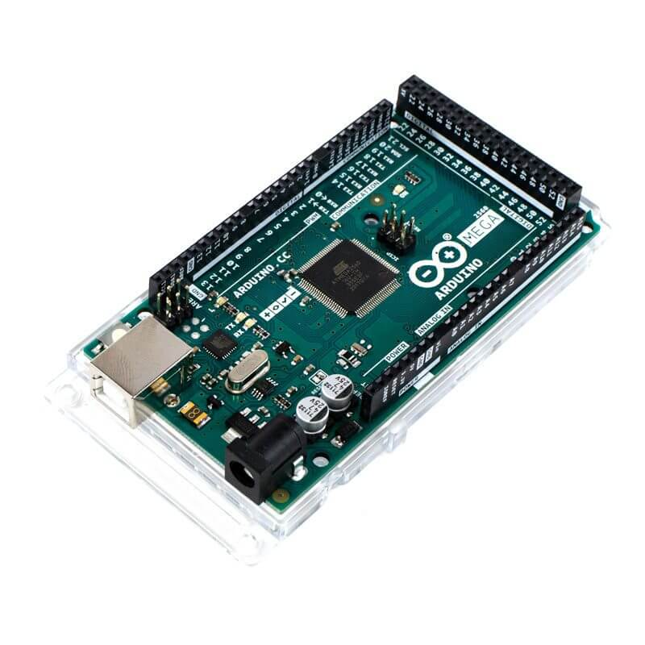 | ≈ 24.46 Dlls |
| Motor DC con Encoder: GA37-520 300RPM | 5.55-16.65W | 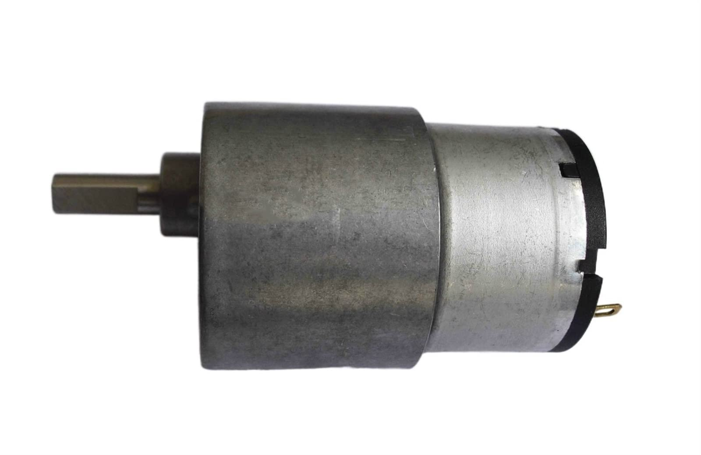 | ≈ 22.12 Dlls |
| Puente H TB6612FNG | 0.025W | 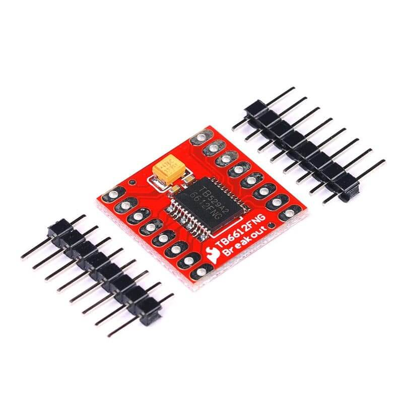 | ≈ 4.35 Dlls |
| Servo Motor: MG90S | 0.5-2.5W | 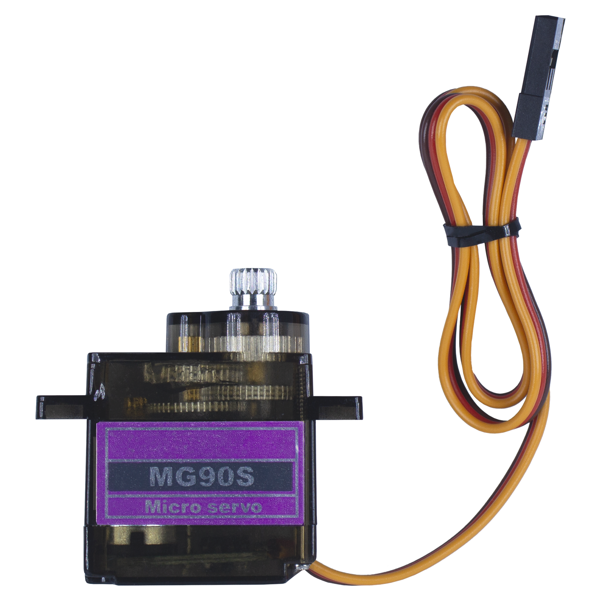 | ≈ 4.08 Dlls |
| Sensor Ultrasonico: HC-SR04P x1 (frontal) | 0.075W | 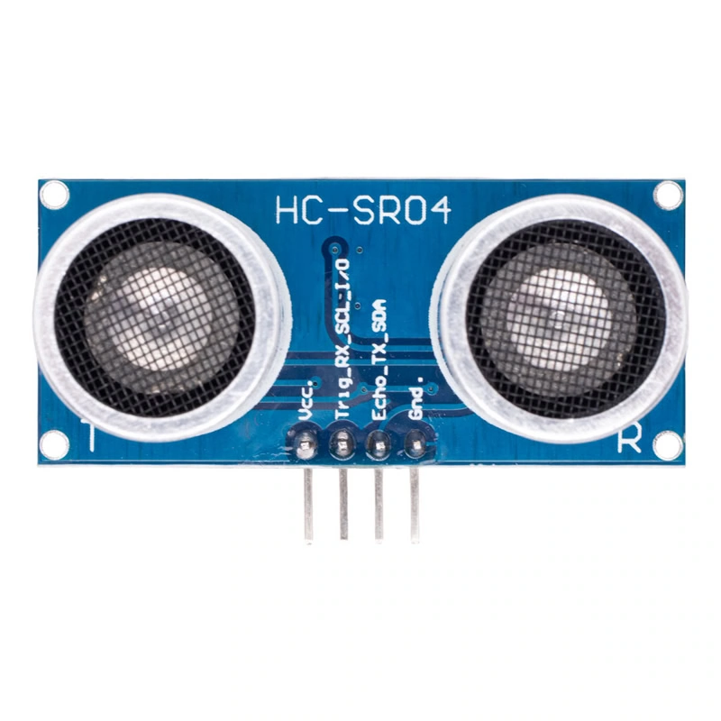 | ≈ 0.90 Dlls |
| Sensor Láser ToF: VL53L0X x2 (laterales) | ≈ 0.10W | 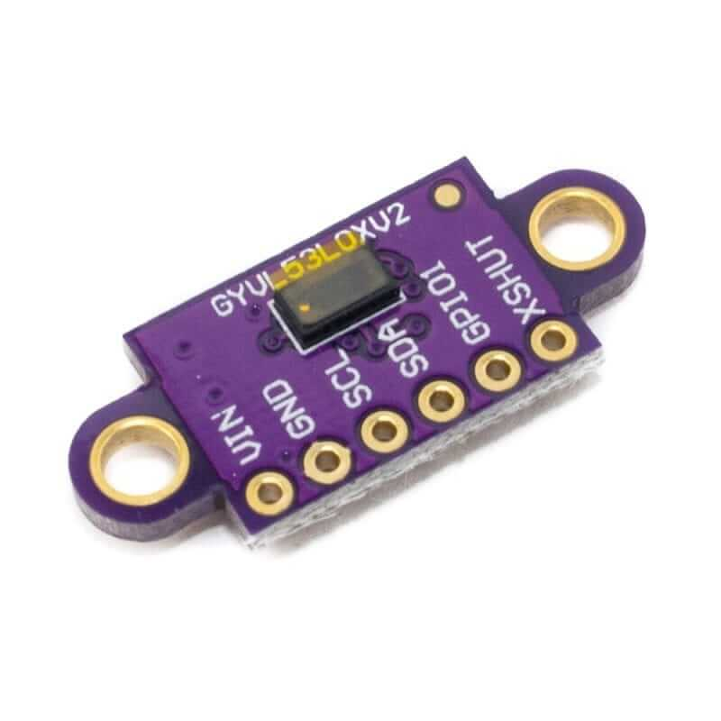 | ≈ 9.00 Dlls |
| Acelerometro/Giroscopio: GY-9250 | 0.033W | 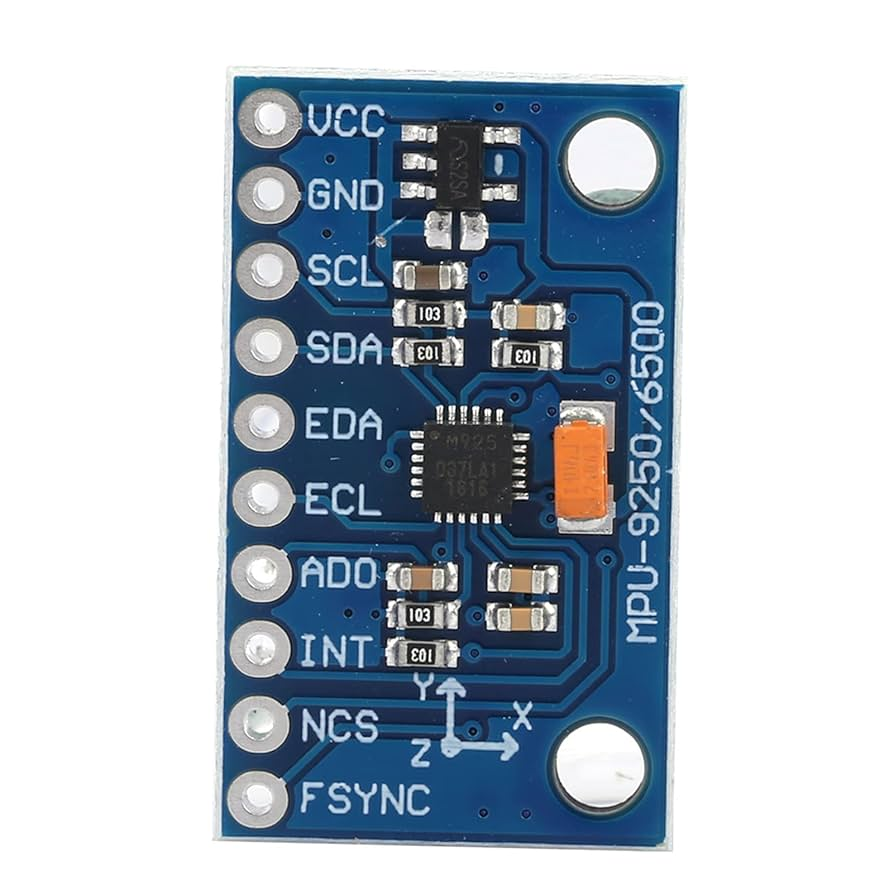 | ≈ 9.24 Dlls |
| LED x4 | 0.264W | 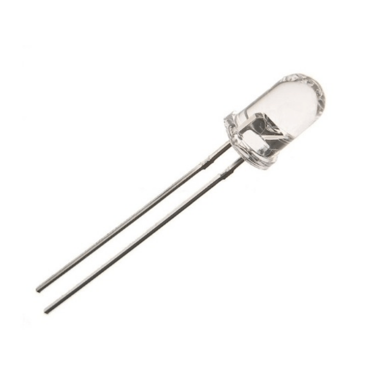 | ≈ 0.44 Dlls |
| Buzzer | N/A | 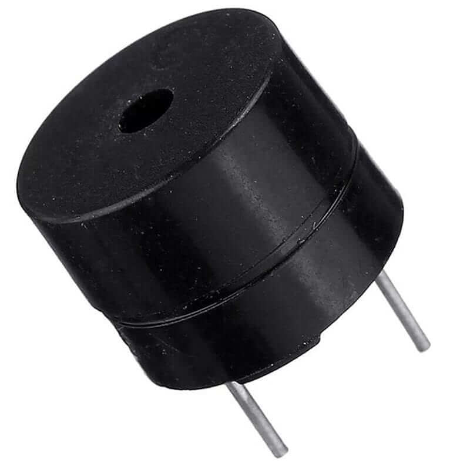 | ≈ 0.27 Dlls |
| SEN0336 HuskyLens PRO OV5640 | 3.3~5.0V | 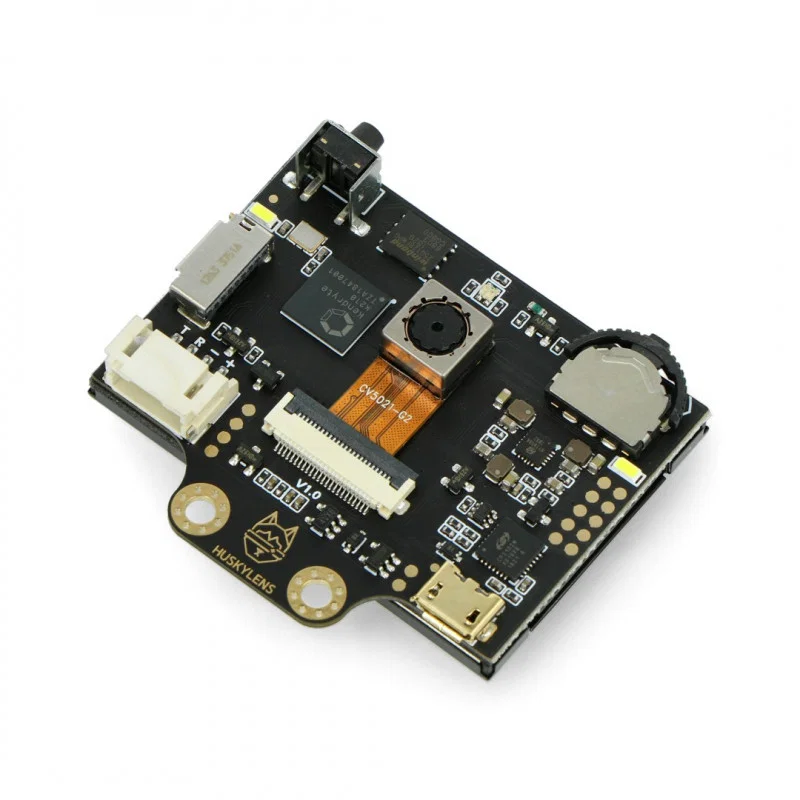 | ≈ 40.65 Dlls |
| Sensor Infrarrojo (Seguimiento de Línea): MH Sensor Series x1 (trasero inferior) | 0.05-0.075W | 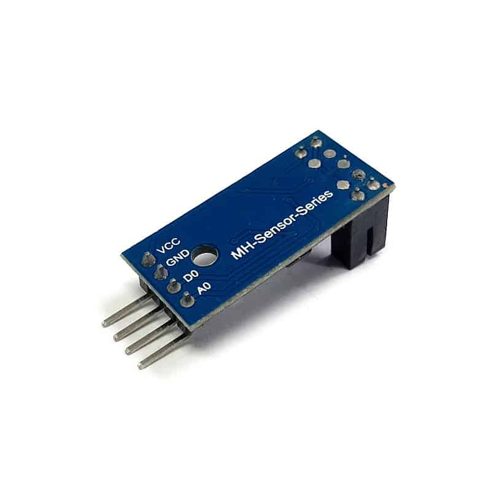 | ≈ 1.50 Dlls* |
| **Total** | | | **≈ 117.50 Dlls*** |
 
[⬆ Volver al índice](#indicleto)
