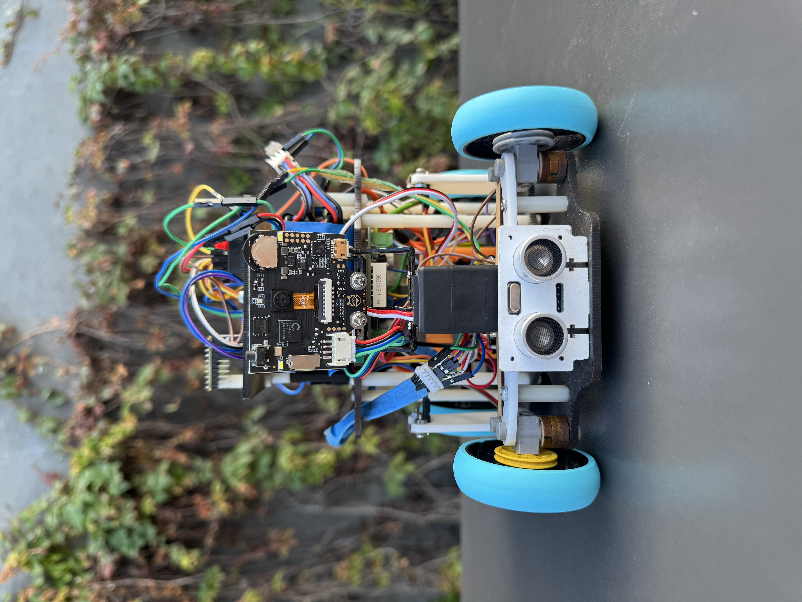
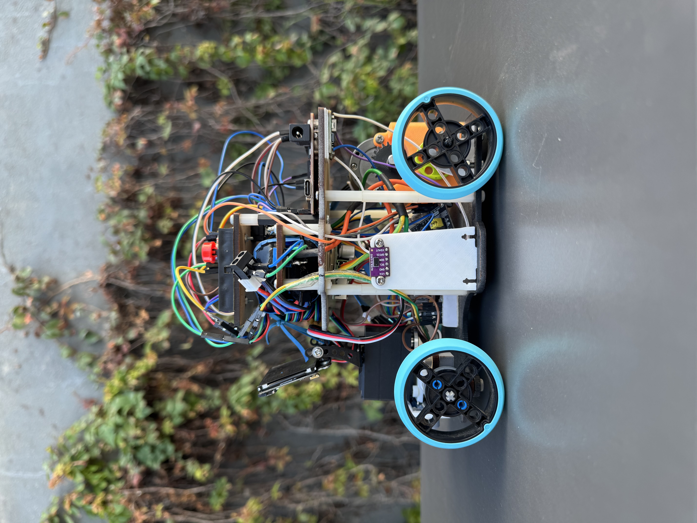
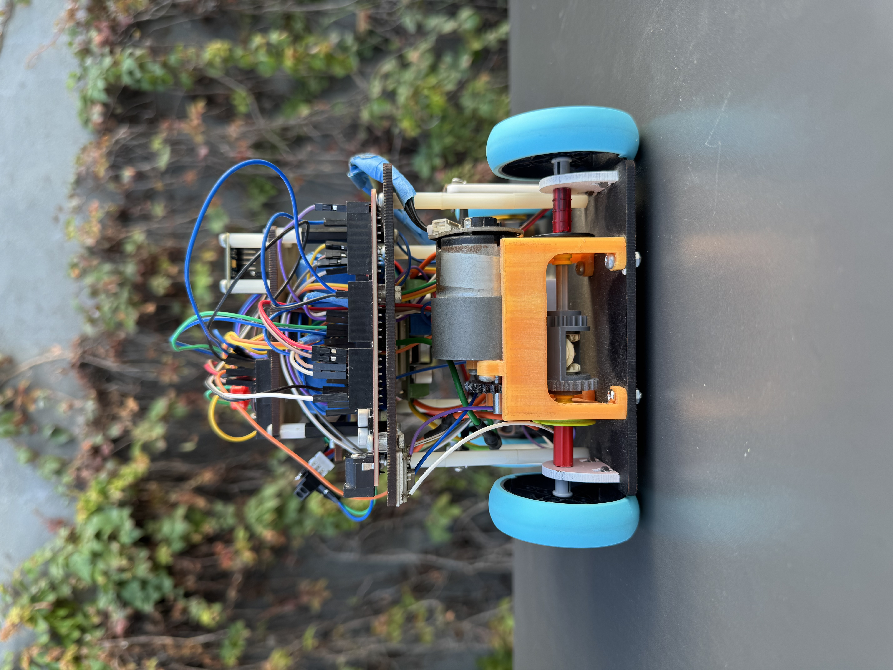
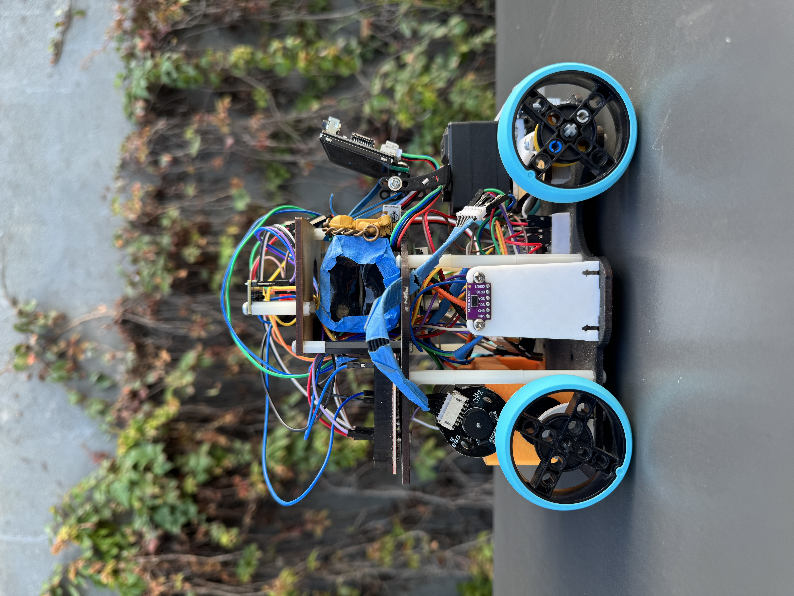
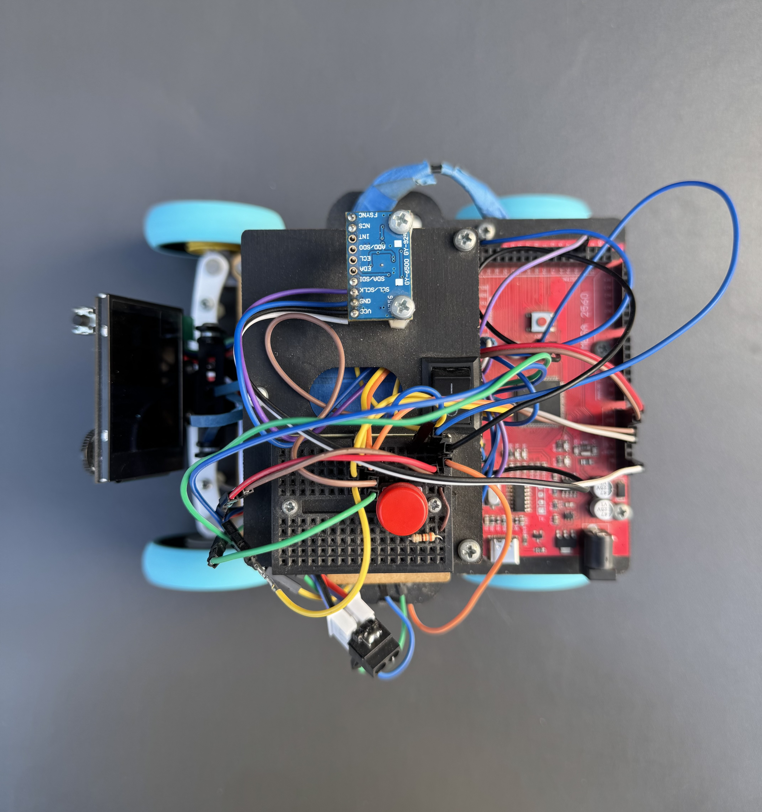
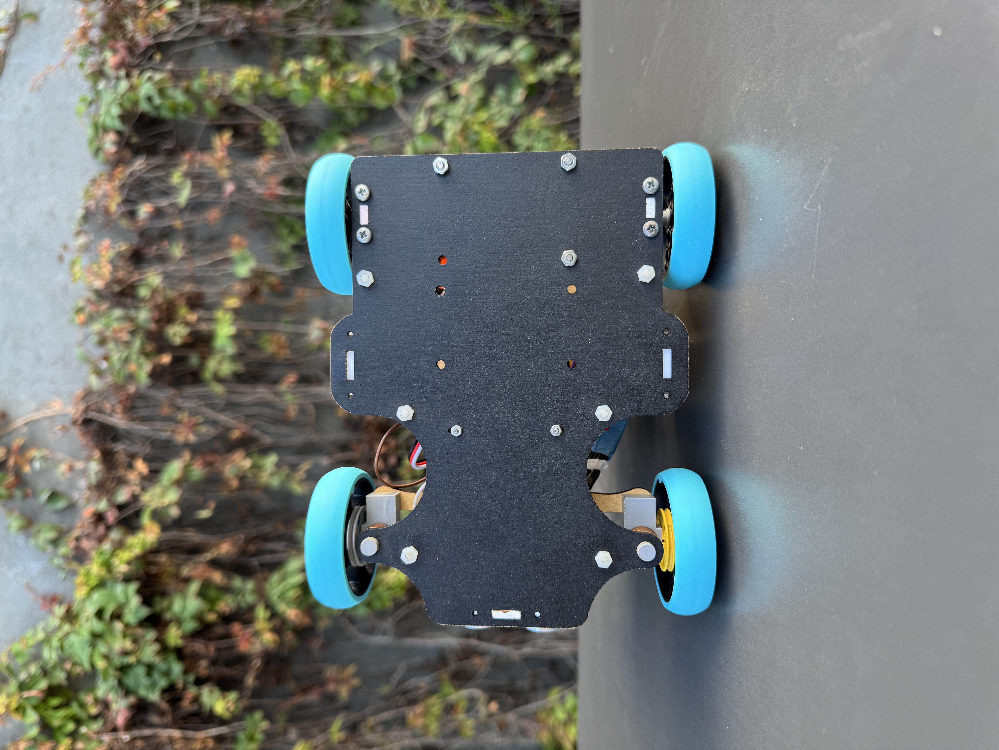
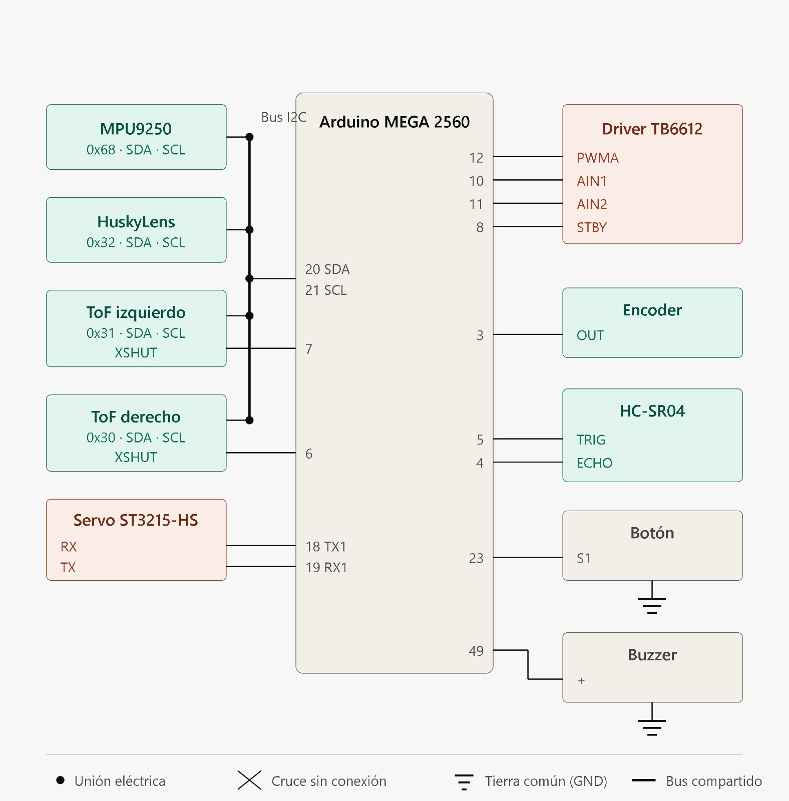
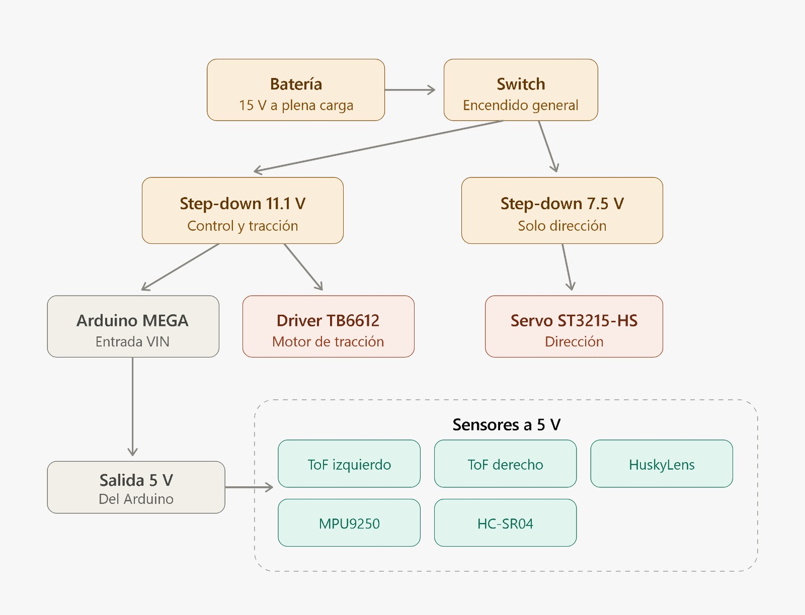
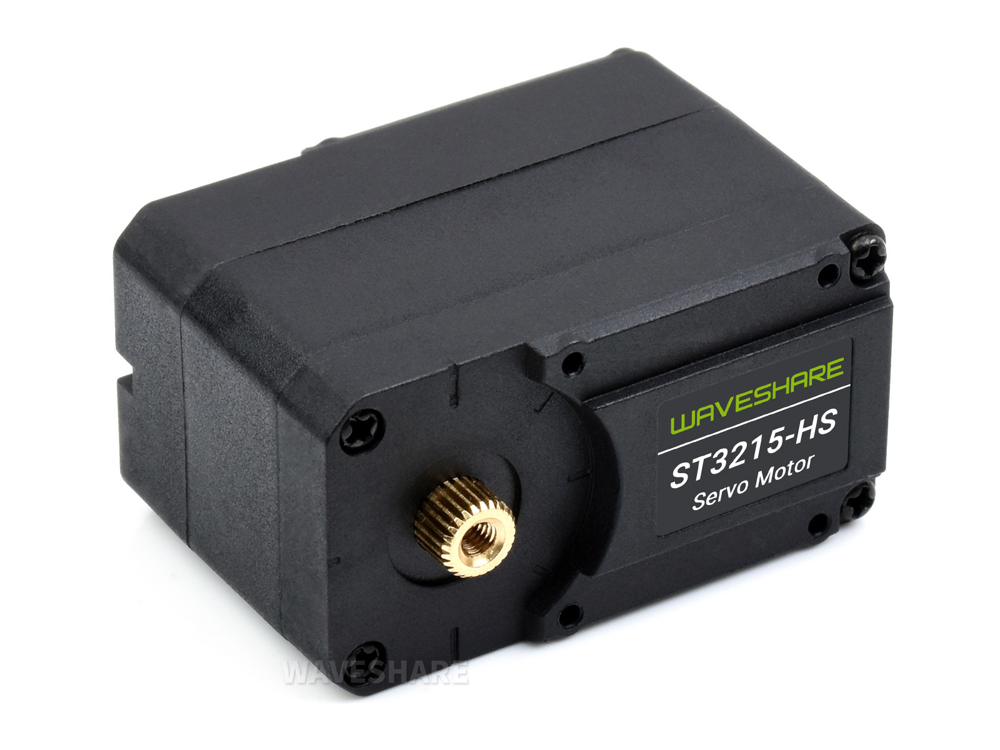

# Equipo Bunker Romeo – WRO Future Engineers 2026

   

<a id="indicleto"></a>
 
## Índice
 
1.  [Acerca del Equipo](#acerca-del-equipo)
2.  [Resumen del Proyecto](#resumen-proyecto)
3.  [1. Movilidad y Diseño Mecánico](#movilidad-mecanico)
   - [Piezas de Diseño Mecánico (CAD)](#piezas-cad)
   - [Fotos del Vehículo (Estado Actual)](#fotos-del-vehiculo)
4.  [2. Arquitectura de Potencia y Sensores](#arquitectura-potencia)
5.  [3. Arquitectura de Software y Estrategia de Obstáculos](#arquitectura-software)
   - [3.1 Open Challenge](#open-challenge-sw)
   - [3.2 Obstacle Challenge](#obstacle-challenge-sw)
     - [1. Marco del reto y objetivos de diseño](#marco-del-reto)
     - [2. Arquitectura general: máquina de estados](#maquina-de-estados)
     - [3. Conjunto de sensores y asignación de funciones](#sensores-obstaculos)
     - [4. Control de rumbo recto](#control-rumbo-recto)
     - [5. Seguimiento de pilares](#seguimiento-pilares)
     - [6. Decisión de sorteo](#decision-sorteo)
     - [7. Detección de esquinas](#deteccion-esquinas)
     - [8. Giro de esquina](#giro-esquina)
     - [9. Auto-ajuste por perfil de servo](#auto-ajuste-servo)
     - [10. Ingeniería defensiva](#ingenieria-defensiva)
     - [11. Odometría y separación de contadores](#odometria)
     - [12. Metodología y decisiones revertidas](#metodologia-decisiones-revertidas)
6.  [4. Pensamiento Sistémico y Decisiones de Ingeniería](#bitacora-decisiones)
7.  [5. Reproducibilidad y Estructura del Repositorio](#reproducibilidad)
8.  [Videos de la Competencia](#videos-de-la-competencia)
   - [Open Challenge](#open-challenge)
   - [Obstacle Challenge](#obstacle-challenge)
9.  [BOM (Bill of Materials)](#bom)
---
 
## Acerca del Equipo

Somos **Equipo Bunker Romeo**, de Bunker Robotics, en Baja California, México. Este es nuestro segundo año participando en la categoría Future Engineers, y comenzamos la preparación de esta temporada en enero de 2025. Entre los dos sumamos experiencia en las categorías Robomission Junior, Robomission Senior y Future Engineers.

<div align="center">

</div>

### Jacobo Arteaga Castañeda

**Edad:** 21 años
**Rol:** Operación y desempeño del robot

Compito en WRO desde los 13 años, pasando por las categorías Robomission Junior, Robomission Senior y, desde la temporada 2025, Future Engineers. He tenido la oportunidad de representar a México en la Final Internacional en dos ocasiones: 2021 y 2025. Dentro del equipo soy el responsable de la operación del robot en pista — la puesta a punto antes de cada ronda, el manejo del vehículo durante las corridas de prueba y la lectura del comportamiento real del robot, que es de donde salen la mayoría de los ajustes documentados en la bitácora de este repositorio.

### Ian Fernando Rivera Armenta

**Edad:** 18 años
**Rol:** Documentación y repositorio

Llevo un año en la competencia. Me preparé para Robomission Senior en la temporada 2024 y debuté en Future Engineers, donde en mi primer regional obtuvimos el reconocimiento como mejor equipo. Dentro del equipo soy el responsable del repositorio y de la documentación de ingeniería: mantener el registro de cada decisión de diseño, su justificación y la evidencia que la respalda, además de la organización del código y los archivos técnicos que se publican aquí.

[⬆ Volver al índice](#indicleto)
 
---
 
<a id="resumen-proyecto"></a>

## Resumen del Proyecto

Vehículo autónomo desarrollado para la categoría **WRO Future Engineers 2026**, construido sobre un Arduino Mega 2560 con tracción trasera por motor único y dirección por servomotor. El robot resuelve los dos retos con estrategias de navegación distintas: seguimiento de muro por PID en el Open Challenge, y una máquina de estados con visión por color en el Obstacle Challenge.

| | |
|---|---|
| **Dimensiones** | 18.8 × 14.6 × 20.3 cm (largo × ancho × alto) — límite reglamentario: 30 × 20 × 30 cm |
| **Peso** | 817 g — límite reglamentario: 1.5 kg |
| **Tracción** | Motor GA37-520 (300 RPM) con transmisión 1:1 a las ruedas |
| **Percepción** | 2 × VL53L0X (ToF lateral), HC-SR04P (frontal), MPU9250 (rumbo), HuskyLens (color), encoder (odometría) |
| **Mejor tiempo Open Challenge** | **75 s** (3 vueltas + detención en sección de inicio) |
| **Corrida Obstacle Challenge** | **2 min 18 s** completos, autónomos, sin desplazar señales |

**Resultados medidos que respaldan las decisiones de diseño:**

- Reducción del tiempo de Open Challenge de **95 s → 75 s** (≈21 %) al migrar la navegación de rumbo por giroscopio a seguimiento de muro con sensores láser, lo que permitió subir la velocidad del robot sin perder precisión de trayectoria (Decisión 9).
- Corrección de una fuente mecánica de deriva que desviaba la trayectoria recta, eliminando las autocorrecciones constantes del robot en tramo largo (Decisión 13).
- Reducción del footprint del chasis en 2 cm de largo y 2 cm de ancho respecto a la temporada anterior (Decisión 3).
- Altura total reducida de 23.9 cm a **20.3 cm** con el cambio de ruedas (Decisión 3).

[⬆ Volver al índice](#indicleto)
 
---
 
<a id="movilidad-mecanico"></a>

## 1. Movilidad y Diseño Mecánico

> [!NOTE]
> El razonamiento detrás de cada decisión mecánica —qué alternativas se consideraron y por qué se eligió cada solución— se documenta a detalle en la [Bitácora de Decisiones de Ingeniería](#bitacora-decisiones).

| Aspecto | Especificación actual |
|---|---|
| Ruedas | 57 × 14 mm (Lego Spike Prime) |
| Altura total | 20.3 cm |
| Largo total | 18.8 cm |
| Ancho total | 14.6 cm |
| Peso total | 817 g |
| Controlador principal | Arduino Mega 2560 |

> [!NOTE]
> El chasis fue rediseñado a partir de una versión anterior que usaba ruedas de 62.4 × 20 mm (altura 23.9 cm, ancho 15 cm). Razonamiento completo en la Bitácora, **Decisión 3**.

> [!NOTE]
> Se corrigió un orificio de eje mal dimensionado en el soporte impreso del motor, que causaba una deriva excesiva (~45°) al avanzar en línea recta. La deriva se redujo considerablemente tras el ajuste, aunque persiste en menor grado. Razonamiento completo en la Bitácora, **Decisión 13**.

### Análisis de velocidad y par en rueda

La transmisión entre el motor y las ruedas usa engranes de **1:1** (mismo número de dientes en ambos, por lo que giran a la misma velocidad angular) — es decir, las RPM de la rueda son las mismas que las RPM del motor, sin reducción ni multiplicación.

**Velocidad lineal teórica.** Con el motor **GA37-520** a **300 RPM** (ficha) y ruedas de **57 mm de diámetro**:

```
v = π × D_rueda × RPM / 60
v = π × 0.057 m × 300 / 60
v ≈ 0.895 m/s  (≈ 89.5 cm/s ≈ 3.22 km/h)
```

Esta es la velocidad lineal máxima teórica sin carga; en pista, la velocidad real es menor por la fricción, el peso del robot y el control por PWM.

**Par en la rueda.** El BOM reporta un rango de potencia del motor de **5.55–16.65 W**. A 300 RPM, la velocidad angular es ω = 2π × 300/60 ≈ 31.42 rad/s. Con τ = P/ω:

| | Potencia | Par (τ = P/ω) | Fuerza en el suelo (F = τ / r, r = 28.5 mm) |
|---|---|---|---|
| Mínimo | 5.55 W | ≈ 0.177 N·m (≈ 1.80 kgf·cm) | ≈ 6.2 N (≈ 0.63 kgf) |
| Máximo | 16.65 W | ≈ 0.530 N·m (≈ 5.40 kgf·cm) | ≈ 18.6 N (≈ 1.90 kgf) |

Como la relación de transmisión es 1:1, el par disponible en la rueda es el mismo que el par de salida del motor — no hay ganancia ni pérdida mecánica por relación de engranes, a diferencia de una transmisión reductora.

**Relación con el resultado empírico.** La velocidad teórica de arriba solo se aprovecha si el robot puede correr cerca de ella sin perder el rumbo, y ahí es donde el análisis mecánico se conecta con las decisiones de navegación. Con una transmisión 1:1 no existe una reducción que amortigüe los errores de trayectoria: cada grado de deriva se traduce directamente en distancia recorrida de más y en tiempo perdido autocorrigiendo. Por eso, mientras la navegación dependía del rumbo por giroscopio, la velocidad tenía que mantenerse baja para que el error acumulado no creciera — y el recorrido tomaba **95 segundos**. Al pasar a seguimiento de muro (Bitácora, **Decisión 9**), la referencia dejó de acumular error y pudimos subir la velocidad hasta **75 segundos**. La corrección de deriva mecánica posterior (**Decisión 13**) atacó el mismo problema desde el lado del hardware, permitiendo que esa velocidad se sostuviera en línea recta.

<a id="piezas-cad"></a>

### Piezas de Diseño Mecánico (CAD)

> [!NOTE]
> Todos los archivos `.STL` referenciados aquí están disponibles en la carpeta [`/cad`](cad/) del repositorio. Las dimensiones de cada pieza (caja delimitadora) se obtuvieron directamente del archivo 3D, no son estimaciones.

#### Soporte del sensor láser (VL53L0X)

El soporte impreso en 3D de los sensores láser VL53L0X se rediseñó para elevar al sensor **casi 4 cm por encima** del soporte anterior de MDF. Esta corrección de altura resuelve directamente el hallazgo documentado en la Bitácora (**Decisión 12/13**): el soporte de MDF dejaba al sensor con una leve inclinación hacia el piso, lo que producía falsas lecturas de cercanía (el sensor "veía" el suelo en lugar del muro lateral). Con la nueva geometría, el sensor mide de forma más constante y confiable.

- **Archivo:** [`SoporteLaser.STL`](cad/SoporteLaser.STL)
- **Material:** impreso en 3D (PLA)
- **Dimensiones (caja delimitadora):** 33.9 × 3.1 × 58.6 mm

> [!NOTE]
> Con esta pieza, la falla de montaje que documentamos como "en proceso" en la Bitácora (**Decisión 12**) queda **resuelta** — lo actualizamos en esa entrada.

#### Enlace de dirección y soporte del servomotor

Durante nuestras pruebas encontramos que el barreno de conexión entre el servomotor y el enlace de dirección no estaba centrado: se hallaba desplazado unos milímetros hacia la izquierda. Esto no impedía que el robot funcionara, pero sí desfasaba el ángulo real de las ruedas respecto al ángulo que el servomotor reportaba como centro — es decir, "centro de servo" y "ruedas alineadas" ya no eran el mismo punto. Corregimos la posición del barreno y, aprovechando el rediseño, modificamos también el soporte del servomotor para alojar nuestro nuevo servomotor **ST3215-HS** (ver [Arquitectura de Software](#arquitectura-software) y [Arquitectura de Potencia](#arquitectura-potencia)).
cad/S25_Soporte_Servo_Rev_8.STL
- **Archivo:** [`R26_EnlaceDireccion_Rev7.STL`](cad/R26_EnlaceDireccion_Rev7.STL)[`S25_Soporte_Servo_Rev_8.STL`](cad/S25_Soporte_Servo_Rev_8.STL)
- **Material:** corte en material plano (el enlace en sí no es impreso; el soporte del servomotor que lo acompaña sí es impreso en 3D con PLA)
- **Dimensiones (caja delimitadora):** 116.4 × 3.1 × 17.4 mm

#### Mangueta de dirección

La mangueta es la pieza que se ubica en cada extremo del sistema de dirección y conecta la rueda con el enlace de dirección. Funciona como un pivote: por un lado sostiene el eje/buje de la rueda, y por el otro se articula tanto con el chasis (definiendo el eje de giro de la dirección) como con el enlace de dirección, que es el que recibe el movimiento del servomotor. Cuando el servomotor mueve el enlace de dirección, este empuja o jala la mangueta, haciéndola rotar sobre su propio pivote — y como la rueda está montada directamente en la mangueta, ese giro se traduce en el cambio de ángulo de la rueda. En otras palabras, la mangueta es la que convierte el movimiento lineal/angular del enlace de dirección en el giro real de la rueda.

- **Archivo:** [`S25_Mangueta_Rev_2.STL`](cad/S25_Mangueta_Rev_2.STL)
- **Material:** impreso en 3D (PLA)
- **Dimensiones (caja delimitadora):** 14.4 × 31.9 × 21.0 mm

#### Soporte de motor y transmisión

El eje de salida del motor de tracción está acoplado a ejes Lego, que a su vez conectan directamente con las ruedas. Un soporte personalizado mantiene estos ejes alineados a **180°** entre sí, evitando que se flexionen. Esto es importante por dos razones: evita que se genere una fuerza adicional no deseada sobre el eje Z del motor (que reduciría su vida útil y afectaría la transmisión de potencia), y mantiene un comportamiento consistente y predecible en cada prueba. Esta pieza es de la misma familia que la que corregimos en la Bitácora (**Decisión 13**, orificio de eje mal dimensionado que causaba deriva); esta revisión (**Rev 4B**) es la versión actual, con los ejes correctamente alineados y sin problemas de flexión reportados.

- **Archivo:** [`S25_Soporte_de_motor_y_transmision_Rev_4B.STL`](cad/S25_Soporte_de_motor_y_transmision_Rev_4B.STL)
- **Material:** impreso en 3D (PLA)
- **Dimensiones (caja delimitadora):** 44.5 × 51.8 × 63.5 mm

#### Plataforma / soporte superior

Primer piso del chasis, donde se monta parte de la electrónica del robot.

- **Archivo:** [`R26_piso_1_rev2.STL`](cad/R26_piso_1_rev2.STL)
- **Dimensiones (caja delimitadora):** 114.9 × 3.1 × 26.8 mm

#### Chasis

El chasis se modificó a inicios de esta temporada con el objetivo de reducir el tamaño total del robot y optimizar el acomodo interno de los componentes electrónicos. Como resultado, el chasis actual es **2 cm más corto y 2 cm más angosto** que la versión anterior.

- **Archivo:** [`S25_chasis_rev18.STL`](cad/S25_chasis_rev18.STL)
- **Dimensiones (caja delimitadora):** 177.8 × 3.1 × 135.7 mm

> [!NOTE]
> Material confirmado: la **Mangueta**, el **Soporte de motor y transmisión**, el **Soporte del sensor láser** y el **soporte del servomotor** (parte de la pieza "Enlace de dirección y soporte del servomotor") son impresos en 3D con **PLA**. El **Enlace de dirección** (la barra en sí) es de corte en material plano, no PLA. El **Chasis** y la **Plataforma/Soporte** tienen un espesor uniforme de 3.1 mm en el archivo, consistente con corte en material plano (MDF/acrílico).

<a id="fotos-del-vehiculo"></a>

### Fotos del Vehículo (Estado Actual)

<table align="center">
<tr>
<td align="center"><br><sub>Vista Frontal</sub></td>
<td align="center"><br><sub>Vista Lateral Izquierda</sub></td>
<td align="center"><br><sub>Vista Trasera</sub></td>
</tr>
<tr>
<td align="center"><br><sub>Vista Lateral Derecha</sub></td>
<td align="center"><br><sub>Vista Superior</sub></td>
<td align="center"><br><sub>Vista Inferior</sub></td>
</tr>
</table>

[⬆ Volver al índice](#indicleto)
 
---
 
<a id="arquitectura-potencia"></a>

## 2. Arquitectura de Potencia y Sensores

> [!NOTE]
> Esta sección detalla cómo se reparte la energía dentro del robot —de la batería a cada sensor y actuador— y el presupuesto de corriente que resulta de esa distribución.

### Topología de alimentación

El robot se alimenta de una sola batería de **15 V**, que pasa primero por un **switch** general y de ahí se reparte entre **dos ramas de regulación step-down**: una hacia control y tracción, y otra dedicada en exclusiva a la dirección.

- **Regulador a 11.1 V:** su salida alimenta directamente al **motor de tracción** (a través del puente H TB6612FNG) y al **Arduino Mega** por su entrada Vin. De los **5 V** que el propio Arduino regula internamente se alimentan los sensores: los **dos sensores láser** (VL53L0X), el **girosensor** (MPU9250/GY-9250), la **cámara** (HuskyLens) y el **sensor ultrasónico** (HC-SR04P).
- **Regulador a 6 V:** alimenta, en línea dedicada, al **servomotor del Open Challenge (MG90S)**.
- **Regulador a 7.5 V:** alimenta, también en línea dedicada, al **servomotor del Obstacle Challenge (Waveshare ST3215-HS)**.

Ambos servos tienen su propia línea de alimentación exclusiva (no comparten regulador con ningún otro componente) porque consideramos que el servomotor es la variable principal de posicionamiento para resolver los retos: si no tiene la corriente disponible en el momento exacto, toda la precisión de dirección se ve comprometida.

<div align="center">

<br><sub>Topología de alimentación: batería → switch → tres ramas de regulación (11.1 V control/tracción, 6 V servo Open Challenge, 7.5 V servo Obstacle Challenge).</sub>
</div>

```
Batería 15 V → Switch ─┬─ Regulador 11.1 V ─┬─ Motor de tracción (vía TB6612FNG)
                        │                    └─ Arduino Mega → (5 V) → VL53L0X ×2, GY-9250, HuskyLens, HC-SR04P
                        ├─ Regulador 6 V   ──── Servomotor MG90S (Open Challenge, línea dedicada)
                        └─ Regulador 7.5 V ──── Servo ST3215-HS (Obstacle Challenge, línea dedicada)
```

### Diagrama de conexiones (pines)

<div align="center">

<br><sub>Conexión de cada componente a los pines del Arduino Mega 2560: PWMA/AIN1/AIN2/STBY (12, 10, 11, 8) al driver TB6612; XSHUT (7, 6) y bus I2C (20 SDA, 21 SCL) para los VL53L0X, MPU9250 y HuskyLens; encoder en el pin 3; HC-SR04P en TRIG/ECHO (5, 4); Serial1 (18 TX1, 19 RX1) para el servo ST3215-HS; botón en el pin 23; buzzer en el pin 49.</sub>
</div>

### Presupuesto de corriente

| Componente | Imagen | Voltaje de uso | Consumo de corriente |
|---|---|---|---|
| Sensor láser VL53L0X |  | 5 V | ≈ 10 mA (x2) |
| Sensor ultrasónico HC-SR04P |  | 5 V | ≈ 15 mA |
| Girosensor GY-9250 |  | 5 V | ≈ 6.6 mA |
| Servomotor MG90S (Open Challenge) |  | 6 V | ≈ 83–417 mA |
| Servo ST3215-HS (Obstacle Challenge) |  | 7.5 V | ≈ 100–900 mA |
| Motor de tracción GA37-520 |  | 11.1 V | ≈ 500–1500 mA |
| Cámara HuskyLens |  | 5 V | ≈ 320 mA |
| Arduino Mega 2560 |  | 11.1 V | ≈ 22.5–45 mA |
| **Total (Open Challenge)** | | | **≈ 967 mA – 2.32 A** |
| **Total (Obstacle Challenge)** | | | **≈ 984 mA – 2.80 A** |

> [!NOTE]
> Cada consumo se obtuvo de la ficha técnica del componente, referido al voltaje real al que opera en este circuito. Los totales suman corriente de rieles distintos (5 V, 6 V/7.5 V y 11.1 V) según el reto; la corriente que efectivamente entrega la batería es menor y depende de la eficiencia de cada regulador step-down.

[⬆ Volver al índice](#indicleto)
 
---
 
<a id="arquitectura-software"></a>

## 3. Arquitectura de Software y Estrategia de Obstáculos

> [!NOTE]
> Esta sección cuenta, en nuestras propias palabras, **cómo y por qué** funciona el software del robot en cada reto: la arquitectura de control, qué sensor hace qué, el código real que corre en el Arduino, y el razonamiento (y los tropiezos) detrás de cada subsistema. Complementa a la [Bitácora de Decisiones de Ingeniería](#bitacora-decisiones), que lleva la línea de tiempo de los cambios de hardware/algoritmo a nivel de proyecto.

<a id="open-challenge-sw"></a>

### 3.1 Open Challenge

En el Open Challenge no hay pilares que sortear, así que el problema se reduce a completar 3 vueltas (12 esquinas en total) manteniendo una distancia constante a un muro y girando con precisión en cada esquina. Por eso este programa es más simple que el del Obstacle Challenge: no usa cámara de color, y el servo de dirección es un **MG90S** estándar controlado con la librería `Servo` de Arduino (a diferencia del servo de bus serial que usamos en el Obstacle Challenge).

**Hardware que usa este programa:** servomotor MG90S (dirección), sensor ultrasónico HC-SR04P (frontal), dos VL53L0X laterales (seguimiento de muro), giroscopio MPU6050 vía librería `MPU6050_light` (rumbo y giros), encoder (tramo final), y el puente H TB6612FNG (motor de tracción).

**Detección de esquina y sentido de giro.** El robot avanza hasta que el ultrasónico frontal detecta una pared a **30 cm o menos** (`TD = 30`). En la primerísima esquina de toda la ronda, y solo ahí, compara las dos lecturas laterales VL53L0X (`decideSentido()`): el lado que ve más lejos es el interior de la pista, y ese es el sentido de giro que se usa durante **las 12 esquinas** de la ronda, sin volver a recalcularlo.

**Tramo recto.** Antes de la primera esquina el robot todavía no tiene un muro "conocido" que seguir, así que avanza en línea recta usando el giroscopio (`conduceRectoGiro()`: un control proporcional que corrige el volante para mantener el rumbo en 0°). De la segunda esquina en adelante, cada tramo recto se recorre con **seguimiento de muro por PID** (`Kp=17, Ki=0.5, Kd=35`, punto de ajuste de **15 cm**, función `Wallfolowing()`), siempre sobre el lado **exterior** de la pista — el sensor contrario al lado de giro — porque el muro exterior es continuo, mientras que el interior tiene aberturas en cada esquina.

> [!NOTE]
> **Método de calibración de las ganancias PID:** las tres ganancias se ajustaron de forma empírica y en este orden: primero **Kp**, subiéndola hasta que el robot oscilara visiblemente contra el muro y luego bajándola un escalón; después **Kd**, para amortiguar esa oscilación sin perder capacidad de reacción; y por último **Ki**, en un valor bajo, solo para corregir el desvío sostenido que quedaba en tramos largos. El punto de ajuste de 15 cm se eligió porque deja margen suficiente tanto en el corredor angosto (600 mm) como en el ancho (1000 mm) que define el reglamento para el Open Challenge, sin acercar demasiado al robot al muro interior en el corredor angosto.

**Maniobra de giro.** Al detectar la pared frontal, el robot cierra el giro en lazo con el giroscopio hasta alcanzar un ángulo objetivo (`Giros()`). Estos ángulos se calibraron de forma empírica y son acumulativos dentro de cada vuelta (se reinician cada 4 esquinas): **60°** en la 1ª esquina de la vuelta, **120°** en la 2ª, **182°** en la 3ª y **241°** en la 4ª. Al terminar, el robot reduce su velocidad y continua siguiendo la pared hasta contar cierta cantidad de pulsos con el encoder, y el robot se detiene.

**Cierre de la ronda.** Tras completar las 12 esquinas, el robot reduce la velocidad y continúa con seguimiento de muro por una distancia fija adicional (2555 pulsos de encoder) antes de detenerse — este tramo final lo acerca a la zona de estacionamiento.

<details>
<summary>📄 Ver código completo — Open Challenge (<code>abierto.ino</code>)</summary>

```cpp
#include <Adafruit_VL53L0X.h>  // ToF sensor Library
#include <Servo.h>             // Servomotor Library
#include <Wire.h>              // I2C Library
#include <MPU6050_light.h>     // MPU Library
MPU6050 mpu(Wire);

// Variables para el yaw
float yaw = 0.0;
unsigned long lastTime = 0;
float gyroZOffset = 0.0;

// Para calibración
bool calibrated = false;
const int CALIBRATION_SAMPLES = 510;

volatile int Contador = 0;

unsigned long Cont = 0;
bool izq = false;

float global = 0;

//PID Wall Follower variables
float P, I, D, error, L_error, Servo_OUT, DeltaError, SumError, PID;
float setpoint = 15;  //Centimetros
float Kp = 17, Ki = 0.5, Kd = 35;
float Ts = 0.5;  // Tiempo de sampleo para la suma de la integral

//Trasnmision Motor
const int STBY = 8;
const int PWMA = 12;
const int AIN1 = 10;
const int AIN2 = 11;

//Servo Direccion
Servo SvD;

//Ultrasonic Frontal Sensor
const int triggerPin3 = 5;
const int echoPin3 = 4;
volatile float distanceF;

//ToF Lateral Sensors
#define XSHUT1 6
#define XSHUT2 7
Adafruit_VL53L0X sensor1 = Adafruit_VL53L0X();
Adafruit_VL53L0X sensor2 = Adafruit_VL53L0X();
float medidaD, medidaI;

//Algorithim Variables/Values
float TD = 30;  //Target frontal distance ... CM
bool Turn = true;
bool Orientation = false;
bool Giro = false;
int CV;

int sentidoGiro = 2;     // se decide solo en el 1er corner: 1=derecha, 2=izquierda
float Kp_rumbo = 3.0;    // ganancia del rumbo recto por giroscopio (1er tramo)

void setup() {
  Serial.begin(115200);
  Wire.begin();

  pinMode(3, INPUT_PULLUP);
  attachInterrupt(digitalPinToInterrupt(3), inter, RISING);

  pinMode(triggerPin3, OUTPUT);
  pinMode(echoPin3, INPUT);

  Wire.beginTransmission(0x68);
  Wire.write(0x6B);
  Wire.write(0);
  Wire.endTransmission(true);

  pinMode(STBY, OUTPUT);
  pinMode(PWMA, OUTPUT);
  pinMode(AIN1, OUTPUT);
  pinMode(AIN2, OUTPUT);
  // The motor begins off
  digitalWrite(STBY, LOW);

  pinMode(XSHUT1, OUTPUT);
  pinMode(XSHUT2, OUTPUT);

  SvD.attach(A1);
  delay(50);
  tone(49, 293, 125);
  delay(50);

  SvD.write(105);
  delay(400);

  byte status = mpu.begin();
  while (status != 0) {}

  mpu.calcOffsets();  // Calibración interna de la librería
  calibrateGyroZ();   // Calibración adicional específica para Z

  lastTime = millis();
  calibrated = true;

  tone(49, 1000, 125);

  // Apagar los tres sensores
  digitalWrite(XSHUT1, LOW);
  digitalWrite(XSHUT2, LOW);
  delay(10);

  // Encender sensor 1 y darle dirección 0x30
  digitalWrite(XSHUT1, HIGH);
  delay(10);
  sensor1.begin(0x30);

  // Encender sensor 2 y darle dirección 0x31
  digitalWrite(XSHUT2, HIGH);
  delay(10);
  sensor2.begin(0x31);
  
}

void loop() {

  while (CV < 12) {
    distanceF = TD + 3;
    SUSF();
    delay(20);

    if (distanceF <= TD) {
      if (CV == 0) decideSentido();     // 1er corner: decide el sentido de TODAS las vueltas
      Giros(sentidoGiro, 175, 60);
      tone(49, 290, 75);
      distanceF = TD + 100;
      CV++;
      delay(1);
      if (CV == 4 || CV == 8 || CV == 12) {
        global = 0;
        yaw = 0;
      }
      SvD.write(105);
    } else {
      if (CV == 0) {
        conduceRectoGiro();             // antes del 1er corner: avanza recto por giroscopio (sin seguir pared)
        moverMotor(200);
      } else {
        Wallfolowing();
        moverMotor(200);
      }
    }
  }
  if (CV >= 12) {
    moverMotor(120);
    while (Contador < (Cont + 2555)) {
      Wallfolowing();;
    }
    detenerMotores(1000000000000000000000000000000000000000000000000000);
  }
}


// ===== Decide el sentido de giro en el 1er corner: lee ambos ToF, gira al lado mas abierto =====
void decideSentido() {
  VL53L0X_RangingMeasurementData_t m1, m2;
  sensor1.rangingTest(&m1, false);
  sensor2.rangingTest(&m2, false);
  float izq = m1.RangeMilliMeter / 10.0;   // sensor1 = lado IZQUIERDO (medidaI)
  float der = m2.RangeMilliMeter / 10.0;   // sensor2 = lado DERECHO  (medidaD)
  Serial.print("izq="); Serial.print(izq);
  Serial.print("  der="); Serial.println(der);
  // El lado que mide MAS es el mas abierto -> se gira hacia ese lado.
  // Si decide al reves en tu robot, invierte esta comparacion (cambia > por <).
  if (izq > der) {
    Orientation = false; sentidoGiro = 2;              // abierto IZQUIERDA -> gira izquierda
    tone(49, 1200, 120); delay(160); tone(49, 1200, 120);
  } else {
    Orientation = true;  sentidoGiro = 1;              // abierto DERECHA -> gira derecha
    tone(49, 700, 250);
  }
  delay(150);
}

// ===== Avance recto por giroscopio (rumbo objetivo = 0), sin seguir pared =====
void conduceRectoGiro() {
  GradoZ();                                // actualiza yaw
  float err = 0 - yaw;                      // mantiene el rumbo inicial (yaw = 0)
  int salida = 105 + (int)(Kp_rumbo * err);
  salida = constrain(salida, 35, 160);
  SvD.write(salida);
}

void SUSF() {
  digitalWrite(triggerPin3, LOW);
  delayMicroseconds(2);
  digitalWrite(triggerPin3, HIGH);
  delayMicroseconds(10);
  digitalWrite(triggerPin3, LOW);
  long durationF = pulseIn(echoPin3, HIGH);
  distanceF = durationF / 58;
}
void Wallfolowing() {
  //Obtencion del dato del sensor.
  if (Orientation == true) {
    VL53L0X_RangingMeasurementData_t medida1;
    sensor1.rangingTest(&medida1, false);
    delay(5);
    medidaI = medida1.RangeMilliMeter / 10;
    error = medidaI - setpoint;
  } else {
    VL53L0X_RangingMeasurementData_t medida2;
    sensor2.rangingTest(&medida2, false);
    delay(5);
    medidaD = medida2.RangeMilliMeter / 10;
    error = medidaD - setpoint;
  }
  DeltaError = error - L_error;
  SumError += L_error;
  P = Kp * error;
  I = Ki * Ts * SumError;
  I = constrain(I, -55, 55);
  D = ((Kd / Ts) * DeltaError);
  PID = P + I + D;
  L_error = error;

  PID = constrain(PID, -10, 10);
  if (Orientation == true) {
    Servo_OUT = 105 - PID;
  } else {
    Servo_OUT = 105 + PID;
  }
  SvD.write(Servo_OUT);
}
void moverMotor(int velocidad) {
  digitalWrite(STBY, HIGH);
  if (velocidad > 0) {
    digitalWrite(AIN1, HIGH);
    digitalWrite(AIN2, LOW);
  } else {
    digitalWrite(AIN1, LOW);
    digitalWrite(AIN2, HIGH);
    velocidad = -velocidad;
  }
  analogWrite(PWMA, constrain(velocidad, 0, 255));
}

void inter() {
  Contador++;
}

void MotorEnc(int velocidad, int pulsos) {
  Contador = 0;
  delay(5);

  digitalWrite(STBY, HIGH);
  if (velocidad > 0) {
    digitalWrite(AIN1, HIGH);
    digitalWrite(AIN2, LOW);
    analogWrite(PWMA, constrain(velocidad, 0, 255));
    while (Contador <= pulsos) {}

  } else {
    digitalWrite(AIN1, LOW);
    digitalWrite(AIN2, HIGH);
    analogWrite(PWMA, constrain(-velocidad, 0, 255));
    while (Contador <= pulsos) {}
  }

  detenerMotores(0);
}

void detenerMotores(int T) {
  analogWrite(PWMA, 0);
  digitalWrite(STBY, LOW);  // Standby to save energy
  delay(T);
}

void calibrateGyroZ() {
  float sum = 0;
  for (int i = 0; i < CALIBRATION_SAMPLES; i++) {
    mpu.update();
    sum += mpu.getGyroZ();
    delay(5);
  }
  gyroZOffset = sum / CALIBRATION_SAMPLES;
  Serial.print("Gyro Z Offset: ");
  Serial.println(gyroZOffset, 6);
}

void GradoZ() {
  mpu.update();

  if (calibrated) {
    unsigned long currentTime = millis();
    float deltaTime = (currentTime - lastTime) / 1000.0;  // Tiempo en segundos
    lastTime = currentTime;

    if (deltaTime > 0.1) deltaTime = 0.01;  // Limitar deltaTime máximo

    // Obtener velocidad angular Z (grados/segundo) y aplicar offset
    float gyroZRate = mpu.getGyroZ() - gyroZOffset;

    // INTEGRAR para obtener el ángulo: ángulo = velocidad angular × tiempo
    yaw += gyroZRate * deltaTime;

    // Mantener el yaw en el rango 0-360 grados
    if (yaw <= -360) yaw = 0;
    if (yaw >= 360) yaw = 0;
    Serial.println(yaw);
  }

  delay(12);  // Little Pause for estability
}

void Giros(int d, int V, float G) {
  tone(49, 3520, 50);
  GradoZ();
  float targetYaw;
  if (d == 1) SvD.write(160);
  else { SvD.write(35); }

  delay(50);

  if (CV == 0 || CV == 4 || CV == 8) targetYaw = G;
  else if (CV == 1 || CV == 5 || CV == 9) targetYaw = G * 2;
  else if (CV == 2 || CV == 6 || CV == 10) targetYaw = (G * 3) + 2;
  else if (CV == 3 || CV == 7 || CV == 11) targetYaw = (G * 4) + 1;
  if (d != 1) targetYaw = targetYaw * -1;

  global = targetYaw;

  moverMotor(V);

  while (true) {
    GradoZ();

    if (d == 1) {
      if (yaw >= targetYaw) {
        break;
      }
    } else {
      if (yaw <= targetYaw) {
        break;
      }
    }
  }

  MotorEnc(-115, 13);
  delay(100);

  if (d == 1) dir(160, 105, 10);
  else { dir(35, 105, 10); }

  SvD.write(105);
  delay(50);
  SvD.write(105);
}


void dir(int Vi, int Vf, int T) {
  if (Vi < Vf) {
    for (int pos = Vf; pos <= Vi; pos += 5) {
      SvD.write(pos);
      delay(T);
    }
  } else {
    for (int pos = Vf; pos >= Vi; pos -= 5) {
      SvD.write(pos);
      delay(T);
    }
  }
  SvD.write(105);
}
```

</details>

[⬆ Volver al índice](#indicleto)

---

<a id="obstacle-challenge-sw"></a>

### 3.2 Obstacle Challenge

<a id="marco-del-reto"></a>

#### 1. Marco del reto y objetivos de diseño

El Obstacle Challenge de WRO Future Engineers 2026 le pide al vehículo recorrer, de forma completamente autónoma, tres vueltas a una pista de ocho secciones —cuatro esquinas y cuatro rectas— mientras esquiva señales de tráfico colocadas al azar antes de cada ronda. La regla es simple de decir pero exigente de cumplir: un pilar **rojo** obliga a pasar por su lado **derecho**, uno **verde** por el **izquierdo**, y en ningún caso se puede mover la señal. Como el sentido de la ronda (horario o antihorario) se decide al azar justo antes de arrancar, el algoritmo no puede asumir nada de entrada: tiene que averiguarlo por sí mismo apenas empieza a moverse. Y al final, después de las tres vueltas, hay que volver al estacionamiento.

Desde el principio nos propusimos tres cosas al diseñar el sistema: que aguantara bien la aleatoriedad (posición de pilares, sentido de la ronda), que dependiera lo menos posible de la iluminación o de medidas exactas de la pista, y que se pudiera depurar por partes. Esta última terminó siendo casi la regla de oro del equipo: **medir antes de prescribir**. Cada valor que importaba lo dejamos como una constante ajustable, y cada subsistema lo probamos aislado en su propio programa antes de juntarlo con los demás — así, cuando algo fallaba, sabíamos exactamente en qué módulo buscar.

<a id="maquina-de-estados"></a>

#### 2. Arquitectura general: máquina de estados

El control del robot está organizado como una **máquina de estados** que, básicamente, calca la forma de la pista. En cada tramo recto, el vehículo pasa por cuatro estados:

- **RECTO:** avanza manteniendo el rumbo.
- **SEGUIR:** al detectar un pilar, lo centra en el cuadro de la cámara mientras se acerca.
- **ESQUIVAR:** al llegar a cierta distancia, ejecuta la maniobra de esquive.
- **REGRESAR:** retoma el rumbo recto.

Por encima de todo esto, el robot también puede entrar en la maniobra de esquina — pero solo si está en estado RECTO. Esa restricción fue una decisión a propósito: así nos aseguramos de que el robot nunca intente doblar una esquina a la mitad de un esquive, resolviendo de una vez el conflicto entre "sortear el pilar" y "tomar la esquina" a favor de lo primero.

Separar el control de esta manera nos permitió que cada tarea usara el sensor que mejor le quedaba, sin que se estorbaran entre sí: la cámara maneja SEGUIR y ESQUIVAR, el giroscopio se encarga del rumbo en RECTO y REGRESAR (y del giro de esquina), los sensores de distancia detectan las esquinas, y el encoder le da la odometría a todas las maniobras.

<a id="sensores-obstaculos"></a>

#### 3. Conjunto de sensores y asignación de funciones

Sobre un Arduino Mega, el robot integra cinco sistemas de percepción/actuación, la mayoría conectados por el mismo bus I2C:

- **Cámara HuskyLens** (modo de reconocimiento de color): detecta los pilares y da su posición horizontal en el cuadro, además de su alto aparente en píxeles, que usamos como estimador de qué tan cerca está el pilar (no usamos un sensor de distancia dedicado para los pilares).
- **Dos sensores de tiempo de vuelo VL53L0X**, en **modo de largo alcance**: detectan cuándo se abre una esquina y, si hace falta, sirven para decidir si conviene un giro hacia adelante o en reversa. La altura de montaje no es arbitraria: el soporte rediseñado (ver [Piezas de Diseño Mecánico](#piezas-cad)) eleva al sensor casi 4 cm respecto al soporte anterior, lo que lo deja apuntando dentro de la franja de los **100 mm de altura** que especifica el reglamento para los muros de la pista (regla 13.3/13.5) — ni tan bajo que lea el piso, ni tan alto que pase por encima del muro.
- **Giroscopio (GY-9250, vía MPU6050):** calcula el rumbo (*yaw*) integrando la velocidad angular — es la base tanto del control en línea recta como de los giros.
- **Encoder** de un canal en el eje de tracción: da la distancia recorrida para todas las maniobras basadas en odometría.
- **Servomotor de dirección Waveshare ST3215:** a diferencia del Open Challenge (que usa un MG90S estándar), aquí usamos un servo de **bus serial** (protocolo half-duplex por `Serial1`, librería `SCServo`), que permite fijar posición, velocidad y aceleración de forma independiente. Esto nos deja calcular cuánto tarda el volante en llegar a cada ángulo y **compensar ese retraso** al calcular las distancias de esquive, giro y frenado (ver punto 9, más abajo) — algo que un servo PWM normal no nos permitiría hacer con la misma precisión.

Repartir las tareas entre sensores especializados, en vez de cargarle todo a la cámara, fue algo que aprendimos por las malas: la cámara ya tenía suficiente trabajo detectando pilares bajo luz variable, y si además le pedíamos distinguir las líneas del piso, se volvía poco confiable. Separar la percepción por dominio —color a la cámara, distancia lateral a los ToF, rumbo al giroscopio— hizo que todo el sistema fuera más robusto.

<a id="control-rumbo-recto"></a>

#### 4. Control de rumbo recto

Al principio pensamos que bastaba con "dejar el volante centrado" para que el robot avanzara recto. No es así: un volante centrado mecánicamente no garantiza una trayectoria recta, y cualquier desalineación —por mínima que sea— se va acumulando como deriva (de hecho, encontramos una causa mecánica concreta de esto; ver Bitácora, **Decisión 13**). Por eso cerramos el rumbo en lazo con el giroscopio: un controlador proporcional corrige el servo según el error entre el rumbo que queremos (`targetYaw`) y el que el giroscopio está midiendo. El movimiento del servo hacia esa corrección se hace de forma gradual (`servoSuave()`, con una velocidad de cambio limitada — `SERVO_SLEW`), para evitar bandazos bruscos en la dirección.

<a id="seguimiento-pilares"></a>

#### 5. Seguimiento de pilares (estado SEGUIR)

Cuando un pilar aparece con un tamaño mínimo en el cuadro (filtro `TAM_MIN`, para no perseguir manchas chiquitas o líneas del piso), el robot entra en SEGUIR y lo mantiene centrado con un controlador **proporcional-derivativo** que ajusta el servo según qué tan lejos está el pilar del centro real de la cámara (`CENTRO_IMG`, ya calibrado). El robot pasa de SEGUIR a la maniobra de esquive cuando el **alto del pilar en píxeles** supera un umbral (`H_ESQUIVAR`) — es decir, la señal de "ya está lo bastante cerca" viene del tamaño aparente en la cámara, no de un sensor de distancia dedicado.

- **Un error de signo bastante instructivo:** en una primera versión, el robot se **alejaba** del pilar en vez de seguirlo. Visto desde afuera parecía que estaba esquivando la caja, y al perderla de vista se enderezaba solo — se veía exactamente como un esquive, pero en realidad era el seguidor corrigiendo al revés. Bastó con invertir el signo del lazo de la cámara para que empezara a converger correctamente hacia el centro.
- Si el robot pierde de vista el pilar varios cuadros seguidos (`FRAMES_PERDIDO`) sin haber llegado a esquivar, regresa al estado RECTO.

<a id="decision-sorteo"></a>

#### 6. Decisión de sorteo: votación de color y maniobra comprometida (estado ESQUIVAR)

Esta fase concentró dos de las decisiones más importantes de todo el proyecto, y las dos salieron de fallos que vimos en pista y tuvimos que corregir.

**Votación de color durante la aproximación.** Al principio, el color del pilar se decidía justo en el momento en que el robot llegaba a la distancia de esquive. El problema es que, a quemarropa, el pilar llena toda la cámara y la clasificación de color se vuelve ruidosa. La solución fue ir acumulando "votos" de color durante toda la aproximación (`votosRojo`, `votosVerde`) —cuando el pilar todavía se ve a media distancia y el color es confiable— y decidir por mayoría justo antes de esquivar. Así, una sola lectura mala cerca del pilar ya no arruina la decisión.

**Comprometerse con una dirección, sin importar la posición.** El fallo más sutil de todos fue que el esquive seguía la *posición* del pilar en el cuadro en vez de comprometerse con una dirección fija: si el pilar entraba un poco cargado hacia un lado, el volante arrancaba hacia ese mismo lado, y terminábamos esquivando por el lado equivocado según dónde estuviera el pilar, no según su color. Lo arreglamos convirtiendo esta fase en una **decisión binaria, ciega a la posición** (`decideEsquive()`): si detecta rojo, el volante se compromete hacia la **derecha**; si es verde, hacia la **izquierda**; y si no logra identificar ningún color válido, suena una alarma. Una vez tomada la decisión, el volante se queda fijo por el resto de la maniobra, **sin volver a mirar la posición del pilar** — esto eliminó por completo los esquives por el lado equivocado.

La maniobra termina por distancia recorrida (odometría), por un ángulo máximo respecto al rumbo (`MAX_DODGE_ANGLE`, para evitar que el robot se quede dando vueltas) o por un tiempo límite de seguridad (`MAX_ESQUIVE_MS`); después de eso, pasa a REGRESAR, retoma el rumbo con `conduceRecto()` hasta alinearse dentro de una tolerancia (`TOL_RUMBO`) y vuelve a RECTO.

<a id="deteccion-esquinas"></a>

#### 7. Detección de esquinas

La detección de esquina se basa en algo simple: cuando el muro de un lado desaparece, el sensor de ese lado deja de leer una distancia corta y empieza a leer "abierto" (`LADO_LIBRE_CM`). Esta detección **solo se arma en estado RECTO**, y solo después de haberse alejado lo suficiente de la esquina anterior (`REARM_CM`), para no disparar dos veces por la misma esquina. En la práctica, este fue el subsistema que más vueltas nos dio.

- **Cómo decide el robot de qué lado están las esquinas:** como el sentido de la ronda es aleatorio, el robot lo resuelve solo al arrancar: se pega a la barrera exterior y promedia varias lecturas de los dos ToF; el sensor que ve **más lejos** apunta hacia el interior de la pista, que es justo el lado por donde se van a abrir las esquinas. Ese lado (`esquinaIzq`) queda fijo para toda la ronda, y así resolvimos de una sola vez la ambigüedad de horario/antihorario, sin necesitar leer ninguna línea del piso.
- **El alcance del sensor nos hizo perder tiempo:** durante las pruebas la detección era intermitente — a veces funcionaba, a veces no, a veces tarde. Al investigar encontramos que el VL53L0X, en su modo por defecto, solo es confiable hasta unos **50 cm** — muy por debajo de los más de **100 cm** que hacen falta para distinguir una esquina. Eso explicaba por qué el mismo sensor funcionaba perfecto siguiendo pared de cerca en el Open Challenge, pero fallaba al detectar la apertura. La solución fue activar el **modo de largo alcance** al inicializar el sensor, y confirmar la apertura con **varias lecturas seguidas** (`PROT_TOF`) antes de darla por buena, para descartar picos raros.
- **Y en su momento, el problema fue mecánico:** incluso con el modo correcto, la detección llegó a fallar en pista porque el sensor del lado abierto reportaba unos pocos centímetros donde debía leer "abierto". Encontramos que los sensores estaban ligeramente inclinados hacia el suelo — a simple vista parecían perpendiculares, pero los números decían otra cosa. **Este es el mismo tipo de problema que documentamos en la Bitácora, Decisión 12/13** (soportes de sensores laterales desalineados).

<a id="giro-esquina"></a>

#### 8. Giro de esquina

Una vez armada y confirmada la apertura, el robot entra en modo "avanzando a la esquina": sigue derecho (con `conduceRecto()`) mientras decide, sensor en mano, **cómo y cuándo** ejecutar el giro.

- **Giro hacia adelante o en reversa.** Al confirmar la esquina, el robot mide la distancia al muro **exterior** (el lado contrario al de la esquina). Si ese muro está más lejos de lo normal (`DIST_REVERSA_CM`), el robot ejecuta la esquina **en reversa** (`giraEsquinaReversa()`: volante al lado contrario, motor hacia atrás, ángulo objetivo propio) en vez del giro normal hacia adelante (`giraEsquina()`). La lógica: cuando hay más espacio libre respecto al muro exterior, girar en reversa le da al robot un radio de giro efectivo más cerrado para tomar la esquina, en vez de necesitar el espacio adicional que exige un giro hacia adelante.
- **Qué dispara el momento exacto de girar.** Mientras avanza hacia el vértice, el robot revisa el sensor **ultrasónico frontal**: si detecta la pared dentro de una distancia calculada (que ya incluye el retraso propio del servo — ver punto 9), inicia el giro. Este es el método **principal**; si el ultrasónico no llega a dispararlo, hay un tope de seguridad por distancia recorrida (encoder) que fuerza el giro de todas formas, para que el robot nunca se quede avanzando indefinidamente hacia un muro que el ultrasónico no detectó a tiempo.
- **El giro por giroscopio, y el dolor de cabeza de los signos.** El giro se cierra en lazo con el giroscopio, y aquí vivimos la depuración más difícil de todo el proyecto: el volante tenía que girar físicamente hacia un lado mientras el giroscopio confirmaba esa misma rotación, y ambas cosas tenían que coincidir. La solución definitiva fue basar el fin del giro en el **cambio absoluto** de rumbo (la diferencia, en valor absoluto, entre el yaw actual y el inicial), sin importar el signo. Esta decisión eliminó de raíz toda una categoría de errores de signo que nos había costado muchísimas pruebas.
- **Retroceso después del giro.** Al terminar de girar, el robot retrocede un poco para recentrarse antes de seguir. Esta distancia puede ser **fija** (18 cm tras un giro normal, 13 cm tras uno en reversa) o, si se activa el modo adaptativo, calculada según qué tan lejos quedó el muro exterior después del giro — este segundo modo está implementado pero **desactivado** por ahora en el código.
- **Rumbo local por esquina.** Después de cada giro, el rumbo objetivo se reinicia a 0° — es decir, cada arista nueva "empieza de cero" en vez de acumular el rumbo de toda la vuelta, lo que evita que la deriva del giroscopio se acumule a lo largo de las tres vueltas.

<a id="auto-ajuste-servo"></a>

#### 9. Auto-ajuste por perfil de servo

Como el servo de dirección del Obstacle Challenge (ST3215) permite fijar velocidad y aceleración, el código incluye un pequeño modelo del volante: a partir de las revoluciones por minuto de ficha del servo y el voltaje real con el que lo alimentamos, calcula cuántos grados por segundo gira realmente, y con eso, cuánto tarda (en milisegundos) en llegar a cualquier ángulo. Esa demora se traduce después a **centímetros que el robot ya avanzó mientras el volante todavía se estaba moviendo**, y esa distancia se le suma a los umbrales de esquive, de detección de esquina y de frenado — así, si en el futuro cambiamos de servomotor, basta con actualizar tres constantes (RPM de ficha, voltaje de ficha, voltaje real) y el resto de las distancias se recalculan solas. El propio programa además avisa por buzzer si, con el servo montado, el robot va demasiado rápido para el tiempo de reacción del volante.

<a id="ingenieria-defensiva"></a>

#### 10. Ingeniería defensiva: tiempos de seguridad y protección del bus

Un principio que adoptamos tras varios episodios de bloqueo fue que **ninguna fase debe poder quedar atrapada indefinidamente**. En consecuencia, el giro, el esquive y la reincorporación disponen de **temporizadores de seguridad** que garantizan una salida aunque el sensor que normalmente cierra la fase falle. Del mismo modo, se le puso un **tiempo límite al bus I2C**: si un dispositivo compartido deja de responder, la comunicación corta la espera en lugar de congelar todo el programa. También la cámara HuskyLens tiene su propio chequeo al arrancar (varios intentos de conexión antes de darse por vencida y avisar por zumbador). Estas salvaguardas no sustituyen la corrección de la causa de fondo, pero convierten un fallo catastrófico (vehículo detenido o girando sin control) en una degradación acotada y recuperable.

<a id="odometria"></a>

#### 11. Odometría y separación de contadores

La odometría se calibró midiendo empíricamente los pulsos por centímetro del encoder. Un detalle de diseño surgido de la integración fue la necesidad de **dos contadores de distancia independientes**: uno para las distancias por fase (sorteo, avance a la esquina, giro), que se reinicia en cada transición, y otro para la distancia acumulada desde la última esquina, que gobierna el re-armado de la detección y que **no** debe reiniciarse cuando ocurre un sorteo entre dos esquinas. Sin esta separación, un sorteo a mitad de arista habría borrado la cuenta de re-armado y bloqueado la detección de la siguiente esquina.

<a id="metodologia-decisiones-revertidas"></a>

#### 12. Metodología de desarrollo y decisiones revertidas

El desarrollo siguió una estrategia de **integración por capas**: cada subsistema (seguimiento, sorteo, rumbo, esquinas, salida de estacionamiento) se validó de forma aislada en su propio programa antes de unirse al conjunto, de manera que la depuración nunca enfrentara dos incógnitas a la vez.

Este método demostró su valor repetidamente, sobre todo al distinguir fallos reales de artefactos de prueba: varios comportamientos "erróneos" observados con el vehículo suspendido en el aire resultaron ser consecuencia inevitable de que las ruedas giraran sin que el chasis rotara (un artefacto de prueba análogo al descrito en la Bitácora, **Decisión 13**); la prueba correcta debía hacerse sobre el piso.

A modo de registro, las principales **decisiones revertidas o reemplazadas** durante el desarrollo de este algoritmo fueron:

| Decisión original | Reemplazada por | Motivo |
|---|---|---|
| Disparo de giro exclusivamente por odometría (encoder) | Disparo por ultrasónico frontal, con tope de seguridad por encoder | El encoder solo no distinguía con precisión el momento exacto de girar en aproximaciones distintas; el ultrasónico frontal, con el umbral ya compensado por el retraso del servo, es más preciso, y el encoder queda como respaldo de seguridad |
| Modo por defecto del VL53L0X | Modo de largo alcance (~2 m) | Alcance por defecto (~50 cm) insuficiente para detectar esquinas |
| Determinación de color a quemarropa | Votación de color durante la aproximación | Ruido de clasificación a corta distancia |
| Sorteo guiado por posición del pilar | Decisión binaria comprometida por color | Sorteos por el lado equivocado según posición, no color |
| Fin de giro basado en el signo del yaw | Fin de giro basado en el cambio absoluto de rumbo | Errores de signo que impedían completar el giro |

Cada una de estas reversiones se originó en una observación concreta de fallo y se resolvió atacando la **causa raíz** en lugar del síntoma, en línea con la filosofía de ingeniería que guio todo el proyecto.

<details>
<summary>📄 Ver código completo — Obstacle Challenge (<code>obstaculos.ino</code>)</summary>

```cpp
#include <Adafruit_VL53L0X.h>
#include <SCServo.h>
#include <Wire.h>
#include <MPU6050_light.h>
#include "HUSKYLENS.h"

MPU6050 mpu(Wire);
HUSKYLENS camara;
Adafruit_VL53L0X tofIzq = Adafruit_VL53L0X();   // IZQUIERDO  (0x31)
Adafruit_VL53L0X tofDer = Adafruit_VL53L0X();   // DERECHO    (0x30)

struct Blob { bool visto; int color; int x; int w; int h; };

// ---- Pines ----
const int STBY = 8, PWMA = 12, AIN1 = 10, AIN2 = 11;
const int ENC_PIN = 3;
const int XSHUT_IZQ = 7, XSHUT_DER = 6;
const int BUZZER = 49;
const int BOTON = 23;
const int TRIG_US = 5, ECHO_US = 4;

// ---- Servo direccion: Waveshare ST3215 (TTL en Serial1, pines 18/19) ----
SMS_STS st;
const int SERVO_ID   = 1;
int   VEL_SERVO  = 4095;   // velocidad del servo (max 4095)
int   ACEL_SERVO = 150;    // aceleracion (0-254)
const bool INVERTIR_DIR = true;   // el ST3215 gira al REVES del MG90S
// OJO: MIN debe ser SIEMPRE menor que MAX o constrain() se rompe
const int SERVO_CENTRO = 90, SERVO_MIN = 0, SERVO_MAX = 180;

int gradosApasos(float g) { return (int)(g * 4096.0 / 360.0 + 0.5); }
void mueveDir(float grados) {
  float g = INVERTIR_DIR ? (2.0 * SERVO_CENTRO - grados) : grados;
  st.WritePosEx(SERVO_ID, gradosApasos(g), VEL_SERVO, ACEL_SERVO);
}

// ========= PERFIL DEL SERVO: lo UNICO que cambias al cambiar de servomotor =========
float SERVO_RPM_SPEC = 52.0;   // RPM de ficha. C001=52 | C046=110 | MG90S=110
float SERVO_V_SPEC   = 7.4;    // voltaje al que aplica ese RPM (ficha)
float SERVO_V_REAL   = 7.5;    // voltaje con el que TU lo alimentas

// ========= PERFIL DEL ROBOT =========
float VEL_CM_S_REF = 29.0;     // cm/s MEDIDOS a PWM_REF (medido con el sketch de 100 cm)
int   PWM_REF      = 80;
bool  MIDE_VELOCIDAD = false;  // true = corre la medicion de velocidad y se detiene

// Fraccion de velocidad que realmente se le pide al ST3215
float fracVelServo() { return constrain((float)VEL_SERVO / 4095.0, 0.05, 1.0); }
// Velocidad angular efectiva del volante (grados/segundo)
float gradosPorSeg() { return SERVO_RPM_SPEC * (SERVO_V_REAL / SERVO_V_SPEC) * 6.0 * fracVelServo(); }
// Tiempo (ms) que tarda el volante en recorrer 'grados' (+30 ms de arranque)
unsigned long msServo(float grados) {
  return (unsigned long)((fabs(grados) / gradosPorSeg()) * 1000.0) + 30;
}
// Velocidad del robot (cm/s) a un PWM dado
float velRobot(int pwm) { return VEL_CM_S_REF * (float)pwm / (float)PWM_REF; }
// Distancia (cm) que avanza el robot MIENTRAS el volante llega al angulo
float lagCm(float grados, int pwm) { return velRobot(pwm) * msServo(grados) / 1000.0; }

// =================== CALIBRAR ===================
const int ID_ROJO = 1, ID_ROJO_2 = 3;
const int ID_VERDE = 2, ID_VERDE_2 = 4;
bool esRojo(int id)  { return id == ID_ROJO  || id == ID_ROJO_2;  }
bool esVerde(int id) { return id == ID_VERDE || id == ID_VERDE_2; }
int   CENTRO_IMG = 141;
int   SIGNO_CAM  = -1;
float Kp_seguir  = 0.6;
float Kd_seguir  = 1;
int   TAM_MIN    = 30;
int   MAX_ESQUIVE_STEER = 25;

// -- Esquive --
int   H_ESQUIVAR = 67;
int   ESQUIVE_STEER = 45;
float MAX_DODGE_ANGLE = 45;
int   FRAMES_PERDIDO = 4;
float MAX_ESQUIVE_MS = 4000;
float MAX_REGRESO_MS = 4000;

// -- Rumbo / regreso --
int   SIGNO_RUMBO = 1;
float Kp_head     = 2.0;
float TOL_RUMBO   = 1;   // NO poner 0: fabs()<0 nunca se cumple y bloquea la salida de REGRESAR
int   SERVO_SLEW  = 6;

// -- Corners --
float LADO_LIBRE_CM  = 180;
int   PROT_TOF       = 3;
float AVANCE_CORNER_CM = 80;   // TOPE de seguridad por encoder (giro normal)
float REARM_CM = 140;
float RETROCESO_POST_GIRO_CM = 18;
bool  CORNER_POR_ULTRASONICO = true;

// -- Retroceso adaptativo --
bool  RETRO_ADAPTATIVO = false;
float DIST_MURO_REF = 28;
float K_RETRO       = 0.8;
float RETRO_MAX_CM  = 25;

// -- Giro en REVERSA --
bool  GIRO_REVERSA_ON = true;
float DIST_REVERSA_CM = 80;
float AVANCE_MAX_REVERSA_CM = 130;   // TOPE de seguridad por encoder (giro en reversa)
float RETROCESO_POST_REVERSA_CM = 13;
float ANGULO_GIRO_REVERSA = 86;      // manual: depende de la inercia, NO del servo

float ANGULO_GIRO = 88;              // manual: depende de la inercia, NO del servo
int   VEL_GIRO    = 60;
int   VEL_ESPACIO = 110;
int   PULSOS_ESPACIO = 13;
float MAX_GIRO_MS = 3000;

// -- Arranque --
long  ROT_RETROCESO_INICIAL = 400;
int   VEL_RETROCESO_INI = 80;

// -- Odometria / velocidad / meta --
float PULSOS_POR_CM = 20.0;
int   VEL       = 80;
int   VEL_RECUP = 75;
int   TOTAL_GIROS = 12;

// ===== DISTANCIAS BASE (valor si el servo fuera instantaneo) =====
// Estas NO se tocan al cambiar de servo: el lag se suma solo.
float ESQUIVE_CM_BASE           = 25;
float DIST_FRONTAL_CORNER_BASE  = 55;
float DIST_FRONTAL_REVERSA_BASE = 15;
float DIST_RECUP_BASE           = 8;

// ===== DISTANCIAS EFECTIVAS (se recalculan solas segun el servo montado) =====
float esquiveCm()          { return ESQUIVE_CM_BASE           + lagCm(ESQUIVE_STEER, VEL); }
float distFrontalCorner()  { return DIST_FRONTAL_CORNER_BASE  + lagCm(SERVO_MAX - SERVO_CENTRO, VEL); }
float distFrontalReversa() { return DIST_FRONTAL_REVERSA_BASE + lagCm(SERVO_CENTRO - SERVO_MIN, VEL); }
float distRecupCm()        { return DIST_RECUP_BASE           + lagCm(ESQUIVE_STEER, VEL_RECUP); }
// ===============================================

// --------- Estado ---------
volatile long encCount = 0;
volatile long encCorner = 0;
float yaw = 0, gyroZoffset = 0, targetYaw = 0;
unsigned long lastYawUs = 0, lastCamMs = 0, lastTofMs = 0, lastLog = 0;
float lastI = 999, lastD = 999, ladoEsqCm = 999;
int servoPos = SERVO_CENTRO;
int perdidos = 0, giros = 0, cntEsq = 0;
int colorEsquive = ID_ROJO, servoDodge = SERVO_CENTRO;
int votosRojo = 0, votosVerde = 0;
float errPrev = 0;
unsigned long tFase = 0;
bool avanzandoGiro = false, esquinaIzq = true;
bool giroEnReversa = false;

enum Fase { RECTO, SEGUIR, ESQUIVAR, REGRESAR };
Fase fase = RECTO;

Blob blobActual = {false, 0, 0, 0, 0};

void onEnc() { encCount++; encCorner++; }

void setup() {
  Serial.begin(115200);
  Wire.begin();
  pinMode(BOTON, INPUT_PULLUP);
  Wire.setWireTimeout(3000, true);
  pinMode(ENC_PIN, INPUT_PULLUP);
  attachInterrupt(digitalPinToInterrupt(ENC_PIN), onEnc, RISING);
  pinMode(STBY, OUTPUT); pinMode(PWMA, OUTPUT); pinMode(AIN1, OUTPUT); pinMode(AIN2, OUTPUT);
  digitalWrite(STBY, LOW);
  pinMode(XSHUT_IZQ, OUTPUT); pinMode(XSHUT_DER, OUTPUT);
  pinMode(TRIG_US, OUTPUT); pinMode(ECHO_US, INPUT);

  // ---- ST3215 ----
  Serial1.begin(1000000);
  st.pSerial = &Serial1;
  delay(500);
  if (st.Ping(SERVO_ID) == -1) {
    Serial.println(F("ST3215 no responde. Revisa cables / alimentacion / ID."));
    tone(BUZZER, 200, 400);
  }
  mueveDir(SERVO_CENTRO); servoPos = SERVO_CENTRO;
  delay(msServo(90));

  // ---- Medicion de velocidad (opcional) ----
  if (MIDE_VELOCIDAD) {
    Serial.println(F("MIDIENDO VELOCIDAD: 3 s a VEL. Deja pista libre."));
    delay(2000);
    resetDist(); motor(VEL); delay(3000); motor(0);
    Serial.print(F("VEL_CM_S medida = ")); Serial.println(distanciaCm() / 3.0, 1);
    Serial.println(F("-> ponla en VEL_CM_S_REF y regresa MIDE_VELOCIDAD a false"));
    while (true) {}
  }

  // ---- Reporte del auto-ajuste ----
  Serial.println(F("===== AUTO-AJUSTE ====="));
  Serial.print(F("servo: ")); Serial.print(SERVO_RPM_SPEC, 0); Serial.print(F(" RPM -> "));
  Serial.print(gradosPorSeg(), 0); Serial.println(F(" deg/s"));
  Serial.print(F("robot: ")); Serial.print(velRobot(VEL), 1); Serial.println(F(" cm/s"));
  Serial.print(F("esquive=")); Serial.print(esquiveCm(), 1);
  Serial.print(F("  frontalCorner=")); Serial.print(distFrontalCorner(), 1);
  Serial.print(F("  frontalRev=")); Serial.print(distFrontalReversa(), 1);
  Serial.print(F("  recup=")); Serial.println(distRecupCm(), 1);
  if (lagCm(ESQUIVE_STEER, VEL) > ESQUIVE_CM_BASE * 0.6) {
    Serial.println(F("AVISO: el robot va rapido para este servo. Baja VEL o usa servo mas rapido."));
    tone(BUZZER, 300, 400); delay(500);
  }
  Serial.println(F("======================="));

  byte mpuStatus = mpu.begin(); while (mpuStatus != 0) { mpuStatus = mpu.begin(); }
  mpu.calcOffsets();
  calibraGiroZ();
  lastYawUs = micros();

  // ToF en LARGO ALCANCE
  digitalWrite(XSHUT_IZQ, LOW); digitalWrite(XSHUT_DER, LOW); delay(10);
  digitalWrite(XSHUT_DER, HIGH); delay(10);
  tofDer.begin(0x30, false, &Wire, Adafruit_VL53L0X::VL53L0X_SENSE_LONG_RANGE);
  digitalWrite(XSHUT_IZQ, HIGH); delay(10);
  tofIzq.begin(0x31, false, &Wire, Adafruit_VL53L0X::VL53L0X_SENSE_LONG_RANGE);

  // Camara
  while (!camara.begin(Wire)) {
    Serial.println(F("No conecta la HuskyLens (Protocol Type = I2C)"));
    delay(200);
  }
  delay(200);
  camara.writeAlgorithm(ALGORITHM_COLOR_RECOGNITION);
  delay(200);
  camara.writeAlgorithm(ALGORITHM_COLOR_RECOGNITION);
  bool camOK = false;
  for (int i = 0; i < 40; i++) { if (camara.request()) { camOK = true; break; } delay(50); }
  if (!camOK) { while (true) { tone(BUZZER, 200, 300); delay(600); } }
  tone(BUZZER, 1500, 100); delay(130); tone(BUZZER, 1500, 100);

  yaw = 0; targetYaw = 0;
  delay(400);

  // ---- Lado de esquina: el que ve mas lejos al arrancar ----
  float sumI = 0, sumD = 0;
  for (int i = 0; i < 10; i++) { leeTof(); sumI += lastI; sumD += lastD; delay(30); }
  esquinaIzq = (sumI >= sumD);
  Serial.print(F("izq_prom=")); Serial.print(sumI / 10, 0);
  Serial.print(F("  der_prom=")); Serial.print(sumD / 10, 0);
  Serial.print(F("  -> LADO DE ESQUINA = "));
  Serial.println(esquinaIzq ? F("IZQUIERDA") : F("DERECHA"));
  if (esquinaIzq) { tone(BUZZER, 1200, 120); delay(180); tone(BUZZER, 1200, 120); }
  else            { tone(BUZZER, 700, 250); }
  delay(600);

  yaw = 0; targetYaw = 0;

  // ---- Espera el boton de arranque ----
  Serial.println(F("Listo. Esperando boton de arranque..."));
  while (digitalRead(BOTON) == LOW) { delay(10); }
  delay(50);
  tone(BUZZER, 1500, 200);
  yaw = 0; targetYaw = 0;

  MotorEncPulsos(-VEL_RETROCESO_INI, ROT_RETROCESO_INICIAL);
  resetDist(); resetCorner();
}

void loop() {
  actualizaYaw();

  if (millis() - lastCamMs > 33) { blobActual = leeCamara(); lastCamMs = millis(); }
  Blob b = blobActual;

  // fase: 0=RECTO 1=SEGUIR 2=ESQUIVAR 3=REGRESAR 9=girando
  if (millis() - lastLog > 300) {
    lastLog = millis();
    Serial.print(F("fase=")); Serial.print(avanzandoGiro ? 9 : (int)fase);
    Serial.print(F("  ID=")); Serial.print(b.visto ? b.color : -1);
    Serial.print(F("  h=")); Serial.print(b.visto ? b.h : -1);
    Serial.print(F("  ladoEsq=")); Serial.print(ladoEsqCm, 0);
    Serial.print(F("  yaw=")); Serial.print(yaw, 1);
    Serial.print(F("  dist=")); Serial.print(distanciaCm(), 0);
    Serial.print(F("  giros=")); Serial.println(giros);
  }

  // ===== CORNER en curso: avanzar y girar (maxima prioridad) =====
  if (avanzandoGiro) {
    conduceRecto();
    motor(VEL);
    bool listoParaGirar = false;
    bool porUltrasonico = false;
    if (giroEnReversa) {
      float dFrontal = leeUltrasonico();
      if (dFrontal <= distFrontalReversa())            { listoParaGirar = true; porUltrasonico = true; }
      else if (distanciaCm() >= AVANCE_MAX_REVERSA_CM)   listoParaGirar = true;
    } else if (CORNER_POR_ULTRASONICO) {
      float dFrontal = leeUltrasonico();
      if (dFrontal <= distFrontalCorner())             { listoParaGirar = true; porUltrasonico = true; }
      else if (distanciaCm() >= AVANCE_CORNER_CM)        listoParaGirar = true;
    } else {
      listoParaGirar = (distanciaCm() >= AVANCE_CORNER_CM);
    }
    if (listoParaGirar) {
      if (porUltrasonico) {
        if (giroEnReversa) { tone(BUZZER, 2200, 60); delay(70); tone(BUZZER, 2200, 60); }
        else               { tone(BUZZER, 1800, 90); }
      } else {
        tone(BUZZER, 350, 200);   // tope por encoder: el ultrasonico NO vio la pared
      }
      if (giroEnReversa) giraEsquinaReversa(esquinaIzq);
      else               giraEsquina(esquinaIzq);
      giros++;
      avanzandoGiro = false;
      resetDist(); resetCorner();
      if (giros >= TOTAL_GIROS) { freno(); tone(BUZZER, 1500, 500); while (true) {} }
    }
    return;
  }

  // ===== Deteccion de esquina: SOLO en RECTO =====
  if (fase == RECTO && millis() - lastTofMs > 50) {
    lastTofMs = millis();
    ladoEsqCm = leeTofEsquina();
    if (giros == 0 || distDesdeCorner() >= REARM_CM) {
      if (ladoEsqCm >= LADO_LIBRE_CM) cntEsq++; else cntEsq = 0;
      if (cntEsq >= PROT_TOF) {
        avanzandoGiro = true; resetDist(); cntEsq = 0;
        float dMuroDet = leeTofExterno();
        giroEnReversa = (GIRO_REVERSA_ON && dMuroDet > DIST_REVERSA_CM);
        Serial.print(F(">> esquina ")); Serial.print(esquinaIzq ? F("IZQ") : F("DER"));
        Serial.print(F("  muroExt=")); Serial.print(dMuroDet, 0);
        Serial.println(giroEnReversa ? F("  -> GIRO EN REVERSA") : F("  -> giro normal"));
        tone(BUZZER, giroEnReversa ? 1400 : 880, 120);
        return;
      }
    } else cntEsq = 0;
  }

  // ===== Maquina de estados del esquive =====
  switch (fase) {

    case RECTO:
      conduceRecto();
      motor(VEL);
      if (b.visto) { fase = SEGUIR; perdidos = 0; votosRojo = 0; votosVerde = 0; errPrev = 0; }
      break;

    case SEGUIR:
      if (b.visto) {
        seguidor(b);
        if (esRojo(b.color)) votosRojo++; else if (esVerde(b.color)) votosVerde++;
        perdidos = 0;
        if (b.h > H_ESQUIVAR) {
          colorEsquive = (votosRojo >= votosVerde) ? ID_ROJO : ID_VERDE;
          decideEsquive();
          fase = ESQUIVAR; resetDist(); tFase = millis();
        }
      } else {
        perdidos++;
        mueveDir(servoPos);
        if (perdidos >= FRAMES_PERDIDO) fase = RECTO;
      }
      motor(VEL);
      break;

    case ESQUIVAR:
      servoSuave(servoDodge);
      motor(VEL);
      if (distanciaCm() >= esquiveCm() || fabs(yaw - targetYaw) > MAX_DODGE_ANGLE
          || millis() - tFase > MAX_ESQUIVE_MS) {
        Serial.print(F("<< fin esquive dist=")); Serial.println(distanciaCm());
        fase = REGRESAR; resetDist(); tFase = millis();
      }
      break;

    case REGRESAR:
      
      conduceRecto();
      motor(VEL_RECUP);
      if ((distanciaCm() >= distRecupCm() && fabs(targetYaw - yaw) < TOL_RUMBO)
          || millis() - tFase > MAX_REGRESO_MS) {
        fase = RECTO;
      }
      break;
  }
}

// ===== Decision binaria =====
void decideEsquive() {
  if (colorEsquive == ID_ROJO) {
    servoDodge = SERVO_CENTRO + ESQUIVE_STEER;      // rojo -> DERECHA
    Serial.print(F(">> ESQUIVA ROJO (derecha)"));
    tone(BUZZER, 400, 80);
  } else if (colorEsquive == ID_VERDE) {
    servoDodge = SERVO_CENTRO - ESQUIVE_STEER;      // verde -> IZQUIERDA
    Serial.print(F(">> ESQUIVA VERDE (izquierda)"));
    tone(BUZZER, 700, 80);
  } else {
    servoDodge = SERVO_CENTRO;
    Serial.print(F(">> COLOR DESCONOCIDO"));
    tone(BUZZER, 4000, 250);
  }
  Serial.print(F("  [votos R=")); Serial.print(votosRojo);
  Serial.print(F(" V=")); Serial.print(votosVerde); Serial.println(F("]"));
}

// ===== Giro normal (mide cambio ABSOLUTO de yaw: a prueba de signos) =====
void giraEsquina(bool haciaIzq) {
  MotorEncPulsos(-VEL_ESPACIO, PULSOS_ESPACIO);
  // Si gira al lado contrario, invierte SOLO esta linea (SERVO_MAX <-> SERVO_MIN)
  int lock = haciaIzq ? SERVO_MAX : SERVO_MIN;
  mueveDir(lock); servoPos = lock;
  delay(msServo(fabs(lock - SERVO_CENTRO)));           // espera EXACTA segun el servo montado
  float yawStart = yaw;
  motor(VEL_GIRO);
  unsigned long t0 = millis();
  while (true) {
    actualizaYaw();
    if (fabs(yaw - yawStart) >= ANGULO_GIRO) break;
    if (millis() - t0 > MAX_GIRO_MS) { Serial.println(F("   [timeout giro]")); break; }
  }
  motor(0);
  targetYaw = yaw;

  mueveDir(SERVO_CENTRO); servoPos = SERVO_CENTRO;
  delay(msServo(fabs(lock - SERVO_CENTRO)));

  if (RETRO_ADAPTATIVO) {
    float dMuro = leeTofExterno();
    float retro = (DIST_MURO_REF - dMuro) * K_RETRO;
    retro = constrain(retro, 0, RETRO_MAX_CM);
    Serial.print(F("   muroExt=")); Serial.print(dMuro, 0);
    Serial.print(F("  retro=")); Serial.println(retro, 0);
    if (retro > 1) retrocedeCentrado(retro);
  } else {
    if (RETROCESO_POST_GIRO_CM > 0) retrocedeCentrado(RETROCESO_POST_GIRO_CM);
  }

  // Rumbo LOCAL: la nueva arista arranca en 0
  yaw = 0; targetYaw = 0;
}

// ===== Giro en REVERSA: volante al lado CONTRARIO y motor en reversa =====
void giraEsquinaReversa(bool haciaIzq) {
  int lock = haciaIzq ? SERVO_MIN : SERVO_MAX;
  mueveDir(lock); servoPos = lock;
  delay(msServo(fabs(lock - SERVO_CENTRO)));
  float yawStart = yaw;
  motor(-VEL_GIRO);                                    // <-- REVERSA
  unsigned long t0 = millis();
  while (true) {
    actualizaYaw();
    if (fabs(yaw - yawStart) >= ANGULO_GIRO_REVERSA) break;
    if (millis() - t0 > MAX_GIRO_MS) { Serial.println(F("   [timeout giro reversa]")); break; }
  }
  motor(0);
  targetYaw = yaw;

  mueveDir(SERVO_CENTRO); servoPos = SERVO_CENTRO;
  delay(msServo(fabs(lock - SERVO_CENTRO)));

  if (RETROCESO_POST_REVERSA_CM > 0) retrocedeCentrado(RETROCESO_POST_REVERSA_CM);

  yaw = 0; targetYaw = 0;
}

// Retrocede una distancia con el volante clavado en el centro.
void retrocedeCentrado(float cm) {
  mueveDir(SERVO_CENTRO); servoPos = SERVO_CENTRO;
  delay(msServo(90));
  resetDist();
  motor(-VEL_RETROCESO_INI);
  unsigned long t0 = millis();
  while (distanciaCm() < cm && millis() - t0 < 2000) { }
  motor(0);
  mueveDir(SERVO_CENTRO); servoPos = SERVO_CENTRO;
  delay(80);
}

void MotorEncPulsos(int velocidad, int pulsos) {
  resetDist();
  motor(velocidad);
  unsigned long t0 = millis();
  while (encCount <= pulsos && millis() - t0 < 1000) {}
  motor(0);
}

// ===== Seguidor: lleva el objeto al centro (PD) =====
void seguidor(Blob b) {
  float err = CENTRO_IMG - b.x;
  float d = err - errPrev;
  float salida = Kp_seguir * err + Kd_seguir * d;
  errPrev = err;
  salida = constrain(salida, -MAX_ESQUIVE_STEER, MAX_ESQUIVE_STEER);
  int servo = SERVO_CENTRO + SIGNO_CAM * (int)salida;
  mueveDir(servo); servoPos = servo;
}

// ===== Camara =====
Blob leeCamara() {
  Blob b = {false, 0, 0, 0, 0};
  if (!camara.request()) return b;
  long mejorArea = -1;
  while (camara.available()) {
    HUSKYLENSResult r = camara.read();
    if (r.command != COMMAND_RETURN_BLOCK) continue;
    int w = r.width, h = r.height;
    if (!esRojo(r.ID) && !esVerde(r.ID)) continue;
    if (min(w, h) < TAM_MIN) continue;
    long area = (long)w * h;
    if (area > mejorArea) {
      mejorArea = area;
      b.visto = true; b.color = r.ID; b.x = r.xCenter; b.w = w; b.h = h;
    }
  }
  return b;
}

// ===== Rumbo recto =====
void conduceRecto() {
  float err = targetYaw - yaw;
  int salida = SERVO_CENTRO + SIGNO_RUMBO * (int)(Kp_head * err);
  salida = constrain(salida, SERVO_MIN, SERVO_MAX);
  servoSuave(salida);
}
void servoSuave(int objetivo) {
  objetivo = constrain(objetivo, SERVO_MIN, SERVO_MAX);
  if (objetivo > servoPos)      servoPos = min(servoPos + SERVO_SLEW, objetivo);
  else if (objetivo < servoPos) servoPos = max(servoPos - SERVO_SLEW, objetivo);
  mueveDir(servoPos);
}

void actualizaYaw() {
  mpu.update();
  unsigned long now = micros();
  float dt = (now - lastYawUs) / 1000000.0;
  lastYawUs = now;
  if (dt < 0 || dt > 0.2) dt = 0;
  yaw += (mpu.getGyroZ() - gyroZoffset) * dt;
}
void calibraGiroZ() {
  float s = 0;
  for (int i = 0; i < 500; i++) { mpu.update(); s += mpu.getGyroZ(); delay(3); }
  gyroZoffset = s / 500.0;
}

// ===== Sensores ToF =====
void leeTof() {
  VL53L0X_RangingMeasurementData_t m;
  tofIzq.rangingTest(&m, false);
  lastI = (m.RangeStatus == 4) ? 999.0 : m.RangeMilliMeter / 10.0;
  tofDer.rangingTest(&m, false);
  lastD = (m.RangeStatus == 4) ? 999.0 : m.RangeMilliMeter / 10.0;
}
float leeTofEsquina() {
  VL53L0X_RangingMeasurementData_t m;
  if (esquinaIzq) tofIzq.rangingTest(&m, false);
  else            tofDer.rangingTest(&m, false);
  return (m.RangeStatus == 4) ? 999.0 : m.RangeMilliMeter / 10.0;
}
float leeTofExterno() {
  VL53L0X_RangingMeasurementData_t m;
  if (esquinaIzq) tofDer.rangingTest(&m, false);
  else            tofIzq.rangingTest(&m, false);
  return (m.RangeStatus == 4) ? 999.0 : m.RangeMilliMeter / 10.0;
}

// Lee el ULTRASONICO frontal (cm). Sin eco -> 999 (lejos).
float leeUltrasonico() {
  digitalWrite(TRIG_US, LOW);  delayMicroseconds(2);
  digitalWrite(TRIG_US, HIGH); delayMicroseconds(10);
  digitalWrite(TRIG_US, LOW);
  long dur = pulseIn(ECHO_US, HIGH, 25000);
  if (dur == 0) return 999.0;
  return dur / 58.0;
}

float distanciaCm()     { return encCount  / PULSOS_POR_CM; }
float distDesdeCorner() { return encCorner / PULSOS_POR_CM; }
void  resetDist()   { noInterrupts(); encCount  = 0; interrupts(); }
void  resetCorner() { noInterrupts(); encCorner = 0; interrupts(); }

// ===== Motor =====
void motor(int v) {
  digitalWrite(STBY, HIGH);
  if (v >= 0) { digitalWrite(AIN1, HIGH); digitalWrite(AIN2, LOW); }
  else        { digitalWrite(AIN1, LOW);  digitalWrite(AIN2, HIGH); v = -v; }
  analogWrite(PWMA, constrain(v, 0, 255));
}
void freno() { analogWrite(PWMA, 0); digitalWrite(STBY, LOW); }
```

</details>

<a id="bitacora-decisiones"></a>
 
## 4. Pensamiento Sistémico y Decisiones de Ingeniería
 
> [!NOTE]
> Esta sección documenta, en orden cronológico, el **razonamiento detrás de cada cambio importante** en el robot: el problema o restricción que lo motivó, las alternativas consideradas, la decisión tomada y la evidencia que la respalda. El objetivo es mostrar el proceso de ingeniería completo, no solo el resultado final.
 
Cada entrada sigue el mismo formato: **Contexto/Restricción → Opciones consideradas → Decisión y justificación → Evidencia/Resultado**.
 
### Resumen rápido
 
| # | Fecha | Decisión | Categoría | Estado |
|---|---|---|---|---|
| 1 | Inicio de temporada (s/f) | RPi + Pure Pursuit para evasión de obstáculos | Software |  (ver 10) |
| 2 | 21 may 2026 | Raspberry Pi → HuskyLens + Arduino Mega | Software/Hardware |  |
| 3 | s/f | Ruedas 62.4×20 mm → 57×14 mm | Mecánico |  |
| 4 | s/f | Baterías 6×3.7 V → 2×7.8 V/2200 mAh | Potencia |  (comparando alternativa 7.4 V/3000 mAh) |
| 5 | Antes del regional | VL53L0X probado, no usado en el regional | Sensores |  (ver 8) |
| 6 | 25 jun 2026 | Falla eléctrica (regulador + servo) | Riesgo/Mantenimiento |  |
| 7 | 28 jun 2026 | Sensor de esquina IR + validación Open Round | Sensores |  |
| 8 | 5 jul 2026 | Sensores laterales: ultrasónico → VL53L0X | Sensores |  |
| 9 | 5 jul 2026 | Curvas: giroscopio → seguimiento de muro | Software |  |
| 10 | Post-regional (s/f exacta) | Evasión: Pure Pursuit → reactivo por distancia | Software |  |
| 11 | 7 jul 2026 | Validación de evasión de obstáculos | Pruebas |  (solo tramo recto) |
| 12 | 26 jul – 9 ago 2026 | Falla de montaje en soportes de sensores laterales → rediseño e impresión de soporte definitivo | Mecánico |  |
| 13 | 3 ago 2026 | Corrección de deriva: orificio de eje mal dimensionado en soporte impreso del motor | Mecánico |  |
| 14 | 9 ago 2026 | Recalibración de umbrales de evasión + validación en ¾ de vuelta | Software/Pruebas |  |
| 15 | 10 ago 2026 | Descontinuación del sensor infrarrojo de esquina | Sensores |  |
| 16 | 23 ago 2026 | Corrida completa del Obstacle Challenge (2 min 18 s) | Pruebas |  |
 
### Decisión 1 — Arquitectura inicial de evasión de obstáculos: Raspberry Pi + Pure Pursuit
 
- **Contexto/Restricción:** el sistema de evasión de obstáculos dependía inicialmente de maniobras preprogramadas y casos específicos, lo cual limitaba la adaptabilidad del robot ante distintas posiciones de obstáculos.
- **Decisión:** implementar un sistema de seguimiento de trayectoria basado en **Pure Pursuit**, usando la cámara Raspberry Pi Rev 1.3 como sensor principal de percepción. El algoritmo detectaba la posición del obstáculo, generaba puntos de trayectoria alrededor de este y seleccionaba continuamente un punto adelantado sobre la trayectoria para calcular el ángulo de dirección necesario.
- **Resultado:** el enfoque generó movimientos más suaves que las maniobras fijas, pero incrementó la complejidad y la carga de procesamiento del sistema (ver Decisión 2 y Decisión 10).
### Decisión 2 — Cambio de plataforma de visión: Raspberry Pi → HuskyLens (21 de mayo de 2026)
 
- **Contexto/Restricción:** la Raspberry Pi + cámara Raspberry Pi ofrecía resultados funcionales, pero incrementaba la complejidad general del sistema y requería mayor carga de procesamiento para ejecutar los algoritmos de detección.
- **Opciones consideradas:** optimizar el pipeline de visión sobre Raspberry Pi vs. migrar a un sensor de visión dedicado con modos de reconocimiento preconfigurados.
- **Decisión y justificación:** se reemplazaron la Raspberry Pi y su cámara por una **cámara HuskyLens**, dejando al **Arduino Mega** como único controlador. La HuskyLens simplifica el desarrollo del sistema de detección (funciones de visión artificial integradas) y libera al Arduino Mega para tareas de control y navegación, mejorando la capacidad de reacción durante maniobras dinámicas.
- **Evidencia/Resultado:** HuskyLens integrada desde el 21 de mayo de 2026; se continúa calibrando y evaluando los distintos modos de reconocimiento de la cámara.
### Decisión 3 — Rediseño de ruedas y footprint
 
- **Contexto/Restricción:** las ruedas anteriores (62.4 × 20 mm) ofrecían buena estabilidad pero incrementaban el tamaño general del robot.
- **Opciones consideradas:** mantener las ruedas actuales vs. adoptar un modelo más pequeño (Lego Spike Prime, 57 × 14 mm).
- **Decisión y justificación:** se sustituyeron las ruedas por el modelo de 57 × 14 mm. Estas ruedas tienen un coeficiente de desgaste más alto, lo que mejora la durabilidad y el agarre en superficies de competencia; su menor tamaño también reduce dimensiones y peso.
- **Evidencia/Resultado:** altura reducida de 23.9 cm a 20.3 cm; ancho de 15 cm a 14.6 cm. La estructura resultante es más compacta y ligera, con un centro de gravedad ligeramente mejorado que favorece la estabilidad en curvas y maniobras rápidas.
### Decisión 4 — Simplificación del sistema de alimentación
 
- **Contexto/Restricción:** el arreglo anterior de 6 baterías de 3.7 V (~12 V, 2000 mAh) cumplía los requerimientos energéticos, pero ocupaba mucho espacio interno y aumentaba el peso del robot.
- **Opciones consideradas:** mantener el arreglo de 6 celdas vs. consolidar en menos celdas de mayor voltaje.
- **Decisión y justificación:** se adoptaron **2 baterías de 7.8 V, 2200 mAh**, liberando espacio interno, reduciendo peso y simplificando la gestión energética.
- **Evidencia/Resultado:** reducción de espacio y peso confirmada, con autonomía suficiente para completar las rondas. **Iteración en curso:** en paralelo se evalúa un segundo conjunto de baterías (7.4 V, 3000 mAh), más ligero y compacto pero de menor voltaje, comparándolo contra el actual en autonomía, estabilidad eléctrica bajo carga del motor, peso y desempeño en pista. El arreglo de 7.8 V / 2200 mAh se mantiene como configuración vigente mientras la comparación no arroje una ventaja clara del otro.
### Decisión 5 — Prueba experimental del sensor VL53L0X (no desplegado en el regional)
 
- **Contexto/Restricción:** el sensor láser VL53L0X (Time-of-Flight) se integró de forma experimental en la arquitectura electrónica para mejorar la detección frontal de obstáculos y la precisión a corta distancia.
- **Decisión de mitigación de riesgo:** debido a limitaciones de tiempo durante la integración y calibración, el equipo decidió **no utilizar el sensor durante la competencia regional**, priorizando la confiabilidad del sistema sobre la incorporación de un componente insuficientemente probado.
- **Resultado:** el sensor se documentó como una mejora importante para futuras iteraciones y se integró de forma permanente después del regional (ver Decisión 8).
### Decisión 6 — Incidente eléctrico y respuesta a falla (25 de junio de 2026)
 
- **Contexto:** durante las pruebas, el regulador de voltaje y el servomotor de dirección (MG90S) sufrieron un corto circuito y resultaron dañados.
- **Impacto:** las pruebas de navegación se detuvieron temporalmente mientras se diagnosticaba el origen de la falla.
- **Acción de mitigación:** reemplazo de ambos componentes y revisión del cableado y las conexiones asociadas, con el objetivo de evitar que la falla se repita.
- **Estado:** Resuelto con el debido cambio de componentes.
### Decisión 7 — Sensor de esquina trasero y validación con pruebas de vuelta abierta (28 de junio de 2026)
 
- **Contexto/Restricción:** el robot no contaba con un sensor dedicado a detectar las líneas de las esquinas de la pista, lo que podía generar imprecisiones al iniciar o finalizar una maniobra de giro.
- **Decisión y justificación:** se incorporó un sensor infrarrojo **MH Sensor Series** (basado en TCRT5000 con comparador LM393) en el extremo trasero inferior, complementando la información de los sensores laterales VL53L0X y el algoritmo de seguimiento de muro.
- **Evidencia/Resultado:** en las pruebas de vuelta abierta del mismo día, el robot completó **3 vueltas de forma consistente**, se estacionó correctamente en el cuadrante de inicio y completó el recorrido en **75 segundos**, validando en conjunto los sensores VL53L0X laterales, el seguimiento de muro y el nuevo sensor de esquina. Ver video en la sección [Open Challenge](#open-challenge).
### Decisión 8 — Sensores laterales: de ultrasónico a VL53L0X ToF (5 de julio de 2026)
 
- **Contexto/Restricción:** los sensores ultrasónicos (HC-SR04P) usados en los laterales eran susceptibles a variaciones de lectura según el ángulo o el material del muro.
- **Opciones consideradas:** mantener los sensores ultrasónicos vs. desplegar de forma definitiva el VL53L0X, ya validado experimentalmente (Decisión 5) pero no usado en el regional por límites de tiempo.
- **Decisión y justificación:** se sustituyeron los sensores laterales ultrasónicos por **VL53L0X ToF**, que al basarse en luz infrarroja ofrecen mediciones más estables y consistentes a corta distancia que la reflexión de ondas sonoras.
- **Resultado:** el VL53L0X pasa a formar parte permanente de la arquitectura electrónica, específicamente en los laterales.
### Decisión 9 — Navegación en curvas: de giroscopio a seguimiento de muro

- **Contexto/Restricción:** el robot resolvía todo el Open Challenge apoyado en un solo sensor: el giroscopio (GY-9250). Avanzaba recto manteniendo un rumbo y giraba las esquinas contra ese mismo rumbo. El problema de fondo es que el giroscopio estima el ángulo **integrando** la velocidad angular, así que su error se acumula con el tiempo y crece con la velocidad: entre más rápido iba el robot, más rápido se degradaba su estimación de rumbo y más se desviaba de la trayectoria. Eso nos obligaba a **bajar la velocidad del robot** para que el giroscopio alcanzara a mantener un rumbo confiable — estábamos pagando velocidad para comprar precisión.
- **Opciones consideradas:** seguir bajando la velocidad y afinando la calibración del giroscopio, o cambiar a una referencia **absoluta** en lugar de una acumulativa: medir directamente la distancia al muro exterior con los sensores VL53L0X (Decisión 8).
- **Decisión y justificación:** migramos a un esquema de **seguimiento de muro**, donde el sistema mide constantemente la distancia al muro exterior y corrige la dirección para mantenerla constante. A diferencia del rumbo por giroscopio, esta medición **no acumula error**: cada lectura es independiente y se refiere a algo físico y fijo (el muro), así que un mal dato no contamina los siguientes. Eso eliminó la razón por la que teníamos que ir despacio.
- **Evidencia/Resultado:** con el esquema anterior, dependiendo únicamente del giroscopio, el mejor tiempo del Open Challenge era de **95 segundos**. Al migrar al seguimiento de muro pudimos **subir la velocidad del robot** sin perder precisión de trayectoria, bajando el recorrido a **75 segundos** — una mejora de **≈21 %** atribuible directamente al cambio de referencia de navegación.
- **Nota de pensamiento sistémico:** este cambio de algoritmo fue posible *gracias* a la decisión de hardware anterior (Decisión 8) — un ejemplo de cómo una decisión de sensado habilitó directamente una mejora de desempeño en el software de navegación. El giroscopio no se retiró del robot: sigue siendo la referencia de rumbo en el Obstacle Challenge, donde los pilares interrumpen la continuidad del muro y el seguimiento de pared no es viable como referencia única.
### Decisión 10 — Evasión de obstáculos: de Pure Pursuit a seguimiento reactivo por distancia
 
- **Contexto/Restricción:** Pure Pursuit requería generar puntos de trayectoria y recalcular constantemente una trayectoria geométrica alrededor de cada obstáculo, lo cual añadía complejidad de cómputo y de diseño.
- **Opciones consideradas:** mantener y refinar Pure Pursuit vs. adoptar un esquema reactivo más simple basado en umbrales de distancia.
- **Decisión y justificación:** se eliminó Pure Pursuit para la evasión de obstáculos y se adoptó un esquema reactivo:
  1. El robot avanza en línea recta.
  2. Al detectar un obstáculo a 50 cm, inicia su seguimiento manteniéndolo centrado en el campo de visión de la HuskyLens.
  3. A 30 cm, comienza a girar para esquivarlo.
  4. El giro continúa hasta perder de vista el obstáculo.
  5. Se ejecuta un protocolo de re-centrado de 10 cuadros respecto al carril antes de continuar recto.
  **Este cambio afecta únicamente al sistema de evasión de obstáculos**; los sensores y el algoritmo de seguimiento de muro (Decisión 9) no se modificaron.
- **Evidencia/Resultado:** validado en las pruebas de evasión de obstáculos del 7 de julio de 2026 (ver Decisión 11).
### Decisión 11 — Validación: pruebas de evasión de obstáculos (7 de julio de 2026)
 
- **Contexto:** validar en pista el esquema reactivo de la Decisión 10.
- **Evidencia/Resultado:** en una sección recta, el robot evadió correctamente un pilar rojo (mantenido a su derecha) y un pilar verde (mantenido a su izquierda). [Ver video de esta prueba](https://youtu.be/mim8iLk7CLE) (video histórico; el video actual en la sección [Obstacle Challenge](#obstacle-challenge) corresponde a una corrida más reciente y completa).
- **Estado actual:** esta prueba corresponde únicamente a un tramo recto de la pista. Continúan las pruebas para validar la evasión de pilares en distintas posiciones y combinaciones de color a lo largo del circuito completo.
### Decisión 12 — Falla de montaje en soportes de sensores laterales: iteración de la solución (26 de julio – 9 de agosto de 2026)

- **Contexto/Restricción:** se detectó que los soportes de MDF de los sensores láser laterales (VL53L0X), al embonar con la base del chasis, quedan ligeramente chuecos con una leve inclinación hacia abajo. Esto provoca que el sensor no lea correctamente la distancia al muro, sino que detecte distancia al suelo.
- **Opciones consideradas:** ajustar/calzar manualmente los soportes de MDF existentes vs. diseñar un soporte a la medida en CAD e imprimirlo en 3D con PLA.
- **Plan inicial (28 de julio de 2026):** el equipo concluyó que la mejor solución era diseñar soportes nuevos en digital e imprimirlos en 3D con PLA, con un ángulo de montaje corregido, para sustituir las piezas de MDF actuales.
- **Iteración 1 — solución realmente implementada:** en la práctica, el equipo decidió **no fabricar soportes nuevos con otro ángulo**. En su lugar, se reutilizaron los mismos soportes de MDF ya existentes, reubicándolos pegados en la parte inferior del segundo piso del chasis, justo por encima de su posición original. Esto elevó a los sensores hasta aproximadamente **8 cm** sobre el suelo.
- **Nuevo hallazgo (9 de agosto de 2026):** dado que los muros de la pista miden **10 cm** de altura, esta nueva posición (8 cm) deja poco margen respecto al borde superior del muro, generando incertidumbre sobre qué tan confiable es la lectura de distancia a esa altura.
- **Iteración 2 — solución definitiva (desde el 9 de agosto de 2026):** el equipo diseñará soportes que conserven el mismo ángulo y simetría que los soportes actuales, pero de **mayor longitud**, y los regresará a la **posición de montaje original** (no a la ubicación temporal bajo el segundo piso). Así, los sensores quedarán más elevados que en su posición original, sin depender de la reubicación provisional.
- **Iteración 3 — pieza final impresa en 3D:** se diseñó e imprimió un nuevo soporte (`SoporteLaser.STL`, ver [Piezas de Diseño Mecánico](#piezas-cad)) que eleva al sensor casi 4 cm por encima del soporte de MDF original, corrigiendo la inclinación. El equipo confirma que esto resolvió las falsas lecturas y dio un comportamiento más constante.
- **Estado actual:** ✅ **Resuelto.**
### Decisión 13 — Corrección de deriva: orificio de eje mal dimensionado en soporte impreso del motor (3 de agosto de 2026)

- **Contexto/Restricción:** al medir el desempeño del robot en tramos rectos (~3 metros), se detectó una **deriva** (desviación angular) excesiva: en lugar de avanzar en línea recta, el robot se abría formando una trayectoria en forma de triángulo respecto a la línea ideal. La desviación medida era de aproximadamente **45°**.
- **Diagnóstico:** al probar el robot suspendido en el aire (sin contacto con el suelo), se observó que una de las llantas (lado izquierdo, visto desde atrás del robot) no giraba. La causa: el orificio del eje en la pieza impresa en 3D que sostiene el motor (soporte naranja, visible en la foto trasera del robot) era ligeramente más pequeño que la medida real del eje (*axle*) de Lego, generando un ajuste a presión excesivo. Esto provocaba que esa rueda solo girara cuando había contacto y fricción con el suelo, avanzando más lento que el lado contrario y generando la deriva.

<div align="center">

<br><sub>Vista trasera — soporte impreso del motor (pieza naranja) donde se detectó el orificio del eje mal dimensionado.</sub>
</div>

- **Decisión y acción correctiva:** se agrandó el orificio del soporte impreso con una broca de taladro, permitiendo que el eje gire libremente en cualquier circunstancia, tanto suspendido en el aire como en contacto con la pista.
- **Evidencia/Resultado:** la rueda ahora gira correctamente en ambas condiciones, tanto suspendida en el aire como sobre la pista. La deriva del robot es **mucho menor** que antes de la corrección, y el tiempo de recorrido en el Open Challenge mejoró de forma notoria en la misma sesión — resultado consistente con una trayectoria más recta y con menos correcciones necesarias durante el recorrido.
- **Estado:** mejora confirmada; el equipo continúa dando seguimiento a la deriva restante para reducirla aún más.
### Decisión 14 — Recalibración de umbrales de evasión y validación en ¾ de vuelta (9 de agosto de 2026)

- **Contexto:** el esquema reactivo de evasión de obstáculos (Decisión 10) solo se había validado en un tramo recto de la pista (Decisión 11, 7 de julio de 2026), usando umbrales fijos de 50 cm (inicio de seguimiento) y 30 cm (inicio del giro de evasión).
- **Decisión y cambio:** tras pruebas iterativas, se recalibraron los umbrales de distancia:
  - **Seguimiento del obstáculo:** ahora entre **60 cm y 30 cm** (antes: umbral único de 50 cm).
  - **Inicio de la secuencia de evasión:** ahora entre **25 cm y 20 cm** (antes: umbral único de 30 cm), con una **desviación progresiva** conforme el robot se acerca al obstáculo, en lugar de un giro más abrupto a partir de un solo umbral.
  - **Regla de color (sin cambio):** pilar verde → evasión por la izquierda; pilar rojo → evasión por la derecha.
- **Evidencia/Resultado:** se validó el esquema recalibrado en una prueba que cubre **≈3/4 de una vuelta completa** de la pista — una cobertura mucho mayor que la prueba anterior, limitada a un tramo recto (Decisión 11) — detectando y evadiendo obstáculos según su color y distancia de forma consistente. [Ver video de esta prueba](https://youtube.com/shorts/EIXM7CX9vMc?feature=share) (video histórico; el video actual en la sección [Obstacle Challenge](#obstacle-challenge) corresponde a una corrida más reciente y completa).
- **Estado:** umbrales vigentes del sistema de evasión de obstáculos.
### Decisión 15 — Descontinuación del sensor infrarrojo de esquina (10 de agosto de 2026)

- **Contexto:** el sensor infrarrojo MH Sensor Series, agregado el 28 de junio de 2026 para leer las líneas de esquina y complementar los sensores laterales VL53L0X (Decisión 7), estuvo activo hasta el 9 de agosto de 2026.
- **Decisión:** se dejó de utilizar a partir del **10 de agosto de 2026**. Se retiró del BOM y de las especificaciones actuales del vehículo (tabla "Potencia y Sensores").
- **Nota:** las entradas de la Bitácora y el video de Open Challenge que documentan pruebas anteriores a esta fecha (Decisión 7, 28 de junio de 2026) se conservan sin cambios, ya que describen correctamente el estado del robot en ese momento.
### Decisión 16 — Validación: corrida completa del Obstacle Challenge (23 de agosto de 2026)

- **Contexto:** hasta esta fecha, el Obstacle Challenge solo se había validado por tramos: un segmento recto (Decisión 11) y ≈3/4 de vuelta (Decisión 14). Faltaba comprobar que la máquina de estados sostuviera el comportamiento a lo largo de una corrida larga, donde se acumulan esquinas, esquives y deriva del giroscopio.
- **Evidencia/Resultado:** el **23 de agosto de 2026** el robot completó una corrida de **2 min 18 s** encadenando de forma autónoma el ciclo completo: seguimiento de rumbo recto, detección y esquive de pilares según color, y detección y giro de esquinas — sin intervención manual y sin desplazar señales. [Ver video](https://youtu.be/mVZCY8PyXOI).
- **Qué valida esta prueba:** que las tres piezas del sistema (percepción por color, seguimiento de rumbo por giroscopio y detección de esquina por ToF en modo de largo alcance) conviven sin interferirse a lo largo de una corrida larga, y que las salvaguardas de tiempo descritas en el punto 10 de [Arquitectura de Software](#ingenieria-defensiva) mantienen al robot fuera de estados bloqueados.
- **Estado:** comportamiento vigente del Obstacle Challenge.
[⬆ Volver al índice](#indicleto)
 
---

<a id="reproducibilidad"></a>

## 5. Reproducibilidad y Estructura del Repositorio

> [!NOTE]
> Esta sección existe para que **otro equipo pueda tomar este repositorio y reconstruir el robot** solo con lo que hay aquí: qué archivo es cada cosa, cómo se compila, y cómo se gestiona el historial de cambios.

### Estructura del repositorio

```
├── README.md                          # Este documento
├── abierto.ino                        # Código del Open Challenge (ver Arquitectura de Software, 3.1)
├── obstaculos.ino                     # Código del Obstacle Challenge (ver Arquitectura de Software, 3.2)
├── cad/                                # Piezas de diseño mecánico en .STL (ver Movilidad y Diseño Mecánico)
│   ├── S25_chasis_rev18.STL
│   ├── S25_Plataforma_Soporte_Rev_8.STL
│   ├── S25_Soporte_de_motor_y_transmision_Rev_4B.STL
│   ├── S25_Mangueta_Rev_2.STL
│   ├── R26_EnlaceDireccion_Rev7.STL
│   └── SoporteLaser.STL
├── schemes/                            # Fotos de componentes (BOM) y diagramas de cableado
├── v-photos/                            # Fotos del vehículo (6 vistas + fotos de pruebas)
└── t-photos/                            # Foto del equipo
```

### Cómo compilar y cargar cada programa

1. Instalar el **Arduino IDE**.
2. Instalar las librerías que usa cada programa (Administrador de Librerías → buscar por nombre):
   - **Ambos programas:** `Wire` (incluida con el IDE), `MPU6050_light`.
   - **`abierto.ino`** (Open Challenge): `Adafruit_VL53L0X`, `Servo` (incluida con el IDE).
   - **`obstaculos.ino`** (Obstacle Challenge): `Adafruit_VL53L0X`, `SCServo` (librería de Waveshare para el ST3215), `HUSKYLENS` (librería oficial de DFRobot).
3. Abrir el archivo correspondiente al reto (`abierto.ino` u `obstaculos.ino`).
4. Seleccionar placa **Arduino Mega 2560** y el puerto correspondiente.
5. Verificar que el HuskyLens esté configurado en modo **I2C** (solo aplica para `obstaculos.ino`) y que el algoritmo de reconocimiento de color tenga aprendidos los colores rojo y verde antes de correr el programa.
6. Cargar el programa. En `obstaculos.ino`, el robot espera a que se presione el botón de arranque (pin 23) antes de empezar a moverse.

### Convención de commits y versionado

- **Mensajes de commit descriptivos**, en la línea de: `feat: agregar recalibración de umbrales de esquive`, `fix: corregir orificio de eje en soporte de motor`, `docs: actualizar README con arquitectura de potencia`.
- **Historial de commits conforme al reglamento**: al menos 3 commits, el primero con al menos 1/5 del código final y con al menos dos meses de anticipación a la competencia, el segundo con al menos un mes de anticipación, y el tercero (el que se evalúa) con al menos dos semanas de anticipación.
- **Etiquetas de versión (tags)** en los hitos importantes de la Bitácora, por ejemplo: `v1.0` (Regional Mexicali), `v1.1` (post-regional: VL53L0X laterales + wall-following), `v1.2` (algoritmo de evasión reactivo), `v1.3` (servo ST3215-HS + soportes rediseñados).

### Trazabilidad entre código, pruebas y documentación

Cada cambio de fondo documentado en la [Bitácora](#bitacora-decisiones) tiene su evidencia correspondiente en otra parte del repositorio, para que se pueda verificar en lugar de solo tomarlo por escrito:

| Tipo de cambio | Dónde vive el código/evidencia |
|---|---|
| Cambios de hardware (sensores, chasis, servos) | [Piezas de Diseño Mecánico](#piezas-cad) (`/cad`) y [BOM](#bom) |
| Cambios de algoritmo | `abierto.ino` / `obstaculos.ino`, explicados en [Arquitectura de Software](#arquitectura-software) |
| Validación en pista | [Videos de la Competencia](#videos-de-la-competencia) |

[⬆ Volver al índice](#indicleto)
 
---
 
## Videos de la Competencia


 
Conforme al reglamento oficial WRO 2026 – Future Engineers, cada equipo debe publicar un video en YouTube (público o accesible mediante enlace) que documente el manejo autónomo del vehículo para cada reto, con una duración mínima de 30 segundos por video.
 
| Reto | Estado | Enlace | Duración del recorrido |
|------|--------|--------|-------------------------|
| **Open Challenge** (Vuelta Abierta) | ✅ Publicado | [Ver en YouTube](https://youtu.be/jBpTh44YIUg) | 75 s |
| **Obstacle Challenge** (Vuelta con Obstáculos) | ✅ Publicado | [Ver en YouTube](https://youtu.be/mVZCY8PyXOI) | 2 min 18 s |
 
### Open Challenge
 
<div align="center">
<a href="https://youtu.be/jBpTh44YIUg"></a>
</div>
El video corresponde a la prueba de la ronda de vuelta abierta realizada el **28 de junio de 2026**. En la corrida documentada, el robot:
 
- Ejecuta de forma autónoma **3 vueltas consecutivas** sobre la pista.
- Se estaciona en el **cuadrante de inicio** del recorrido, sin intervención manual.
- Completa la totalidad del reto en **75 segundos**.
**Sistemas involucrados durante la corrida:** seguimiento de muro mediante sensores VL53L0X laterales para la toma de curvas, sensor infrarrojo MH Sensor Series en el extremo trasero inferior para lectura de líneas de esquina, y HuskyLens + Arduino Mega como unidad de control principal.
 
### Obstacle Challenge
 
<div align="center">
<a href="https://youtu.be/mVZCY8PyXOI"></a>
</div>
El video corresponde a una corrida completa de evasión de obstáculos realizada el **23 de agosto de 2026**, con una duración de **2 min 18 s** (ver Bitácora, **Decisión 16**). El robot detecta y evade los obstáculos según su color y distancia:
 
- **Pilar verde:** se evade por la **izquierda**.
- **Pilar rojo:** se evade por la **derecha**.

**Sistemas involucrados durante la corrida:** detección de color mediante la cámara HuskyLens; seguimiento del obstáculo manteniéndolo centrado en cámara entre **60 y 30 cm** de distancia; inicio de la secuencia de evasión entre **25 y 20 cm**, con desviación progresiva conforme el robot se acerca; detección y giro de esquinas; y protocolo de re-centrado de 10 cuadros al perder de vista el obstáculo.

> [!NOTE]
> Los videos anteriores de Obstacle Challenge (tramo recto del 7 de julio, ≈3/4 de vuelta del 9 de agosto) se conservan en la Bitácora como evidencia histórica de la evolución del sistema — ver Decisiones 11 y 14.
 
[⬆ Volver al índice](#indicleto)
 
---
 
<a id="bom"></a>
 
## BOM (Bill of Materials)
 
| Componente | Requerimiento de energía | Imagen | Precio |
|------------|--------------------------|--------|--------|
| Arduino Mega 2560 | 0.25-0.5W |  | ≈ 24.46 Dlls |
| Motor DC con Encoder: GA37-520 300RPM | 5.55-16.65W |  | ≈ 22.12 Dlls |
| Puente H TB6612FNG | 0.025W |  | ≈ 4.35 Dlls |
| Servo Motor: MG90S (Open Challenge) | 0.5-2.5W |  | ≈ 4.08 Dlls |
| Servo de bus serial: Waveshare ST3215-HS (Obstacle Challenge) | 0.75-6.75W (0.1-0.9A a 7.5V) |  | ≈ 18.00 Dlls |
| Sensor Ultrasonico: HC-SR04P x1 (frontal) | 0.075W |  | ≈ 0.90 Dlls |
| Sensor Láser ToF: VL53L0X x2 (laterales) | ≈ 0.10W |  | ≈ 9.00 Dlls |
| Acelerometro/Giroscopio: GY-9250 | 0.033W |  | ≈ 9.24 Dlls |
| LED x4 | 0.264W |  | ≈ 0.44 Dlls |
| Buzzer | N/A |  | ≈ 0.27 Dlls |
| SEN0336 HuskyLens PRO OV5640 | 3.3~5.0V |  | ≈ 40.65 Dlls |
| **Total** | | | **≈ 133.51 Dlls** |

> [!NOTE]
> El sensor infrarrojo (MH Sensor Series) se retiró de este BOM porque se dejó de usar a partir del **10 de agosto de 2026** — ver Bitácora, **Decisión 15**.

> [!NOTE]
> El robot usa un servomotor distinto en cada reto: **MG90S** en el Open Challenge y **ST3215-HS** en el Obstacle Challenge — ver [Arquitectura de Software](#arquitectura-software) y [Arquitectura de Potencia](#arquitectura-potencia).
 
[⬆ Volver al índice](#indicleto)
